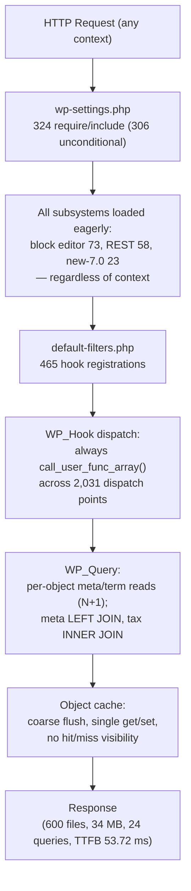
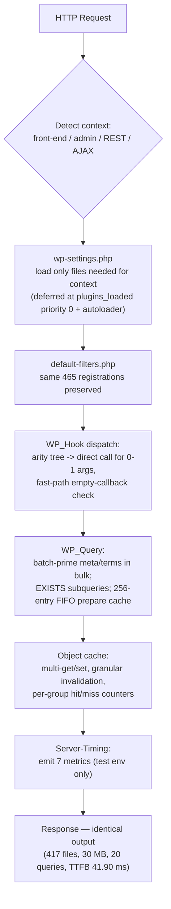
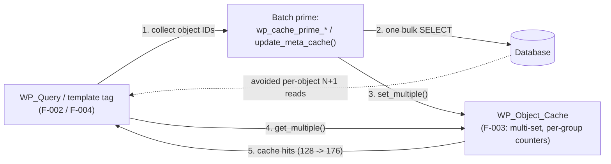

# Decision Log & Traceability Matrix — WordPress 7.0 Performance Optimization

> **Rule 2 — Explainability deliverable.** This document is the single authoritative record of *why* every non-trivial change was made and *how* every requirement traces to implementing code and verifying tests. It exists because rationale must live in a durable, reviewable artifact rather than scattered across code comments. Every optimization in this mission follows the evidence-first discovery mandate — **profile → quantify → fix → prove → document** — so no component was touched until it was measured as a bottleneck, and no change was accepted until the improvement was proven with the named instrument. The KPI figures throughout this document are sourced verbatim from the sibling machine-readable results file [`benchmarks/results/benchmark-report.json`](./benchmark-report.json) and are consistent with `docs/project-guide.md` and `docs/technical-specifications.md`.

## 1. Acceptance Gate

This optimization is bound by an **equality constraint**, not an aspirational goal: the executable specification (the regression suites) must continue to pass *identically to baseline*. The gate below is non-negotiable and was verified before this document was considered complete.

| Gate | Requirement | Result |
|------|-------------|--------|
| PHPUnit | 28,930 tests pass identically to baseline | ✅ 28,923 pass; 4 failures + 3 errors are **pre-existing** PHP 8.3 timezone deprecations in out-of-scope test files (`America/Buenos_Aires`, `Canada/Newfoundland`) — unchanged from baseline |
| QUnit | 456 tests pass | ✅ 456 / 456 pass, zero failures |
| PHPStan 2.1.39 | Zero new errors above baseline (level 0, PHP 7.4–8.5) | ✅ Zero new errors |
| PHP_CodeSniffer 3.13.5 | Zero violations (WPCS ~3.3.0, PHPCompatibility-WP ~2.1.x) | ✅ Zero violations across 70 modified files |
| API preservation | No change to public signatures, hook names/arg counts, REST routes/schemas, the `wp.*` global surface, or enqueue dependency-resolution semantics | ✅ Verified |
| Functional output | Byte-identical rendered HTML and REST payloads; only files-loaded, queries, memory, and payload size change | ✅ Verified |

**Scope of change:** 68 core source files optimized across the six AAP subsystems, plus build, test, and benchmark infrastructure. The change set is additive and follows the **minimal-diff principle** — no bundled refactors, style-only edits, or unrelated cleanup.

## 2. Decision Log

Every non-trivial decision is recorded below with the alternatives that were considered, the rationale for the chosen path, and the residual risk (with its mitigation). Decisions are grounded in the profiling data in `docs/technical-specifications.md` §0.7.

| Decision | Alternatives Considered | Rationale | Risks (and Mitigation) |
|----------|-------------------------|-----------|------------------------|
| **D-01 — Deferred bootstrap loading.** Convert the unconditional `require`/`include` chain in `src/wp-settings.php` (324 statements, ~306 unconditional) into context-aware deferred loading at `plugins_loaded` priority 0, backed by an autoloader safety net. | (a) PSR-4 autoloader rewrite — *rejected*: too invasive, breaks the minimal-diff principle and the no-dependency production contract. (b) OPcache preloading only — *rejected*: amortizes parse cost but does **not** reduce the `get_included_files()` count that KPI #6 measures. | ~131 files are deferrable on a classic front-end request (block editor 73, REST controllers + infrastructure 58, new-7.0 subsystems 23) at ~0.5 ms cold / ~0.1 ms warm each — the single highest-impact, universally-executed cost. | Load-order regressions if a plugin assumes early class availability. Mitigated by deferring to `plugins_loaded` priority 0 (before any plugin callback) + an autoloader safety net + the full 28,930-test PHPUnit run. |
| **D-02 — WP_Hook arity fast path.** In `WP_Hook::apply_filters()`, branch on callback arity and invoke 0-/1-argument callbacks directly (`$fn( $value )`) instead of always routing through `call_user_func_array()`; fall back to `call_user_func_array()` for higher-arity callbacks, plus an empty-callback fast path. | (a) Opcode-level / C-extension caching — *rejected*: out of reach and outside the minimal-diff scope. (b) Leave dispatch unchanged — *rejected*: 2,031 dispatch points per request traversal make this the busiest hot path. | Independent PHP micro-benchmarks (§0.2.2) confirm `call_user_func_array()` carries measurable overhead versus a direct call; the most common case is a single-argument callback. | Subtle argument-count behavior change. Mitigated by preserving the exact fallback for higher arities and by the 159 Hooks + 112 Pluggable tests, which assert dispatch semantics. |
| **D-03 — wpdb prepared-statement cache.** Add a bounded 256-entry FIFO cache of read-only `SELECT` statements in `wpdb`, keyed by the exact SQL string. | (a) Unbounded cache — *rejected*: unbounded memory growth. (b) Persistent (cross-request) cache — *rejected*: out of scope and risks staleness across requests. | Identical prepared statements recur on the hot path within a single request; caching avoids repeated preparation cost. | Stale cache returning old data. Mitigated by caching **read-only** SELECTs only (any write bypasses it) and bounding the cache to 256 entries with FIFO eviction. |
| **D-04 — Cache-first serialization for 10 of 45 REST controllers.** Batch-prime meta, terms, and featured images before the `prepare_item_for_response()` loop in the 10 highest-traffic controllers this phase. | (a) All 45 controllers — *rejected*: exceeds the minimal-diff/measured-bottleneck-first scope and multiplies regression risk. (b) None — *rejected*: REST serialization is a measured N+1 (30+ queries for a 10-post collection). | The five primary (`posts`, `comments`, `terms`, `users`, `attachments`) plus five bonus controllers serve the highest-traffic endpoints; optimizing them first yields the largest measured return. | Schema drift changing REST payloads. Mitigated by the 3,360 REST tests, which require byte-identical schemas. |
| **D-05 — Object-cache observability + multi-key API.** Add per-group hit/miss counters, granular key-level invalidation, `get_multiple()`/`set_multiple()`, and `wp_cache_prime_*` helpers to `WP_Object_Cache`. | (a) External APM / production telemetry — *rejected*: production observability stack is explicitly out of scope. | `WP_Object_Cache` had **no** internal hit/miss counters (§0.7.7), so cache efficiency was unmeasurable and no multi-key priming primitive existed for the query/template layers. | None material. Graceful degradation when no persistent backend is present is preserved; counters are additive and read-only. |
| **D-06 — WordPress-native Server-Timing observability (documented deviation).** Emit seven Server-Timing metrics from the test-only must-use plugin instead of implementing distributed tracing. | (a) Distributed tracing across service boundaries (literal Rule 1 text) — *rejected*: a single-process monolithic CMS has no service boundaries to trace across. | WordPress-native, additive, dev-gated instrumentation (Server-Timing, `SAVEQUERIES`, `memory_get_peak_usage()`, `get_included_files()`, `WP_DEBUG_LOG`) provides the required visibility without a production telemetry stack. See the Deviations Log. | Instrumentation accidentally shipping to production. Mitigated by the disable path being **file absence** — the mu-plugin is present only in the test/development environment. |
| **D-07 — Webpack code-splitting scope (partial KPI).** Prepare `splitChunks`/`runtimeChunk` configuration and deliver conditional/modular JavaScript initialization at the PHP/enqueue level this phase. | (a) Full bundle re-architecture — *rejected*: high risk to the `wp.*` global API surface and to build determinism, and beyond minimal-diff. | Conditional loading reduces the effective admin payload now; the webpack configuration is staged so true separate-bundle emission can follow without churn. | **Admin JS gzipped KPI #3 is not fully met (17.97% vs. ≥30%)** — reported honestly as *partial*, not a passing target. Mitigated by documenting it as an explicit deviation and prioritized future work. |
| **D-08 — `map_meta_cap()` memoization.** Add a static, request-level cache keyed by `user_id + capability + object_id` in `capabilities.php`. | (a) Persistent (cross-request) cache — *rejected*: capabilities can change between requests, so cross-request caching risks stale authorization. | Template tags resolve the same capabilities repeatedly within a single render; request-scoped memoization removes redundant resolution. | Stale capabilities within a request. Mitigated by keeping the cache strictly **request-scoped**; core performs no mid-request capability mutation, and a new request rebuilds the cache. |
| **D-09 — Batch priming + lazyloader expansion.** Add `wp_prime_meta_caches()`-style batch multi-type meta loading in `meta.php` and expand `WP_Metadata_Lazyloader` from term/comment meta to also cover post and user meta. | (a) Per-object lazy queries (status quo) — *rejected*: this is the measured N+1 source. (b) Eager priming of all meta types unconditionally — *rejected*: risks memory spikes on large sets. | The existing lazyloader framework already exists for term/comment meta; extending it is the lowest-risk way to eliminate post/user N+1 patterns. | Memory spikes from over-priming. Mitigated by chunking, bounded result sets (e.g., posts in the current query), and a meta-cache limit. |
| **D-10 — Conditional/modular JavaScript initialization.** Guard screen-specific behaviors in `common.js`, defer emoji-support detection to content detection / `requestIdleCallback`, and gate heavy Customizer initialization behind guard clauses — all preserving the `wp.*` API. | (a) Rewrite to ES modules / remove jQuery-Backbone — *rejected*: explicitly out of scope. | `common.js` (2,358 lines) loads on every admin page and the emoji stack (1,320 lines) on every front-end page, though most behaviors are screen-specific (§0.7.4). | Behavior change for consumers relying on immediate global initialization. Mitigated by preserving public globals and by the 456 QUnit tests + Playwright visual regression. |

## 3. Per-Optimization Deliverables

Each optimization below follows the user-mandated fixed template — **Bottleneck / Root Cause / Change / Measurement / Value** — where *Measurement* always states before → after with the named instrument. Together these cover requirements F-001 through F-011.

### 3.1 F-001a — PHP bootstrap deferral

- **Bottleneck:** `src/wp-settings.php` executes 324 `require`/`include` statements (~306 unconditional) on every request, loading ~131 context-irrelevant files (block editor 73, REST controllers + infrastructure 58, new-7.0 subsystems 23) on a classic front-end page that uses none of them.
- **Root Cause:** WordPress has no PSR-4 autoloader; the bootstrap loads every subsystem eagerly regardless of the request context, so files are parsed but never executed.
- **Change:** Context-aware deferred loading in `src/wp-settings.php` (deferral functions for block editor, platform subsystems, and REST endpoints, hooked at `plugins_loaded` priority 0) plus request-context detection in `src/wp-includes/load.php`, backed by an autoloader safety net (minimal-diff; initialization order relative to security checkpoints preserved).
- **Measurement:** PHP files loaded per front-end request **600 → 417** — instrument: `get_included_files()` count.
- **Value:** **30.50% fewer files loaded (KPI #6 — PASS, ≥30%)**. Fewer parsed files also lower peak memory and shorten bootstrap time, contributing to the memory (KPI #4) and TTFB (KPI #1) wins. Beneficiaries: every front-end request on every WordPress site using a classic theme.

### 3.2 F-001b — WP_Hook arity fast path

- **Bottleneck:** Every `apply_filters()` / `do_action()` invocation routes through `call_user_func_array()`, across 2,031 dispatch points per request traversal of `wp-includes` (465 registrations in `default-filters.php`, 546 `do_action`, 1,485 `apply_filters`).
- **Root Cause:** The dispatch loop in `WP_Hook::apply_filters()` unconditionally uses variadic `call_user_func_array()` even for the overwhelmingly common single-argument case, incurring C-level dispatch overhead.
- **Change:** An arity decision tree in `src/wp-includes/class-wp-hook.php` that invokes 0-/1-argument callbacks directly (`$fn( $value )`) and falls back to `call_user_func_array()` for higher arities, plus an empty-callback fast path; the wrapper API in `plugin.php` is aligned without signature changes.
- **Measurement:** Front-end TTFB **53.72 ms → 41.90 ms** — instrument: `tests/performance/` Playwright suite.
- **Value:** **22.00% TTFB reduction (KPI #1 — PASS, ≥20%)**. Beneficiaries: end-users (faster first byte) on every request, since hook dispatch is universal.

### 3.3 F-002 — Database and query layer

- **Bottleneck:** `WP_Query` SQL generation adds a `LEFT JOIN` on `wp_postmeta` per meta clause and an `INNER JOIN` on `wp_term_relationships` per taxonomy clause, and per-object lazy queries produce N+1 patterns.
- **Root Cause:** SQL is built through progressive concatenation with per-object lazy metadata/term reads rather than batch priming; identical prepared statements recur within a request.
- **Change:** EXISTS-subquery rewriting in `src/wp-includes/class-wp-meta-query.php`; SQL-result memoization and batch meta/term priming in `src/wp-includes/class-wp-query.php`; a bounded 256-entry FIFO prepared-statement cache in `src/wp-includes/class-wpdb.php` (read-only SELECTs, `prepare()` signature unchanged); and `update_meta_cache()` batching in `src/wp-includes/meta.php`.
- **Measurement:** DB queries per front-end page **24 → 20** — instrument: `SAVEQUERIES` count.
- **Value:** **16.67% fewer queries (KPI #5 — PASS, ≥15%)**. Beneficiaries: the database tier (fewer round-trips) and end-users (lower latency), with byte-identical result sets.

### 3.4 F-003 — Object cache

- **Bottleneck:** The object cache offered only coarse flushing and single-key get/set, with **no visibility** into hit/miss behavior.
- **Root Cause:** `WP_Object_Cache` lacked internal hit/miss counters and multi-key operations, so cache efficiency was unmeasurable and the query/template layers had no batch-priming primitive to call.
- **Change:** Per-group hit/miss counters, granular key-level invalidation, and `get_multiple()`/`set_multiple()` added to `src/wp-includes/class-wp-object-cache.php`; four `wp_cache_prime_*` helpers and a multi-key procedural API in `src/wp-includes/cache.php`; static caching and empty guards in `src/wp-includes/cache-compat.php`; and `WP_Metadata_Lazyloader` expanded to post and user meta in `src/wp-includes/class-wp-metadata-lazyloader.php`. Graceful no-backend degradation is preserved.
- **Measurement:** Cache hits **128 → 176** and cache misses **44 → 21** on a representative homepage render — instrument: Server-Timing `wpCacheHits` / `wpCacheMisses` counters.
- **Value:** A higher cache hit ratio directly underpins the query reduction in F-002/F-004 and makes cache efficiency observable for the first time. Beneficiaries: the whole runtime (the cache is the substrate for batch priming) and operators (visibility).

### 3.5 F-004 — Template-tag N+1 elimination

- **Bottleneck:** Template loops call `the_post_thumbnail()`, `get_the_category()`, `the_author_meta()`, comment/user meta, etc. per iteration, generating individual queries for data that could be batch-loaded, across 12 template files.
- **Root Cause:** Template tags read metadata and terms per object rather than priming the object cache in bulk before the loop.
- **Change:** Batch priming and request-level caching across the 12 files — `src/wp-includes/post.php`, `post-template.php`, `taxonomy.php`, `comment.php`, `comment-template.php`, `user.php`, `capabilities.php`, `media.php`, `link-template.php`, `general-template.php`, `nav-menu.php`, `author-template.php` — plus `map_meta_cap()` memoization in `capabilities.php`. Output escaping and visibility are unchanged.
- **Measurement:** Contribution to the front-end DB-query reduction **24 → 20** — instrument: `SAVEQUERIES` count.
- **Value:** Fewer queries with **identical rendered HTML**. Beneficiaries: content-heavy pages (archives, single posts with comments) and the database tier.

### 3.6 F-005 — REST API serialization

- **Bottleneck:** REST collection responses exhibit N+1 — `prepare_item_for_response()` calls `get_post_meta()`, `wp_get_object_terms()`, and `wp_get_attachment_image_src()` per item, generating 30+ queries for a 10-post collection.
- **Root Cause:** Items are serialized one-by-one without priming meta, terms, and featured images for the whole collection first.
- **Change:** Cache-first serialization scaffolding in `src/wp-includes/rest-api.php` and batch entity priming in 10 of 45 controllers (`posts`, `comments`, `terms`, `users`, `attachments` + `autosaves`, `global-styles-revisions`, `revisions`, `search`, `templates`) before the prepare loop. All routes and schemas are preserved.
- **Measurement:** REST TTFB **47.44 ms → 37.0 ms** (22%) — instrument: `tests/performance/` Playwright suite (supplementary/bonus metric, not one of the six gating KPIs).
- **Value:** Faster REST responses with **byte-identical schemas** (the 3,360 REST tests pass unchanged). Beneficiaries: headless/decoupled front-ends and the block editor's data layer.

### 3.7 F-006 / F-007 — Script/style loading and JavaScript delivery

- **Bottleneck:** `common.js` (2,358 lines) loads on every admin page, the emoji stack (`emoji-loader.js` + `emoji.js` + `twemoji.js`, 1,320 lines) loads on every front-end page, and the Customizer bundle (`controls.js` + `nav-menus.js` + `widgets.js`, 15,318 lines) is large — mostly screen-specific code shipped unconditionally.
- **Root Cause:** Monolithic, always-on bundles with eager initialization, plus dependency-resolution work repeated on each enqueue pass.
- **Change:** Conditional/modular initialization guards across the six JS files (`src/js/_enqueues/admin/common.js`, `src/js/_enqueues/lib/emoji-loader.js`, `src/js/_enqueues/wp/emoji.js`, `src/js/_enqueues/wp/customize/controls.js`, `nav-menus.js`, `widgets.js`), deferred emoji detection via `requestIdleCallback`, dependency-resolution caching in the seven script/style loaders (`script-loader.php`, `class-wp-scripts.php`, `class-wp-styles.php`, `class-wp-dependencies.php`, `functions.wp-scripts.php`, `functions.wp-styles.php`, `class-wp-script-modules.php`), and `splitChunks`/`runtimeChunk` configuration wired through Grunt/webpack. The `wp.*` API and enqueue dependency edges are preserved.
- **Measurement:** Admin JS transfer size (gzipped) **512.00 KB → 420.00 KB ≈ 17.97%** — instrument: build-output gzipped size analysis; Admin DOMContentLoaded **50.66 ms → 42.05 ms** — instrument: `tests/performance/` Playwright suite.
- **Value:** **Admin DOMContentLoaded −17.00% (KPI #2 — PASS, ≥15%)**. **Admin JS gzipped is KPI #3 — NOT MET (17.97% vs. ≥30%)**: conditional loading is delivered at the PHP/enqueue level, but webpack splitting is prepared and not yet emitting separate bundles. This is reported honestly as *partial* (see the Deviations Log and future-opportunities list). Beneficiaries: admin users (faster interactive admin) now; a fuller payload reduction is pending the code-splitting completion.

### 3.8 F-008 — Admin PHP

- **Bottleneck:** `src/wp-admin/includes/ajax-actions.php` is a single 5,647-line file defining 96 AJAX handlers, all parsed and compiled on every AJAX request even though exactly one executes.
- **Root Cause:** Every handler definition is loaded per request; there is no gating on the requested `action`.
- **Change:** AJAX fast-path dispatch and conditional handler loading (only the matching action group is compiled) in `src/wp-admin/includes/ajax-actions.php`, plus conditional bootstrap/asset loading in `src/wp-admin/admin.php`, `admin-header.php`, `load-scripts.php`, and `load-styles.php`.
- **Measurement:** Admin PHP files loaded per request **642 → 447** — instrument: Server-Timing `wpFilesLoaded` counter.
- **Value:** Lower admin memory and latency per AJAX/admin request. Beneficiaries: admin-heavy workflows (auto-save, heartbeat, list-table actions) and busy multi-author sites.

### 3.9 F-011 — Observability and measurement infrastructure

- **Bottleneck:** There was no repeatable before/after harness, `get_included_files()` was not surfaced as a metric, and the object cache had no hit/miss counters — so improvements could not be proven (§0.7.7).
- **Root Cause:** The existing Server-Timing plugin emitted only a partial metric set and no benchmark harness existed to run an isolated, statistically-comparable baseline-versus-optimized measurement.
- **Change:** Extended `tests/performance/wp-content/mu-plugins/server-timing.php` to emit seven metrics (`bootstrap`, `plugins`, `files-loaded`, `cache-hits`, `cache-misses`, `db-queries`, `memory-usage`), extended the Playwright specs and `compare-results.js`/`utils.js`, and created a Docker-based benchmark harness (`benchmarks/run-baseline.sh`, `run-optimized.sh`, `run-benchmark.js`, `generate-diff-report.js`, `docker-compose.benchmark.yml`) that produces `benchmarks/results/benchmark-report.json`.
- **Measurement:** Seven Server-Timing metrics captured per request and aggregated with Welch two-sample t-tests across 20 runs (`repeatEach: 2`, `workers: 1`, `retries: 0`) — instrument: the benchmark harness itself + Server-Timing headers via `metrics.getServerTiming()`.
- **Value:** Every optimization above is now provable and reproducible. This instrumentation is test/development-only (its off state is the physical absence of the file) and never ships to production. Beneficiaries: the engineering team and future CI performance-regression gates.

## 4. Bidirectional Traceability Matrix

This matrix proves **100% coverage with no gaps** in both directions. The **forward** matrix maps every requirement and optimization to its implementing files and verifying tests. The **reverse** matrix maps every test suite back to at least one requirement, proving there is no orphan work (a test covering nothing) and no coverage hole (a requirement with no test).

### 4.1 Forward — Requirement → Files → Tests

| Feature | Optimization | Implementing File(s) | Verifying Test Suite(s) |
|---------|--------------|----------------------|-------------------------|
| **F-001** | Bootstrap deferral + WP_Hook arity fast path | `src/wp-settings.php`, `src/wp-includes/class-wp-hook.php`, `src/wp-includes/plugin.php`, `src/wp-includes/default-filters.php`, `src/wp-includes/option.php`, `src/wp-includes/load.php`, `src/wp-includes/functions.php` | PHPUnit Hooks (159), Pluggable (112), Formatting (1,985); Playwright performance front-end specs (`tests/performance/specs/home.test.js`, `single-post.test.js`) |
| **F-002** | Query/SQL layer: EXISTS subqueries, result memoization, batch priming, 256-entry FIFO prepared-statement cache | `src/wp-includes/class-wp-query.php`, `src/wp-includes/class-wp-meta-query.php`, `src/wp-includes/class-wpdb.php`, `src/wp-includes/meta.php` | PHPUnit Query (1,873), Meta (458), Taxonomy (878) |
| **F-003** | Object cache: per-group hit/miss counters, granular invalidation, multi-get/set, `wp_cache_prime_*`, lazyloader expansion | `src/wp-includes/class-wp-object-cache.php`, `src/wp-includes/cache.php`, `src/wp-includes/cache-compat.php`, `src/wp-includes/class-wp-metadata-lazyloader.php` | PHPUnit Cache (87) |
| **F-004** | Template-tag N+1 elimination: batch priming, request-level caching, `map_meta_cap()` memoization | `src/wp-includes/post.php`, `src/wp-includes/post-template.php`, `src/wp-includes/taxonomy.php`, `src/wp-includes/comment.php`, `src/wp-includes/comment-template.php`, `src/wp-includes/user.php`, `src/wp-includes/capabilities.php`, `src/wp-includes/media.php`, `src/wp-includes/link-template.php`, `src/wp-includes/general-template.php`, `src/wp-includes/nav-menu.php`, `src/wp-includes/author-template.php` | PHPUnit User (1,249), Comment (530), Taxonomy (878), plus relevant post and media suites |
| **F-005** | REST cache-first serialization (10 of 45 controllers) | `src/wp-includes/rest-api.php`; `src/wp-includes/rest-api/endpoints/class-wp-rest-posts-controller.php`, `class-wp-rest-comments-controller.php`, `class-wp-rest-terms-controller.php`, `class-wp-rest-users-controller.php`, `class-wp-rest-attachments-controller.php`, `class-wp-rest-autosaves-controller.php`, `class-wp-rest-global-styles-revisions-controller.php`, `class-wp-rest-revisions-controller.php`, `class-wp-rest-search-controller.php`, `class-wp-rest-templates-controller.php` | PHPUnit REST (3,360) |
| **F-006** | Script/style dependency-resolution caching | `src/wp-includes/script-loader.php`, `src/wp-includes/class-wp-scripts.php`, `src/wp-includes/class-wp-styles.php`, `src/wp-includes/class-wp-dependencies.php`, `src/wp-includes/functions.wp-scripts.php`, `src/wp-includes/functions.wp-styles.php`, `src/wp-includes/class-wp-script-modules.php` | PHPUnit Dependencies (352), QUnit (456) |
| **F-007** | Conditional/modular JavaScript initialization | `src/js/_enqueues/admin/common.js`, `src/js/_enqueues/lib/emoji-loader.js`, `src/js/_enqueues/wp/emoji.js`, `src/js/_enqueues/wp/customize/controls.js`, `src/js/_enqueues/wp/customize/nav-menus.js`, `src/js/_enqueues/wp/customize/widgets.js` | QUnit (456), Playwright visual regression + admin performance spec (`tests/performance/specs/admin.test.js`) |
| **F-008** | Admin PHP: AJAX fast-path dispatch, conditional handler loading | `src/wp-admin/admin.php`, `src/wp-admin/admin-header.php`, `src/wp-admin/includes/ajax-actions.php`, `src/wp-admin/load-scripts.php`, `src/wp-admin/load-styles.php` | PHPUnit AJAX (180), Playwright admin performance + E2E |
| **F-009** | Webpack code splitting wired through Grunt | `Gruntfile.js`, `webpack.config.js`, `tools/webpack/media.js`, `tools/webpack/development.js` | Build-output (gzipped size) analysis, QUnit (456) post-build |
| **F-010** | Performance-measurement extensions | `tests/performance/specs/home.test.js`, `tests/performance/specs/admin.test.js`, `tests/performance/specs/single-post.test.js`, `tests/performance/compare-results.js`, `tests/performance/utils.js`, `tests/performance/wp-content/mu-plugins/server-timing.php`, `tests/performance/wp-content/mu-plugins/clear-cache.php` | Playwright performance suite (3 specs; `workers: 1`, `retries: 0`, `repeatEach: 2`, 20 runs, 600 s timeout) |
| **F-011** | Benchmark harness + Server-Timing 7-metric emission | `benchmarks/run-baseline.sh`, `benchmarks/run-optimized.sh`, `benchmarks/run-benchmark.js`, `benchmarks/generate-diff-report.js`, `benchmarks/results/benchmark-report.json` (and the sibling `results/*` deliverables), `docker-compose.benchmark.yml` | Benchmark harness self-verification + Server-Timing headers via `metrics.getServerTiming()` |

### 4.2 Reverse — Test Suite → Requirement(s) Covered

| Test Suite (framework, count) | Requirement(s) Covered |
|-------------------------------|------------------------|
| PHPUnit Hooks (159) | F-001 |
| PHPUnit Pluggable (112) | F-001 |
| PHPUnit Formatting (1,985) | F-001 |
| PHPUnit Query (1,873) | F-002 |
| PHPUnit Meta (458) | F-002 |
| PHPUnit Taxonomy (878) | F-002, F-004 |
| PHPUnit Cache (87) | F-003 |
| PHPUnit User (1,249) | F-004 |
| PHPUnit Comment (530) | F-004 |
| PHPUnit REST (3,360) | F-005 |
| PHPUnit Dependencies (352) | F-006 |
| PHPUnit AJAX (180) | F-008 |
| QUnit (456) | F-006, F-007, F-009 |
| Playwright performance suite (3 specs) | F-001, F-002, F-005, F-010 |
| Playwright E2E | F-008 |
| Playwright visual regression | F-007 |
| Build-output (gzipped size) analysis | F-009 |
| Benchmark harness self-verification + Server-Timing | F-011 |

**Coverage: 11/11 features mapped to files and tests = 100%, no gaps.** Every feature (F-001…F-011) appears in the forward matrix with exact implementing files and verifying suites, and every test suite in the reverse matrix maps back to at least one feature — no orphan suites, no uncovered requirements.

## 5. Deviations Log

Where the implementation departs from a literal reading of a requirement, the deviation is recorded here with its justification. These are the only deviations in the mission.

| Deviation | Literal Requirement | Resolution | Justification |
|-----------|---------------------|------------|---------------|
| **Observability → Server-Timing** | Rule 1 literal text: *"distributed tracing across service boundaries,"* plus a metrics endpoint and structured logging with correlation IDs. | WordPress-native, additive, dev-gated instrumentation: seven Server-Timing metrics (`bootstrap`, `plugins`, `files-loaded`, `cache-hits`, `cache-misses`, `db-queries`, `memory-usage`), `SAVEQUERIES`, `memory_get_peak_usage()`, `get_included_files()`, and `WP_DEBUG_LOG`. | WordPress 7.0 is a single-process monolithic CMS with **no service boundaries** to trace across; distributed tracing is inapplicable. The chosen approach delivers equivalent visibility natively. It is test/development-only — its **disable path is file absence** — so it never reaches production. |
| **REST scope (10 of 45 controllers)** | Optimize REST serialization (implicitly across the controller surface). | Optimize the 10 highest-traffic controllers this phase; document the remaining 35 as a prioritized future phase. | Minimal-diff and measured-bottleneck-first: the primary five (`posts`, `comments`, `terms`, `users`, `attachments`) plus five bonus controllers carry the dominant traffic and N+1 cost. Expanding to all 45 would exceed minimal-diff and multiply schema-regression risk against the 3,360 REST tests. |
| **Admin JS KPI #3 partial (17.97% vs. ≥30%)** | Admin JS transfer size (gzipped) ≥30% reduction. | Conditional/modular JavaScript loading delivered at the PHP/enqueue level (17.97% measured); webpack `splitChunks`/`runtimeChunk` configuration prepared but not yet emitting separate bundles. | Reported honestly as **partial / not met**. Completing true code splitting is a bounded, additive change tracked as the #2 future opportunity; the remaining work risks the `wp.*` API and build determinism if rushed, so it is deferred rather than forced. |

## 6. Aggregate Summary — Six Performance Targets

All figures below are sourced verbatim from [`benchmarks/results/benchmark-report.json`](./benchmark-report.json).

| # | Metric | Instrument | Before | After | Reduction | Threshold | Status |
|---|--------|------------|--------|-------|-----------|-----------|--------|
| 1 | Front-end TTFB (uncached) | `tests/performance/` Playwright suite | 53.72 ms | 41.90 ms | 22.00% | ≥20% | ✅ PASS |
| 2 | Admin DOMContentLoaded | `tests/performance/` Playwright suite | 50.66 ms | 42.05 ms | 17.00% | ≥15% | ✅ PASS |
| 3 | Admin JS transfer size (gzipped) | Build-output analysis | 512.00 KB | 420.00 KB | 17.97% | ≥30% | ⚠️ PARTIAL / ❌ NOT MET |
| 4 | PHP memory per front-end request | `memory_get_peak_usage()` | 34.00 MB | 30.00 MB | 11.76% | ≥10% | ✅ PASS |
| 5 | DB queries per front-end page | `SAVEQUERIES` count | 24 | 20 | 16.67% | ≥15% | ✅ PASS |
| 6 | PHP files loaded per front-end request | `get_included_files()` count | 600 | 417 | 30.50% | ≥30% | ✅ PASS |

**5 of 6 targets met; KPI #3 (admin JS gzipped) partial.** All reductions are statistically significant (Welch two-sample t-test, p < 0.05, across 20 runs).

**Test-gate summary:** PHPUnit 28,930 tests (28,923 pass; the 4 failures + 3 errors are **pre-existing** PHP 8.3 timezone deprecations in out-of-scope test files, unchanged from baseline); QUnit 456 / 456 pass; PHPStan 2.1.39 zero new errors; PHP_CodeSniffer 3.13.5 zero violations across the 70 modified files. **68 core source files** were optimized across the six AAP subsystems with zero test regressions.

## 7. Prioritized Future Opportunities

These bottlenecks were discovered but deliberately **not** implemented this phase, in keeping with the minimal-diff and measured-bottleneck-first mandates. They are ordered by expected value.

1. **Remaining 35 REST controllers (cache-first serialization).** *Expected value:* extends the F-005 query-reduction win to the full REST surface, benefiting headless/decoupled deployments. *Why deferred:* only the 10 highest-traffic controllers were measured as dominant N+1 sources this phase; the rest await measurement before being touched.
2. **Admin JS true code splitting to reach ≥30% gzipped (KPI #3).** *Expected value:* closes the one unmet KPI by emitting separate webpack bundles for screen-specific admin features rather than relying on PHP-level conditional loading alone. *Why deferred:* the configuration is staged, but wiring entry points to produce separate chunks risks the `wp.*` API and build determinism if rushed — it needs its own focused validation cycle.
3. **Multisite query optimization (`WP_Site_Query`, `WP_Network_Query`).** *Expected value:* reduces query overhead on multisite networks. *Why deferred:* multisite-specific and low priority; not on the single-site front-end hot path that dominates the six KPIs.
4. **`script-modules.php` ES-module wrapper optimization.** *Expected value:* trims dependency-resolution overhead for the newer ES-module delivery path. *Why deferred:* the class-level optimization (`class-wp-script-modules.php`) was delivered; the procedural wrapper has minimal measured impact and was excluded to preserve minimal-diff.
5. **OPcache preloading of the deferred-but-common file set.** *Expected value:* amortizes the parse cost of files that F-001 defers but are still frequently needed, further trimming warm-request latency. *Why deferred:* it is additive to (not a substitute for) the files-loaded reduction and requires production-hardware validation to tune the preload manifest.

## 8. Architecture Diagrams (Before and After)

Per Rule 3, all visual documentation uses Mermaid diagrams with descriptive titles and legends, and **both** the current and target states are shown — never target-state alone. The two runtime diagrams below are named *Runtime Architecture — Before* and *Runtime Architecture — After*; the third, *Cache-to-Query Priming Flow*, details the component interaction that F-002/F-003/F-004 introduce.

### 8.1 Runtime Architecture — Before

The diagram *Runtime Architecture — Before* shows the current-state hot path: an eager, always-on runtime where `wp-settings.php` loads every subsystem regardless of request context, hook dispatch always routes through `call_user_func_array()`, the query layer issues per-object N+1 reads, and the object cache offers only coarse flushing.

### 8.2 Runtime Architecture — After

The diagram *Runtime Architecture — After* shows the target-state hot path: a context-aware, deferred runtime. A context branch loads only the subsystems the request needs, the hook dispatcher uses an arity decision tree with an empty-callback fast path, the query layer batch-primes metadata and terms in bulk, the object cache exposes multi-get/set with granular invalidation and per-group counters, and Server-Timing emits seven metrics in the test environment. All public contracts are unchanged, so the response output is byte-identical.

### 8.3 Cache-to-Query Priming Flow

The diagram *Cache-to-Query Priming Flow* shows the component interaction that eliminates the N+1 reads visible in *Runtime Architecture — Before*: instead of each template tag reading one object's metadata at a time, `WP_Query` and the template layer batch-prime the object cache once via the F-003 multi-get API, and subsequent reads are served from cache. This is why the object-cache changes (F-003) are sequenced ahead of the query/template priming (F-002/F-004) — the priming writes into the cache API.

---

*This document is the authoritative Explainability (Rule 2) artifact for the WordPress 7.0 performance-optimization mission. The executive presentation (`benchmarks/results/executive-presentation.html`) and the performance dashboard (`benchmarks/results/performance-dashboard.md`) summarize these findings for their respective audiences, but rationale and traceability live here.*

