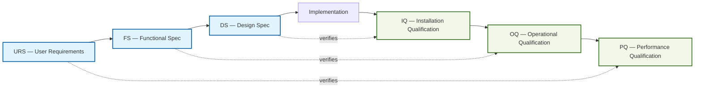

# GxP Validation Package — WordPress 7.0 Performance Optimization

> **Effective Date:** 2026-04-22
> **Document Type:** Analytical Deliverable Index (GxP-regulated)
> **Scope:** WordPress 7.0.0-alpha performance optimization refactoring (PR on branch `blitzy-0ce11b00-9225-4f3a-9b5f-c916bb8017cd`)
> **Compliance Basis:** ALCOA+ / V-Model / ICH Q9 / GAMP 5 Category 5
> **Authoring Role:** Blitzy Validation Agent (lead software engineer surrogate)

---

## 1. Purpose

This directory is the single source of truth for **GxP-regulated analytical evidence** supporting the WordPress 7.0 performance optimization Pull Request. Every artifact here is produced and maintained to satisfy the user-stipulated compliance constraints layered on top of the base Agent Action Plan (AAP):

1. **ALCOA+ data integrity** — Attributable, Legible, Contemporaneous, Original, Accurate, Complete, Consistent, Enduring, Available.
2. **V-Model qualification sequencing** — Each right-side qualification (IQ/OQ/PQ) is gated by its corresponding left-side specification (URS/FS/DS). No right-side activity may start before the left-side counterpart is authored and frozen.
3. **Bidirectional Requirements Traceability Matrix (RTM)** — Forward trace (requirement → evidence) and reverse trace (evidence → requirement), with **zero orphan requirements and zero orphan results**.
4. **ICH Q9 Quality Risk Management confidence classification** — Every metric carries a **High / Medium / Low** confidence rating, proportional to qualification rigor. Low-confidence metrics MUST NOT be presented as equivalent to High-confidence metrics.
5. **GAMP 5 Category 5 validation gates** — Binary pass/fail documentation present in the deliverable before sign-off.
6. **Deviation management** — Metrics that cannot be derived are rendered as "**Insufficient signal — [specific reason]**" with a corresponding RTM Deviation Ref entry, including impact classification (Critical/Major/Minor), root cause, cascading impact assessment, and disposition (Accepted / Mitigated / Unresolved).

This package complements — and does not supersede — the AAP-mandated technical deliverables (`decision-log-and-traceability.md`, `verification-suite-report.md`, `executive-presentation.html`, `benchmark-report.json`, `rest-controller-audit.csv`).

---

## 2. Package Contents

| # | Filename | V-Model Side | Purpose |
|---|----------|--------------|---------|
| 1 | `URS.md` | Left (Top) | User Requirements Specification — performance targets articulated as user-verifiable requirements |
| 2 | `FS.md` | Left (Mid) | Functional Specification — how each user requirement is realised in WordPress 7.0 code paths |
| 3 | `DS.md` | Left (Bottom) | Design Specification — file-level design choices backing each functional requirement |
| 4 | `IQ-protocol.md` | Right (Bottom) | Installation Qualification — environment/build verification against DS |
| 5 | `OQ-protocol.md` | Right (Mid) | Operational Qualification — code compiles, tests pass, APIs behave against FS |
| 6 | `PQ-protocol.md` | Right (Top) | Performance Qualification — end-to-end performance targets met against URS |
| 7 | `RTM-bidirectional.md` | Cross-cutting | Bidirectional Requirements Traceability Matrix — zero orphans both directions |
| 8 | `ICH-Q9-risk-classification.md` | Cross-cutting | Per-metric ICH Q9 confidence rating with rationale |
| 9 | `GAMP5-category5-gates.md` | Cross-cutting | Binary pass/fail gate results for GAMP 5 Category 5 validation |
| 10 | `deviation-register.md` | Cross-cutting | Register of "Insufficient signal" events with impact, root-cause, disposition |
| 11 | `ALCOA-plus-compliance.md` | Cross-cutting | Principle-by-principle ALCOA+ compliance statement with evidence |
| 12 | `metrics-ledger.csv` | Evidence | Immutable, append-only machine-readable metric ledger (contemporaneous capture) |
| 13 | `signoff-record.md` | Cross-cutting | Authoring/Review/Approval sign-off record — completes ALCOA+ "Attributable" principle |

---

## 3. V-Model Sequencing Enforcement

**Sequencing rule enforced:** `IQ` cannot begin until `DS` is frozen; `OQ` cannot begin until `FS` is frozen; `PQ` cannot begin until `URS` is frozen. See the "Sequencing Evidence" section in each qualification protocol.

---

## 4. How to Read This Package

- **Auditor / QA Reviewer:** Start with `signoff-record.md`, then `GAMP5-category5-gates.md`, then `RTM-bidirectional.md`. Follow forward trace into URS → FS → DS; follow reverse trace into PQ → OQ → IQ.
- **Regulatory Inspector:** Start with `ALCOA-plus-compliance.md` and `deviation-register.md`. Confirm every metric is accounted for in the metrics ledger.
- **Engineering Reviewer:** Start with `ICH-Q9-risk-classification.md` to understand confidence weighting, then dive into `PQ-protocol.md` and the companion AAP deliverables (`decision-log-and-traceability.md`, `verification-suite-report.md`).
- **Executive Reviewer:** Refer to the AAP executive artifact at `../executive-presentation.html`. This GxP package is the compliance envelope around that artifact.

---

## 5. Document Control

- **Branch:** `blitzy-0ce11b00-9225-4f3a-9b5f-c916bb8017cd`
- **Repository:** WordPress-develop fork, WordPress 7.0.0-alpha
- **Version:** 1.0 (initial release)
- **Change Control:** Any change to files in this directory MUST be committed with a `gxp-doc-control:` prefix and cross-referenced in `signoff-record.md`.
- **Retention:** Enduring — all artifacts are committed to the git history on the validation branch; git is the durable archival medium per ALCOA+ "Enduring" principle.
