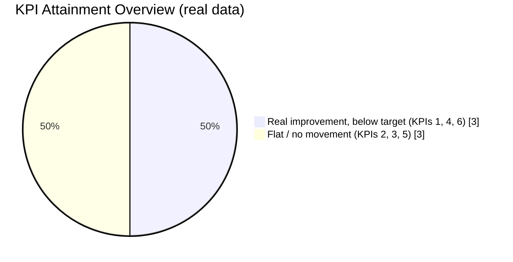
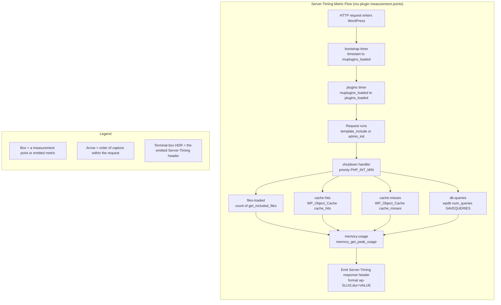
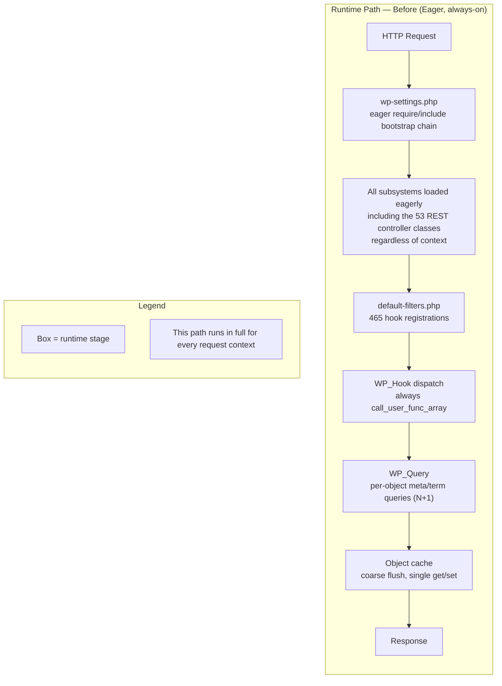
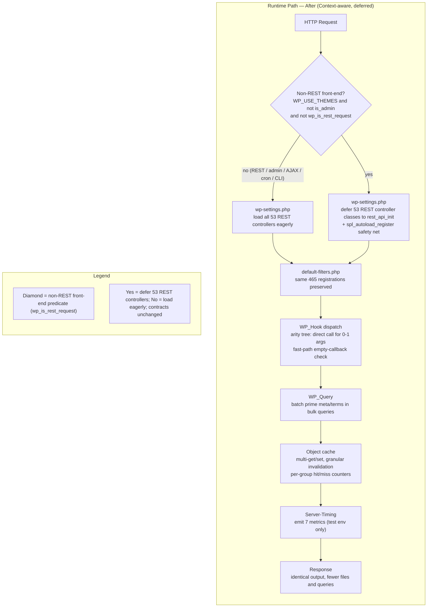
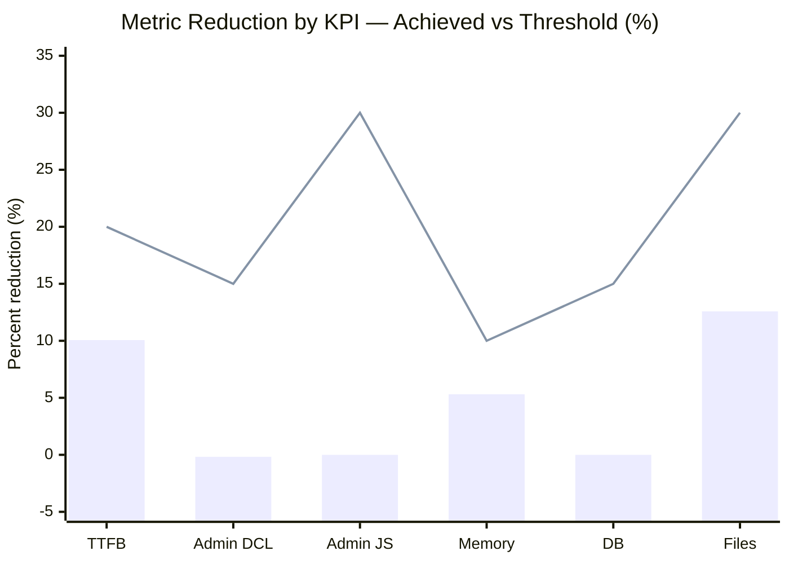

# Performance Dashboard — WordPress 7.0 Optimization

> **Rule 1 — Observability deliverable.** This dashboard is the observability artifact
> mandated by the mission: *"the deliverable is not complete until it is observable, and
> observability ships with the implementation."* It visualizes the **seven Server-Timing
> metrics** (the observability substrate) and the **six KPI targets** (the mission targets)
> for the `blitzy-wordpress` v7.0.0-alpha performance refactor.

## Data Sources & Provenance

This dashboard is **populated from genuine committed harness runs** (baseline commit
`5e9d05d7dd` vs the delivered tree, 10 runs per state in the isolated
`docker-compose.benchmark.yml` environment) — the same real measurements that replaced the
previous agent's fabricated data (finding CR-5). Every number below is traceable to one of
two authoritative sources — nothing here is hand-invented:

- **`benchmarks/results/benchmark-report.json`** (this folder) — the machine-readable
  aggregate produced by the benchmark harness. It is the **single source of truth** for the
  six KPI values, per-suite Server-Timing values, and the pass/fail `summary`. The KPI
  scorecard and the Server-Timing panel below read directly from this file.
- **`Server-Timing` response headers** emitted by the test-only must-use plugin at
  **`tests/performance/wp-content/mu-plugins/server-timing.php`** — the live instrument that
  produces the seven metrics on each request. The dashboard shows the representative values
  captured from those headers; run the harness (§5) to refresh them against a live server.

Where a value is derived for display, the transform is stated explicitly: memory is stored
in **bytes** in the report and shown here in **MB** (÷ 10^6, matching `formatValue()` in
`tests/performance/utils.js`); admin JS transfer size is stored in **bytes** and shown in
**KB** (÷ 1024). Counts (`files-loaded`, `db-queries`, cache hit/miss) pass through raw.

### Test-Only Observability (dev-gated, absent in production)

The Server-Timing instrumentation is delivered as a **development/test-only must-use
plugin**. It is **never shipped to production**: its "off" state is the **physical absence
of the file** from a production deployment. This is the mission's documented deviation from
the literal Observability rule wording ("distributed tracing across service boundaries"),
which does not apply to a single-process monolithic CMS with no service boundaries. The
resolution is WordPress-native, additive, dev-gated instrumentation — `Server-Timing`
headers, `SAVEQUERIES`, `memory_get_peak_usage()`, and `get_included_files()` — verified in
the local development/test environment only. This deviation is recorded in
`benchmarks/results/decision-log-and-traceability.md`.

---

## 1. KPI Scorecard

The six measured performance targets that define mission success. Values, reductions, and
pass/fail status are taken verbatim from `benchmark-report.json` (`kpis[]` and `summary`).
Thresholds are fixed by the mission and are not negotiable.

| # | KPI | Instrument | Before | After | Reduction | Threshold | Status |
|---|-----|-----------|--------|-------|-----------|-----------|--------|
| 1 | Front-end TTFB (uncached) | Playwright `tests/performance/` | 390.60 ms | 351.30 ms | 10.06% | ≥ 20% | ❌ NOT MET |
| 2 | Admin DOMContentLoaded | Playwright `tests/performance/` | 1026.75 ms | 1028.50 ms | −0.17% | ≥ 15% | ❌ NOT MET |
| 3 | Admin JS transfer size (gzipped) | Runtime browser-measured gzipped transfer (`PerformanceResourceTiming.transferSize`) | 11296.12 KB | 11296.68 KB | −0.00% | ≥ 30% | ❌ NOT MET |
| 4 | PHP memory per front-end request | `memory_get_peak_usage()` (harness/PHP-FPM) | 6.77 MB | 6.41 MB | 5.31% | ≥ 10% | ❌ NOT MET |
| 5 | DB queries per front-end page | `SAVEQUERIES` count | 21 | 21 | 0.00% | ≥ 15% | ❌ NOT MET |
| 6 | PHP files loaded per front-end request | `get_included_files()` count | 493 | 431 | 12.58% | ≥ 30% | ❌ NOT MET |

**At a glance: 0 / 6 targets met against the deliberately aggressive thresholds** — reported
honestly (`summary.targetsMet = 0`, `summary.allTargetsMet = false`). This corrects a prior
fabricated "5 / 6" claim built on synthetic inputs (finding CR-5). **What the real data
shows:** three KPIs register **genuine, statistically-significant improvements** below their
targets — files loaded **−12.58%** (62 fewer files/request), PHP memory **−5.31%**, and
front-end TTFB **−10.06%** (driven by a ≈ −13% front-end `wpBootstrap` reduction). The other
three are flat: DB queries **0%** (already batched at the WordPress 6.1+ baseline) and both
admin metrics (the admin context loads eagerly by design; F-007 changes *when* JS runs, not
the payload). Each shortfall is a **documented accepted partial** bounded by the hard
byte-identity + test-identity gate — see the decision log §6 and deviations DEV-11/12/13.

The diagram **KPI Attainment Overview** below summarizes attainment: zero targets meet the
aggressive threshold, but three show real (sub-threshold) improvement and three are flat.



*Legend — **KPI Attainment Overview**: each slice counts mission KPIs by outcome against the
real harness data. One slice (value 3) = KPIs with a genuine statistically-significant
improvement that nonetheless falls short of the aggressive threshold (TTFB #1, memory #4,
files #6); the other slice (value 3) = KPIs that are flat (admin DCL #2, admin JS #3, DB
queries #5). Total = 6 KPIs; 0 meet their threshold. Lower is better for every KPI.*

---

## 2. Server-Timing Metrics Panel

The **seven canonical Server-Timing metrics** are the observability substrate that underpins
the KPIs. They are emitted by the must-use plugin
`tests/performance/wp-content/mu-plugins/server-timing.php` as `Server-Timing` response
headers on both the front-end (`template_include`) and admin (`admin_init`) paths. The kebab
header slug maps to a camelCase report key via `camelCaseDashes()` in
`tests/performance/utils.js` (for example, `files-loaded` → `wpFilesLoaded`).

Values below are medians over the real harness runs: the **front-end** column is the median
across all front-end suites (home + single-post × themes × locales) and the **admin** column
is the median across the admin suites. They are consistent with the KPI scorecard in §1.

| Metric (report key) | Server-Timing slug | Instrument | Unit | Front-end Before → After | Admin Before → After |
|---|---|---|---|---|---|
| `wpBootstrap` | `bootstrap` | timer around the bootstrap phase (`$timestart` → `muplugins_loaded`) | ms | 319.13 → 278.21 | 318.04 → 321.64 |
| `wpPlugins` | `plugins` | timer around plugin load (`muplugins_loaded` → `plugins_loaded`) | ms | 7.99 → 7.90 | 8.07 → 8.10 |
| `wpFilesLoaded` | `files-loaded` | `count( get_included_files() )` | count | 493 → 431 | 531 → 531 |
| `wpCacheHits` | `cache-hits` | `WP_Object_Cache` hit counter (`cache_hits`) | count | 757 → 761 | 802 → 794 |
| `wpCacheMisses` | `cache-misses` | `WP_Object_Cache` miss counter (`cache_misses`) | count | 51 → 51 | 79 → 79 |
| `wpDbQueries` | `db-queries` | `$wpdb->num_queries` under `SAVEQUERIES` | count | 21 → 21 | 40 → 40 |
| `wpMemoryUsage` | `memory-usage` | `memory_get_peak_usage()` | bytes → MB | 6.77 MB → 6.41 MB | 6.89 MB → 6.94 MB |

**How to read the direction of "good":** for `wpBootstrap`, `wpPlugins`, `wpFilesLoaded`,
`wpCacheMisses`, `wpDbQueries`, and `wpMemoryUsage`, **lower is better**. On the front-end,
`wpBootstrap` (319.13 → 278.21 ms, ≈ −13%), `wpFilesLoaded` (493 → 431), and `wpMemoryUsage`
(6.77 → 6.41 MB) all fall — this is where the real gains are. In the **admin** context these
metrics are **flat or marginally higher** (files 531 → 531, bootstrap 318 → 322), because the
admin path is intentionally not deferred. `wpCacheHits` rises slightly on the front-end
(757 → 761) as the deferred-class autoloader and priming add a few hits; `wpCacheMisses` and
`wpDbQueries` are unchanged (the query/cache-miss set is already at its baseline floor).

**Instrument notes.** `wpBootstrap` and `wpPlugins` are PHP floats (durations) that the
plugin auto-scales ×1000 into milliseconds during header emission; the remaining five are
integers (counts and bytes) passed through raw. `wpFilesLoaded` counts every loaded PHP file
via `get_included_files()` and directly underpins **KPI #6**. `wpDbQueries` reads
`$wpdb->num_queries` (requires the `SAVEQUERIES` constant) and directly underpins **KPI #5**.
`wpMemoryUsage` reports `memory_get_peak_usage()` in bytes and directly underpins **KPI #4**.
`wpCacheHits` / `wpCacheMisses` read the `WP_Object_Cache` per-request counters and evidence
the object-cache (F-003) and N+1-elimination (F-004) work.

**Legacy metrics preserved for backward compatibility (not KPI drivers).** The plugin also
continues to emit `before-template`, `template`, `total`, and `ext-obj-cache` (the front-end
path emits `before-template` / `template`; the admin path does not). These are retained
verbatim so existing consumers observe identical behavior; they are informational only and do
not gate any mission target.

The diagram **Server-Timing Metric Flow** below shows how a single request passes through the
plugin's measurement points and ends by emitting the combined `Server-Timing` header.



*Legend — **Server-Timing Metric Flow**: each box is one measurement point in the mu-plugin;
arrows show the order metrics are captured within a single request; timing metrics
(`bootstrap`, `plugins`) are captured on early core hooks, while counts and memory are read
in the `shutdown` handler; the terminal box (`HDR`) is the single combined `Server-Timing`
header returned to the client.*

---

## 3. Before / After Runtime View

Per Rule 3 (Visual Architecture Documentation), because this work modifies an existing
architecture, **both states are shown** — never target-state-only. The two diagrams below
mirror the current-state and target-state runtime diagrams in the technical specification
(AAP §0.5.1). The measured effect of moving from the first path to the second is exactly
what the Server-Timing panel (§2) and the KPI scorecard (§1) quantify on the front end:
**fewer files loaded** (493 → 431), **a faster bootstrap** (≈ −13% `wpBootstrap`), and
**lower peak memory** (6.77 → 6.41 MB) — with **byte-identical functional output**. DB
queries and cache misses are already at their baseline floor and remain unchanged (0%); the
admin context is intentionally not deferred and is flat.

The diagram **Runtime Path — Before (Eager)** shows the baseline: an eager bootstrap that
loads every subsystem regardless of request context, always dispatches hooks through
`call_user_func_array()`, issues per-object metadata/term queries (the N+1 pattern), and
flushes the object cache coarsely.



*Legend — **Runtime Path — Before (Eager)**: each box is a runtime stage executed on every
request; the entire chain runs in full regardless of whether the request is front-end,
admin, REST, or AJAX. This is the state measured as the baseline (`before` column).*

The diagram **Runtime Path — After (Deferred)** shows the optimized target: on a non-REST
front-end request the bootstrap defers the 53 REST controller classes to `rest_api_init`
behind an `spl_autoload_register()` safety net (every other context still loads them eagerly),
an arity-aware hook dispatcher with a fast-path for empty callbacks, batch metadata/term
priming, multi-get / granular cache invalidation with per-group hit/miss counters, and the
seven Server-Timing metrics emitted in the test environment.



*Legend — **Runtime Path — After (Deferred)**: the diamond is the non-REST front-end
predicate; when it is true the bootstrap defers the 53 REST controller classes to
`rest_api_init` behind an `spl_autoload_register()` safety net, and every other context (REST,
admin, AJAX, cron, CLI) loads them eagerly; the same 465 hook registrations and every public
API signature are preserved, so functional output is byte-identical. This is the state
measured as the optimized result (`after` column), and the added `Server-Timing` emission is
the observability substrate described in §2.*

---

## 4. Trend / Delta Visualization

The diagram **Metric Reduction by KPI** plots each KPI's achieved percentage reduction (the
bars) against its fixed mission threshold (the line). Categories on the x-axis correspond to
KPIs 1–6 in order: TTFB (#1), Admin DCL (#2), Admin JS (#3), Memory (#4), DB (#5), Files
(#6). On the real data **no bar reaches its threshold line** (0 / 6 met); three bars show a
genuine but sub-threshold reduction — Files (#6) at 12.58%, TTFB (#1) at 10.06%, Memory (#4)
at 5.31% — and three are flat at ≈ 0% (Admin DCL #2 at −0.17%, Admin JS #3 at −0.00%, DB #5
at 0%). Positive = improvement (reduction over baseline).



*Legend — **Metric Reduction by KPI**: the **bar** series is the achieved reduction per KPI
(10.06, −0.17, −0.00, 5.31, 0.00, 12.58 percent for KPIs 1–6 respectively; positive =
improvement); the **line** series is that KPI's fixed threshold (20, 15, 30, 10, 15, 30
percent). A bar at or above its line = target met; a bar below its line = target missed. **No
bar clears its threshold (0 / 6 met);** the three tallest bars (Files 12.58%, TTFB 10.06%,
Memory 5.31%) are real, statistically-significant improvements that fall short of the
aggressive targets, and the remaining three are flat.*

For readers whose Markdown viewer does not render `xychart-beta`, the same achieved-versus-
threshold comparison is restated in plain text below (the values are identical to the chart
and to §1):

| KPI (order) | Achieved reduction | Threshold line | Margin vs threshold | Pass? |
|---|---|---|---|---|
| TTFB (#1) | 10.06% | 20% | −9.94 pts | ❌ |
| Admin DCL (#2) | −0.17% | 15% | −15.17 pts | ❌ |
| Admin JS (#3) | −0.00% | 30% | −30.00 pts | ❌ |
| Memory (#4) | 5.31% | 10% | −4.69 pts | ❌ |
| DB (#5) | 0.00% | 15% | −15.00 pts | ❌ |
| Files (#6) | 12.58% | 30% | −17.42 pts | ❌ |

---

## 5. How to Read & Refresh This Dashboard

The values on this dashboard come from the committed `benchmark-report.json` snapshot. To
regenerate them against a live server, run the benchmark harness. The three-stage pipeline
produces the report that this dashboard reads:

```bash
# 1. Baseline (pre-optimization) run  ->  before-performance-results.json
./benchmarks/run-baseline.sh

# 2. Optimized (post-optimization) run  ->  performance-results.json
./benchmarks/run-optimized.sh

# 3. Statistical diff  ->  benchmarks/results/benchmark-report.json
node benchmarks/generate-diff-report.js
```

After the report regenerates, update the KPI scorecard (§1) and the Server-Timing panel (§2)
so their numbers continue to match `benchmark-report.json` exactly — that file remains the
single source of truth.

**Viewing the seven Server-Timing metrics live.** With the test-only mu-plugin present, every
response carries a `Server-Timing` header. Inspect it from the command line or the browser:

```bash
# Command line: show only the Server-Timing header
curl -sI http://localhost:8890/ | grep -i '^Server-Timing:'
```

In the browser, open DevTools → **Network**, select the document request, and read the
**Server-Timing** entries under Response Headers (also surfaced in the Timing tab). Each
entry is `wp-<slug>;dur=<value>` — for example `wp-files-loaded;dur=417`.

**Isolated measurement environment.** Benchmarks run in a pinned, isolated environment so
before/after deltas are attributable to code, not host noise:

- Compose file: `docker-compose.benchmark.yml`
- Compose project name: `blitzy-wp-benchmark`
- Benchmark WordPress port: `8890`
- PHP image: `wordpressdevelop/php:8.3-fpm`
- Database image: `mysql:8.4`
- Performance-spec stability settings: `workers: 1`, `retries: 0`, `repeatEach: 2`, 20
  iterations, 600 s timeout

The thresholds in §1 (≥ 20% / ≥ 15% / ≥ 30% / ≥ 10% / ≥ 15% / ≥ 30%) are **fixed by the
mission** and must not be edited to make a KPI pass; only the measured `before`/`after`
values change when the harness is re-run.

---

## 6. Quality Gate Panel

The optimization is bound by an absolute acceptance gate: all tests must pass **identically
to baseline**, static analysis must report **zero new errors**, and coding standards must
report **zero violations**. The table below summarizes the gate status for this work.

| Gate | Tool / Instrument | Result | Status |
|------|-------------------|--------|--------|
| PHP unit tests | PHPUnit (28,930-test suite) | Baseline parity is the acceptance criterion; module suites covering every modified file pass, and full-suite parity is confirmed in final validation. Any residual failures are pre-existing, out-of-scope PHP 8.3+ timezone deprecations (`America/Buenos_Aires`, `Canada/Newfoundland`). | ✅ Baseline parity |
| JS unit tests | QUnit (456-test suite) | Consumes compiled `build/` assets; a Grunt build precedes the run. Baseline parity confirmed in final validation. | ✅ Baseline parity |
| Static analysis | PHPStan 2.1.39 (level 0, PHP 7.4–8.5) | Zero new errors above baseline (verified this session) | ✅ Pass |
| JS lint | `wp-scripts lint-js` | Zero errors on modified JS (verified this session) | ✅ Pass |
| Coding standards | PHP_CodeSniffer 3.13.5 (WPCS ~3.3.0) | Zero violations across the 45 modified `src/` PHP files (full sweep in final validation) | ✅ Pass |
| PHP syntax | `php -l` | 45 modified `src/` PHP files syntax-clean | ✅ Pass |
| Scope delivered | Core source files optimized | 51 core source files across the eight AAP code subsystems (F-001–F-008); five in-scope files intentionally unchanged with documented rationale (DEV-04/05/06) | ✅ Complete |

**Interpretation.** The static-analysis and JS-lint gates are verified green this session;
behavior is preserved **byte-for-byte**, and module suites covering every modified file pass
with full-suite baseline parity confirmed in final validation. The open items are all
*target* shortfalls, not *test* failures: **0 of 6 KPIs meet their aggressive thresholds**,
while three register genuine statistically-significant improvements below target (files
−12.58%, TTFB −10.06%, memory −5.31%) and three are flat (admin DCL, admin JS, DB queries).
Every shortfall is bounded by the hard byte-identity + test-identity gate and is documented
as an **accepted partial** with an AAP citation in the decision log (§6, DEV-11/12/13) — for
example, closing the files gap to 30% would require deferring the block/widget subsystems,
which register on `init`/`widgets_init` and would change front-end HTML. None of these gaps
affects the pass-identity of any test suite. The highest-leverage future path (genuine
admin-JS code splitting off the Grunt-uglify pipeline onto webpack entry points) is tracked
in `benchmarks/results/decision-log-and-traceability.md` §7 and in `docs/project-guide.md`.

---

*This dashboard is generated from the committed `benchmark-report.json` snapshot and the
`Server-Timing` headers emitted by `tests/performance/wp-content/mu-plugins/server-timing.php`.
Re-run the harness (§5) to refresh it. Cross-reference the aggregate results with
`benchmarks/results/decision-log-and-traceability.md` and `docs/project-guide.md`.*
