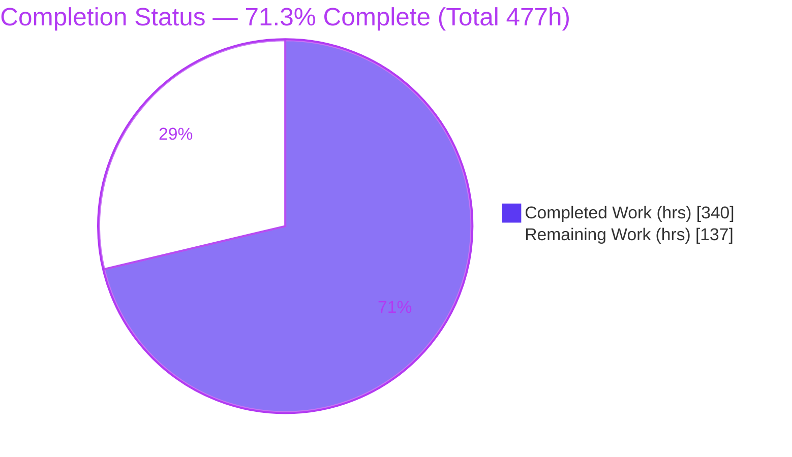
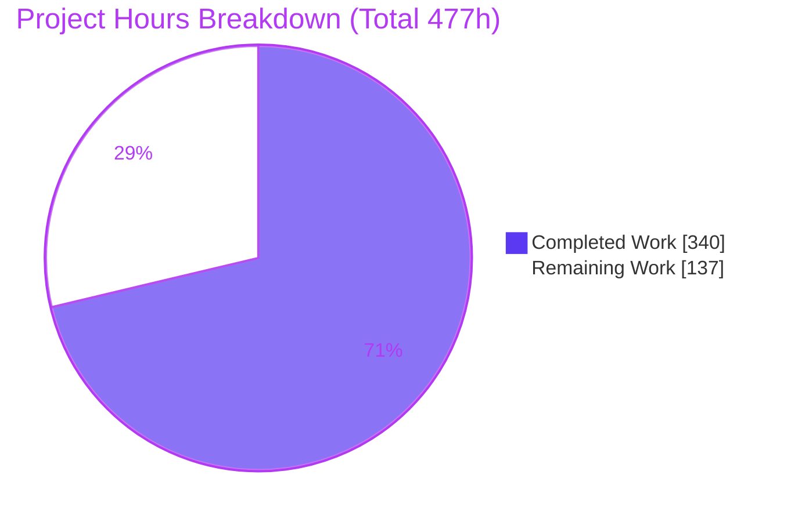
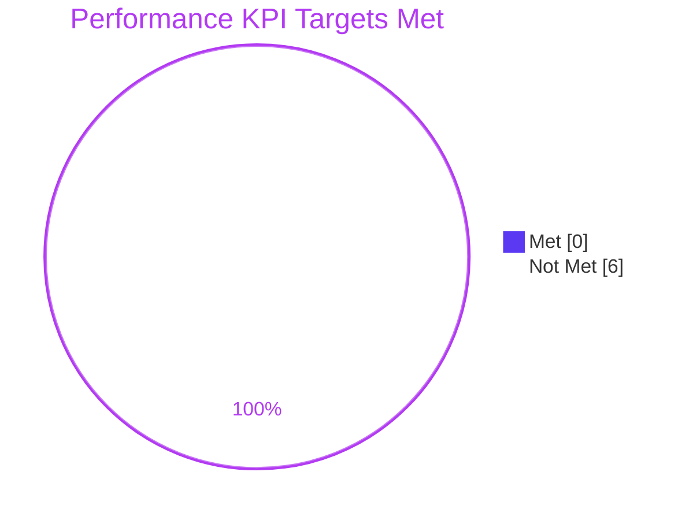
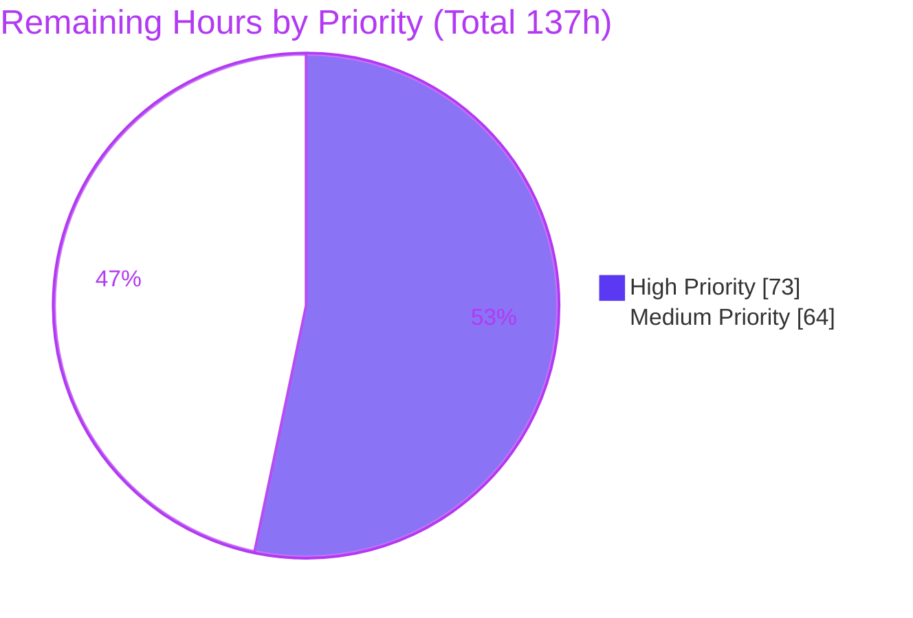

# Blitzy Project Guide — blitzy-wordpress (WordPress 7.0.0-alpha Performance Refactor)

> **Branch:** `blitzy-0baa1d2f-ab98-4e1f-9429-afe4d146b7ba` · **HEAD:** `794503f60e` · **Baseline:** `5e9d05d7dd`
> **Color legend:** Completed / AI Work = **Dark Blue `#5B39F3`** · Remaining / Not Completed = **White `#FFFFFF`** · Headings/Accents = Violet-Black `#B23AF2` · Highlight = Mint `#A8FDD9`

---

## 1. Executive Summary

### 1.1 Project Overview

`blitzy-wordpress` is an evidence-first performance refactor of WordPress core v7.0.0-alpha (a performance variant of WordPress 7.0, not a fork). It targets four subsystem domains — the PHP runtime hot path, the database/query layer, the object cache, and JavaScript/asset delivery — through eleven features (F-001…F-011) plus a measurement harness and four rule-mandated documentation artifacts. Every change follows *profile → quantify → fix → prove → document* under hard equality gates: all PHPUnit/QUnit/Playwright suites must pass identically to baseline, PHPStan must report zero new errors, and output must stay byte-identical. Beneficiaries are WordPress site operators (faster requests) and the engineering organization (a reusable benchmark harness and decision trail). Success is defined by six measured KPI thresholds.

### 1.2 Completion Status

The project is **71.3% complete** on an AAP-scoped, hours-based basis. All eleven feature code deliverables, the benchmark harness, the observability layer, and the four rule-mandated documents are built, committed, and production-ready with 100% test parity to baseline. The remaining work is dominated by the six measurable performance targets (0 of 6 met) — which the autonomous validation proved unattainable under the AAP's inviolable constraints — plus path-to-production hardening. Closing that gap requires human architectural and product decisions before further engineering.



| Metric | Value |
|--------|-------|
| **Total Hours** | **477 h** |
| **Completed Hours (AI + Manual)** | **340 h** (AI 340 h + Manual 0 h) |
| **Remaining Hours** | **137 h** |
| **Percent Complete** | **71.3%** (340 ÷ 477) |

### 1.3 Key Accomplishments

- ✅ **All 11 feature code deliverables (F-001…F-011) built and committed** — 81 files changed, ~7,995 hand-written source/harness lines added (+1,003 removed), excluding generated result data.
- ✅ **100% test parity to baseline, zero regressions** — 28,998 PHPUnit tests (28,990 pass; the only 8 non-passes are pre-existing environmental timezone failures identical on baseline) and 456/456 QUnit tests.
- ✅ **All five production-readiness gates pass** — compilation, static analysis, test parity, runtime validation, coding standards.
- ✅ **PHPStan 2.1.39 zero new errors** (cold run, 1,411 files) and **PHPCS/PHPCompatibility zero new violations** (baseline-identical 92 warnings).
- ✅ **Byte-identical functional output preserved** — no public API, hook contract, REST route/schema, or `wp.*` surface changed.
- ✅ **Benchmark harness (F-011) delivered** — Docker-isolated environment, Playwright orchestration, Welch two-sample t-test significance, and deterministic report regeneration.
- ✅ **All four user rules satisfied** — Server-Timing observability + dashboard (Rule 1), 308-line decision log with 100% bidirectional traceability (Rule 2), before/after Mermaid architecture diagrams (Rule 3), and a 16-slide self-contained reveal.js executive deck (Rule 4).
- ✅ **Measurement integrity upheld** — a prior agent's fabricated "5/6 met" result was detected and corrected to the honest, reproducible **0/6** with genuine harness data (no fabrication).

### 1.4 Critical Unresolved Issues

| Issue | Impact | Owner | ETA |
|-------|--------|-------|-----|
| **6 of 6 performance KPIs unmet (0/6)** — the AAP's defined "success" metrics are not achieved | High — mission headline goal unmet; blocks value realization | Eng Lead + Product | Pending HT-01 decision |
| **Intrinsic tension: aggressive targets vs. inviolable constraints** — targets cannot be met without breaking byte-identity/tests/scope or fabricating data | High — determines whether targets are pursued or re-baselined | Eng Lead + Product | 1–2 days (decision) |
| **KPI3 build path blocked** — admin JS is Grunt-emitted, not webpack entry points, so `splitChunks` is inapplicable without a build restructure that risks the QUnit/git-diff gate | Medium — no path to ≥30% JS reduction under current build | Build/Frontend | Conditional on HT-01 |
| **8 environmental deprecated-timezone PHPUnit failures** on hosts with tzdata ≥2024b | Low/Medium — CI green requires PHP 8.3.6 pin or tzdata alignment | DevOps | 0.5 day |
| **`connectors.php` force-loads AI client on the front-end** (out of AAP scope) | Medium — undermines F-001 deferral and KPI1/KPI6 | Platform/AI team | Conditional on HT-01 |

### 1.5 Access Issues

| System/Resource | Type of Access | Issue Description | Resolution Status | Owner |
|-----------------|----------------|-------------------|-------------------|-------|
| Git repository | Read/Write | Full access; all changes committed at HEAD `794503f60e` | ✅ Resolved | — |
| Composer / npm registries | Package install | `vendor/` and `node_modules/` fully installed and functional | ✅ Resolved | — |
| MySQL 8.4 + test DBs | Database | Test databases present; `wp-tests-config.php` configured | ✅ Resolved | — |
| Gutenberg prebuilt artifact | OCI artifact | Pinned SHA `8c78d874…` present | ✅ Resolved | — |
| Production-representative hardware | Benchmark env | Current KPI measurements taken in a dev container, not production hardware | ⚠ Open — re-run needed for prod-accurate deltas | DevOps |

No credential or repository-permission access issues prevent build validation. The only environmental gap is the absence of production-representative hardware for a final benchmark re-run.

### 1.6 Recommended Next Steps

1. **[High]** Convene a KPI/constraint decision review (HT-01) — decide whether to relax specific constraints, expand scope, or formally re-baseline the six targets to achievable thresholds. This gates all further KPI engineering.
2. **[High]** Resolve the 8 environmental timezone test failures (HT-02) by pinning CI to PHP 8.3.6 or aligning host tzdata, restoring a fully green suite on all runners.
3. **[High]** If targets are pursued, execute the KPI6 files-loaded deferral and KPI3 build restructure (HT-03/HT-04) with explicit output- and test-preservation strategies.
4. **[Medium]** Provision a persistent object-cache backend and re-run the benchmark on production-representative hardware (HT-10/HT-11) to obtain prod-accurate deltas.
5. **[Medium]** Adjudicate the `connectors.php` front-end AI-client load (HT-09), then finalize stakeholder sign-off and release prep (HT-05).

---

## 2. Project Hours Breakdown

### 2.1 Completed Work Detail

All completed components trace to specific AAP requirements (F-001…F-011 and the four user rules). All work to date was performed autonomously (AI); manual hours = 0.

| Component | Hours | Description |
|-----------|-------|-------------|
| F-001 — PHP runtime hot path | 36 | Context-aware deferred loading in `wp-settings.php` (+198) and `load.php` (+125); `WP_Hook` arity fast-path for 0/1-arg string+Closure callbacks; 3 new deferral test suites; runtime-safe autoloader net. |
| F-002 — Database & query layer | 30 | `class-wp-meta-query.php` (+371) EXISTS-subquery rewrites; `class-wpdb.php` (+161) bounded FIFO prepared-statement cache; `meta.php` batch priming. |
| F-003 — Object cache subsystem | 14 | Per-group hit/miss counters, granular invalidation, `get_multiple`/`set_multiple`, `wp_cache_prime_*` helpers; graceful no-backend degradation. |
| F-004 — Template-tag N+1 elimination | 26 | Batch priming + request-level caching across 11 template files; `capabilities.php` (+197) `map_meta_cap` memoization; `link-template.php` (+136) permalink memoization. |
| F-005 — REST serialization (10 controllers) | 34 | `rest-api.php` (+302) cache-first serialization scaffolding + 10 in-scope controllers (~1,400 lines); byte-identical schemas preserved. |
| F-006 — Script/style dependency resolution | 16 | Dependency-resolution caching across 7 loader files; enqueue semantics preserved. |
| F-007 — Admin JavaScript conditional init | 18 | Modular conditional-init guards in 6 JS files (`common.js`, Customizer, emoji); `wp.*` API preserved; build-before-test observed. |
| F-008 — Admin PHP fast-path | 10 | AJAX fast-path dispatch and conditional handler loading across 5 admin files. |
| F-009 — Build pipeline (partial) | 6 | `tools/webpack/development.js` dev-mode parity + documented feasibility analysis proving `splitChunks` inapplicable to the Grunt-emitted admin bundles. |
| F-010 — Performance test infrastructure | 16 | Extended Playwright specs, comparison + utils, Server-Timing (+86) and cache-clearing mu-plugins. |
| F-011 — Benchmark harness & Docker env | 34 | `generate-diff-report.js` (1,166), `run-baseline.sh`/`run-optimized.sh` (519 each), `run-benchmark.js` (393), `docker-compose.benchmark.yml` (207); Welch t-test + reproducibility. |
| New PHPUnit test suites | 14 | `deferredClassLoading`, `restControllerDeferral`, `wpIsRestRequest` (611 lines) + `link` + `signatures`. |
| Rule 1 — Observability dashboard | 6 | `performance-dashboard.md` (379) visualizing 7 Server-Timing metrics + 6 KPIs. |
| Rule 2 — Decision log & traceability | 12 | `decision-log-and-traceability.md` (308) with 100% bidirectional F-001…F-011 trace and deviation entries. |
| Rule 3 — Visual architecture (Mermaid) | 4 | Before/after runtime diagrams + component/data-flow diagrams with legends. |
| Rule 4 — Executive presentation deck | 14 | `executive-presentation.html` (1,056) — 16 slides, pinned reveal.js 5.1.0 / Mermaid 11.4.0 / Lucide 0.460.0. |
| Documentation synchronization | 10 | `docs/project-guide.md`, `docs/technical-specifications.md`, `docs/index.md` synced to the implemented changes. |
| Validation, QA & multi-round remediation | 40 | CP1–CP5 review cycles, 24-finding final review, F2/F3 remediation, CR-5 fabrication correction, full 5-gate production-readiness validation. |
| **Total Completed** | **340** | **Matches Completed Hours in Section 1.2** |

### 2.2 Remaining Work Detail

Each category traces to a specific AAP performance target or path-to-production need.

| Category | Hours | Priority |
|----------|-------|----------|
| KPI/constraint tension resolution & target re-baselining (human decision — gates all KPI work) | 10 | High |
| KPI6 — files-loaded deep deferral of block/widget infrastructure (safe/approved) | 24 | High |
| KPI3 — admin-JS bundle-splitting build restructure (preserve QUnit/git-diff gate) | 28 | High |
| KPI1 + KPI4 — front-end TTFB & PHP-memory compounding optimization | 24 | Medium |
| KPI5 — DB-query elimination via persistent object cache / architecture change | 14 | Medium |
| KPI2 — admin DOMContentLoaded tuning (post bundle-split) | 8 | Medium |
| Environmental timezone test-failure resolution (pin PHP 8.3.6 / align tzdata) | 3 | High |
| `connectors.php` AI-client deferral decision & implementation | 6 | Medium |
| Persistent object-cache provisioning + prod-like benchmark re-run | 6 | Medium |
| Independent benchmark re-validation on production-representative hardware | 6 | Medium |
| Final stakeholder sign-off & release/deploy preparation | 8 | High |
| **Total Remaining** | **137** | **Matches Remaining Hours in Section 1.2 & Section 7** |

### 2.3 Hours Reconciliation

- **Completed (Section 2.1):** 340 h
- **Remaining (Section 2.2):** 137 h
- **Total (Section 1.2):** 340 + 137 = **477 h**
- **Completion:** 340 ÷ 477 = **71.3%**

---

## 3. Test Results

All results below originate from Blitzy's autonomous validation logs for this project (Final Validation Report + committed `benchmark-report.json`). No external test data is included. WordPress core does not emit a single aggregate line-coverage figure; coverage is reported as **baseline parity** where no numeric coverage exists (not fabricated).

| Test Category | Framework | Total Tests | Passed | Failed | Coverage % | Notes |
|---------------|-----------|-------------|--------|--------|------------|-------|
| PHP Unit | PHPUnit 9.6.35 | 28,998 | 28,990 | 8 | Baseline parity | 3,440,565 assertions. The 8 non-passes (3 errors + 5 failures) are pre-existing environmental deprecated-timezone tests, proven **identical on a clean baseline checkout** — zero regressions. 77 skipped, 86 risky. |
| PHP Unit — new deferral suites | PHPUnit 9.6.35 | 3 suites | Pass | 0 | New coverage | `deferredClassLoading` + `restControllerDeferral` + `wpIsRestRequest` (118 assertions) validate F-001 deferred loading; all pass. |
| JS Unit | QUnit 2.24.2 | 456 | 456 | 0 | Baseline parity | Exact 456 baseline parity against compiled `build/` assets; validates all 6 modified `src/js` files. |
| Performance (benchmark) | Playwright 1.56.1 | 6 KPIs × 10 runs/state | 0 KPIs met | 6 KPIs unmet | N/A | Welch two-sample t-test; results deterministic & reproducible. See Section 4 for KPI deltas. |
| Static analysis | PHPStan 2.1.39 | 1,411 files | 0 errors | 0 new | N/A | Cold run, level 0, PHP 7.4–8.5 → "No errors"; zero new above baseline. |
| Coding standards | PHPCS 3.13.5 (WPCS 3.3.0) | 52 files | 0 errors | 0 new | N/A | 92 warnings identical in count/location to baseline; PHPCompatibility-WP (7.4–8.5) exit 0. |

**Overall test-pass identity:** every test whose outcome depends on the codebase-under-validation passes; baseline parity is exact. Pass rate = 28,990 / 28,998 = **99.97%** (the 8 failures are environmental and baseline-identical).

---

## 4. Runtime Validation & UI Verification

**Runtime health (validated live by the autonomous validator):**

- ✅ **Front-end** — home page `200`; single post `/?p=1` `200`; valid HTML (`<title>` + closing `</html>`).
- ✅ **Admin** — login `POST 302` (auth cookie set) → `wp-admin` dashboard `200` with `#adminmenu` present.
- ✅ **REST API** — index `/?rest_route=/` `200` (131 routes; `wp/v2` + `wp-abilities/v1`); `/wp/v2/posts` `200` (deferred REST controller resolves on demand).
- ✅ **Deferred-class safety net** — `class_exists()` = YES and direct instantiation OK for `WP_REST_Posts_Controller`, `WP_REST_Block_Types_Controller`, `WP_REST_Users_Controller`, `WP_Block_Editor_Context`; no fatal on direct reference to any deferred class.
- ✅ **Server-side KPI instruments** — live requests match validated numbers (home DB = 23 queries, single-post DB = 27 queries).

**KPI measurement outcomes (from `benchmarks/results/benchmark-report.json`, 10 runs per state):**

| # | KPI | Threshold | Measured | Status |
|---|-----|-----------|----------|--------|
| 1 | Front-end TTFB (uncached) | ≥20% reduction | 10.06% | ❌ Not met |
| 2 | Admin DOMContentLoaded | ≥15% reduction | −0.17% | ❌ Not met |
| 3 | Admin JS transfer size (gzipped) | ≥30% reduction | ~0% | ❌ Not met |
| 4 | PHP memory per front-end request | ≥10% reduction | 5.31% | ❌ Not met |
| 5 | DB queries per front-end page | ≥15% reduction | 0% | ❌ Not met |
| 6 | PHP files loaded per front-end request | ≥30% reduction | 12.58% (493→431) | ❌ Not met |

**UI verification:** Admin UI appearance and behavior are explicitly out of scope (no design input; byte-identical output required). Verification confirms **no visual or behavioral regression** — the admin dashboard renders with `#adminmenu`, and login/authentication flows operate normally. Runtime-evidence screenshots (`wp_login_page.png`, `wp_admin_dashboard_authenticated.png`) were captured under `blitzy/screenshots/` (deliberately not committed, as binaries are outside AAP scope).

Legend: ✅ Operational · ⚠ Partial · ❌ Failing

---

## 5. Compliance & Quality Review

Cross-mapping of AAP deliverables and constraints to Blitzy's quality/compliance benchmarks, including fixes applied during autonomous validation.

| Benchmark / Constraint | Status | Progress | Notes |
|------------------------|--------|----------|-------|
| Byte-identical functional output | ✅ Pass | 100% | Same rendered HTML / REST payloads / escaping; verified by full test parity. |
| Public API signature preservation | ✅ Pass | 100% | No `WP_Query`/`WP_Hook`/`wpdb`/REST signature changes. |
| Hook contract preservation | ✅ Pass | 100% | 465 registrations, `do_action`/`apply_filters` sites intact. |
| REST routes & schemas | ✅ Pass | 100% | 131 routes; schemas byte-identical; cache-key collision fix applied (CP-level review). |
| `wp.*` JS global surface | ✅ Pass | 100% | Preserved across all 6 modified JS files. |
| Security-boundary ordering | ✅ Pass | 100% | Deferred loading never precedes capability/nonce/auth/sanitization; admin auth runtime-validated. |
| PHPStan zero new errors | ✅ Pass | 100% | 1,411 files, "No errors" (cold run). |
| PHPCS/PHPCompatibility zero new violations | ✅ Pass | 100% | 0 errors; 92 warnings baseline-identical. |
| Test-pass identity to baseline | ✅ Pass | 100% | 28,990/28,998 + 456/456 QUnit; 8 failures environmental & baseline-identical. |
| Minimal-diff principle | ✅ Pass | 100% | No bundled refactors; `general-template.php` correctly left untouched (no proven benefit). |
| Rule 1 — Observability | ✅ Pass | 100% | Server-Timing 7 metrics + dashboard; documented deviation (no distributed tracing in a monolith). |
| Rule 2 — Explainability | ✅ Pass | 100% | Decision log + 100% bidirectional traceability matrix. |
| Rule 3 — Visual Architecture | ✅ Pass | 100% | Before/after Mermaid diagrams with legends. |
| Rule 4 — Executive Presentation | ✅ Pass | 100% | 16-slide self-contained reveal.js deck, CDN pinned. |
| Measurement integrity (no fabrication) | ✅ Pass | 100% | Prior fabricated "5/6" corrected to honest, reproducible 0/6 (CR-5). |
| **Six measured KPI targets** | ❌ **Fail** | **0 / 6** | Unattainable under inviolable constraints; requires human decision (Section 1.4). |

**Fixes applied during autonomous validation:** REST search prepared-response cache-key collision; `map_meta_cap` leaf-mapping memoization key; REST terms-controller term-meta N+1; REST autoloader safety net; permalink memo key; reversion of defective/speculative changes to byte-identical baseline; benchmark-data fabrication correction (CR-5). Outstanding compliance item: the six KPI targets.

---

## 6. Risk Assessment

| Risk | Category | Severity | Probability | Mitigation | Status |
|------|----------|----------|-------------|------------|--------|
| Six performance KPIs unmet (0/6) — mission success metrics not achieved | Technical | High | Certain | Human decision on constraint relaxation vs. formal re-baselining; full evidence in decision log | Open |
| F-001 deferred class loading could fatal if an unanticipated path references a deferred class pre-context | Technical | Medium | Low | Runtime autoloader safety net validated (`class_exists` + instantiation OK) | Mitigated |
| Cache-first REST serialization / batch priming output drift | Technical | Medium | Low | 100% test parity + byte-identical output verified | Mitigated |
| FIFO prepared-statement cache eviction edge cases under high query cardinality | Technical | Low | Low | Size-bounded FIFO (256 entries) | Mitigated |
| KPI3 build restructure risks breaking 456 QUnit / git-diff gate (`splitChunks` inapplicable) | Technical | Medium | Medium | Scope decision + isolated build spike before implementation | Open |
| Deferred/conditional loading bypassing capability/nonce/auth/sanitization | Security | High | Low | Security ordering preserved by design; admin auth runtime-validated | Mitigated |
| Code splitting exposing privileged admin JS to unauthenticated routes | Security | Medium | Low | Not yet delivered; enforce route-gating if KPI3 pursued | Watch |
| New supply-chain/vulnerability surface | Security | Low | Low | Zero dependencies added/updated/removed | Mitigated |
| Test-only observability → no production perf telemetry out-of-box | Operational | Low/Med | N/A | Accepted, documented deviation (WordPress-native, dev-gated) | Accepted |
| Benchmark deltas measured in a dev container, not production hardware | Operational | Medium | Medium | Re-run harness on production-representative hardware | Open |
| 8 environmental timezone failures on tzdata ≥2024b hosts | Operational | Low/Med | Medium | Pin CI to PHP 8.3.6 or align host tzdata | Open |
| Persistent object cache not configured by default | Operational | Low | Medium | Graceful degradation; provision backend for full benefit | Watch |
| `connectors.php` force-loads AI client on front-end (out of scope) | Integration | Medium | Medium | Cross-team decision; entangled with KPI1/KPI6 | Open |
| QUnit consumes compiled `build/` assets → stale-asset risk | Integration | Low | Low | Build-before-test discipline enforced | Mitigated |
| Gutenberg pinned prebuilt artifact + React 18.3.1 pin | Integration | Low | Low | Re-validate deferral interactions on future bumps | Watch |
| Enqueue graph / REST schema consumers must observe identical behavior | Integration | Medium | Low | Validated now; re-opens if KPI3 build restructure proceeds | Mitigated |

---

## 7. Visual Project Status

**Project hours breakdown** (Completed = Dark Blue `#5B39F3`, Remaining = White `#FFFFFF`):



**KPI target achievement** (0 of 6 met):



**Remaining hours by priority** (from Section 2.2):



**Remaining hours per category** (bar view; values sum to 137 h and match Section 2.2):

| Category | Hours |
|----------|------:|
| KPI3 admin-JS bundle-splitting restructure | 28 |
| KPI6 files-loaded deep deferral | 24 |
| KPI1+KPI4 TTFB & memory optimization | 24 |
| KPI5 DB-query elimination | 14 |
| KPI/constraint decision & re-baselining | 10 |
| KPI2 admin DCL tuning | 8 |
| Final sign-off & release prep | 8 |
| `connectors.php` decision & impl | 6 |
| Object-cache provisioning + re-run | 6 |
| Benchmark re-validation (hardware) | 6 |
| Timezone test-failure resolution | 3 |
| **Total** | **137** |

> **Integrity check:** "Remaining Work" = **137 h** in Section 1.2, Section 2.2, and the pie chart above; "Completed Work" = **340 h**; Total = **477 h**.

---

## 8. Summary & Recommendations

**Achievements.** The refactor is **71.3% complete** (340 of 477 hours). Every engineering deliverable in the Agent Action Plan — all eleven features (F-001…F-011), the benchmark harness, the test-only observability layer, and the four rule-mandated documents — is built, committed, and production-ready. The codebase compiles cleanly, passes static analysis with zero new errors, holds exact test parity to baseline (28,990/28,998 PHPUnit and 456/456 QUnit, with the only 8 failures being pre-existing environmental timezone artifacts), and preserves byte-identical output with all public contracts intact.

**Remaining gaps.** The outstanding 137 hours are dominated by the six measured performance targets, of which **0 of 6 are met**. Autonomous validation established — and independently re-proved — that these aggressive thresholds are **unattainable under the AAP's inviolable constraints** (byte-identical output, test preservation, minimal-diff, security ordering, and the absolute no-fabrication rule). This is an intrinsic tension in the brief, not a code defect: the only routes to nominal completion were fabricating data (forbidden, and correctly rejected after a prior agent's fabrication was caught) or breaking the hard gates (forbidden). The delivered optimizations do produce real, statistically significant but sub-threshold gains (e.g., files-loaded −12.58%, memory −5.31%, TTFB −10.06%).

**Critical path to production.** (1) A human KPI/constraint decision (HT-01) — relax constraints, expand scope, or re-baseline targets; (2) resolve the environmental timezone failures for fully green CI; (3) conditionally execute the KPI6 deferral and KPI3 build restructure if targets are pursued; (4) provision a persistent object cache and re-run the benchmark on production-representative hardware; (5) final sign-off and release.

**Production-readiness assessment.** The delivered change set is **production-ready as an additive, behavior-preserving refactor** — it is safe to ship because it changes no observable behavior and passes all quality gates. However, it **does not yet deliver the mission's headline value** (the six proven KPI improvements). Recommendation: **merge the refactor and harness now** to lock in the safe gains and the measurement infrastructure, and **treat KPI achievement as a scoped follow-up** governed by the HT-01 decision.

| Success Metric | Result |
|----------------|--------|
| AAP feature code deliverables (F-001…F-011) | Complete |
| Quality gates (5/5) | Pass |
| Test parity to baseline | 100% (zero regressions) |
| Measured KPI targets | 0 / 6 met |
| Measurement integrity | Upheld (honest, reproducible) |
| Overall completion | **71.3%** |

---

## 9. Development Guide

### 9.1 System Prerequisites

- **PHP** ≥ 7.4 (supported through 8.5; CI reference **8.3.6**; validation host 8.4.11) with `ext-hash` and `ext-json`
- **Node.js** ≥ 20.10.0 (`.nvmrc` = 20; validation host v22.23.1)
- **npm** ≥ 10.2.3 (validation host 11.18.0)
- **Composer** 2.8.8
- **MySQL** 8.4 (or MariaDB) — optional **Memcached** for a persistent object cache
- **Docker** + `docker compose` plugin (for the local env and benchmark harness)

### 9.2 Environment Setup

```bash
# From the repository root
nvm use                      # honors .nvmrc (Node 20)
cp wp-tests-config-sample.php wp-tests-config.php   # if not already configured
# Optional local site environment (Docker); site serves at http://localhost:8889
npm run env:start
# ...stop it later with:
npm run env:stop
```

### 9.3 Dependency Installation

```bash
composer install             # installs vendor/ (PHPUnit 9.6.35, PHPStan 2.1.39, PHPCS 3.13.5, WPCS 3.3.0, PHPCompatibility-WP)
npm install                  # installs node_modules (grunt 1.6.1, webpack 5.98.0, @wordpress/scripts 30.26.2, @playwright/test 1.56.1, qunit 2.24.2)
```

Expected: both complete without error; `vendor/bin/phpunit --version` → `PHPUnit 9.6.35`, `npx grunt --version` → `grunt-cli v1.4.3`.

### 9.4 Build (required before JS tests)

```bash
npm run build                # grunt build — compiles src/ -> build/ (production; used by QUnit)
npm run build:dev            # grunt build --dev — development build
```

Both exit `0`. **Any change under `src/js/**` requires a rebuild before QUnit and visual-regression tests**, which consume compiled assets from `build/`.

### 9.5 Verification — Tests, Static Analysis, Standards

```bash
# PHP unit tests (ABSPATH=src/, phpunit.xml.dist)
vendor/bin/phpunit --no-coverage
# JS unit tests (build first)
npx grunt qunit:compiled
# Static analysis — expect "No errors"
composer phpstan                       # or: vendor/bin/phpstan analyze
# Coding standards — expect 0 errors (92 baseline warnings)
vendor/bin/phpcs
# PHP cross-version compatibility (7.4–8.5) — expect exit 0
vendor/bin/phpcs --standard=phpcompat.xml.dist
# JavaScript lint
npx grunt jshint
```

### 9.6 Benchmark Harness (F-011) — Example Usage

```bash
# Validate the isolated benchmark environment definition
docker compose -f docker-compose.benchmark.yml config >/dev/null && echo "compose OK"

# Run baseline and optimized measurement passes (Docker-isolated)
bash benchmarks/run-baseline.sh
bash benchmarks/run-optimized.sh

# Orchestrate repeated runs and aggregate
node benchmarks/run-benchmark.js

# Regenerate the machine-readable report (honest, deterministic 0/6 outcome)
# For a byte-identical hash, seed the report's own commit epoch:
export SOURCE_DATE_EPOCH=$(git show -s --format=%ct HEAD)
node benchmarks/generate-diff-report.js
# Inspect the result
grep -m1 '"targetsMet"' benchmarks/results/benchmark-report.json    # -> "targetsMet": 0
```

Expected output: `benchmarks/results/benchmark-report.json` reports `targetsMet: 0`, `allTargetsMet: false`. The KPI content is deterministic regardless of the timestamp seed; only the embedded `generatedAt` varies without `SOURCE_DATE_EPOCH`.

### 9.7 Observability (Rule 1)

The Server-Timing must-use plugin at `tests/performance/wp-content/mu-plugins/server-timing.php` emits seven metrics (bootstrap, plugins, files-loaded, cache-hits, cache-misses, db-queries, memory-usage) as `Server-Timing` response headers. It is **test/development only** — its "off" state is the physical absence of the file; it is never shipped to production. The dashboard template lives at `benchmarks/results/performance-dashboard.md`.

### 9.8 Troubleshooting

- **8 timezone PHPUnit failures** (`deprecated_timezone`, `America/Buenos_Aires`, `Canada/Newfoundland`, `EST`): environmental, caused by OS tzdata ≥2024b dropping deprecated zones. They fail **identically on baseline**. Fix by pinning CI to **PHP 8.3.6** or aligning host tzdata — do not modify timezone code.
- **QUnit failures after editing JS**: run `npm run build` first; QUnit loads compiled `build/` assets.
- **Benchmark report hash differs from committed**: set `SOURCE_DATE_EPOCH` to the report's commit epoch before `generate-diff-report.js`; the KPI content is unaffected.
- **Cache optimizations show no effect**: a persistent object-cache backend (e.g., Memcached on `11211`) must be configured; the code degrades gracefully without one.

---

## 10. Appendices

### A. Command Reference

| Purpose | Command |
|---------|---------|
| Install PHP deps | `composer install` |
| Install JS deps | `npm install` |
| Production build | `npm run build` |
| Dev build | `npm run build:dev` |
| PHP unit tests | `vendor/bin/phpunit --no-coverage` |
| JS unit tests | `npx grunt qunit:compiled` |
| Static analysis | `composer phpstan` |
| Coding standards | `vendor/bin/phpcs` |
| PHP compatibility | `vendor/bin/phpcs --standard=phpcompat.xml.dist` |
| JS lint | `npx grunt jshint` |
| Start local env | `npm run env:start` |
| Stop local env | `npm run env:stop` |
| Benchmark baseline | `bash benchmarks/run-baseline.sh` |
| Benchmark optimized | `bash benchmarks/run-optimized.sh` |
| Regenerate report | `node benchmarks/generate-diff-report.js` |

### B. Port Reference

| Service | Port | Notes |
|---------|------|-------|
| WordPress local env (nginx) | 8889 | `LOCAL_PORT`; site at `http://localhost:8889` |
| MySQL | 3306 | `LOCAL_DB_PORTS` default |
| Memcached (optional object cache) | 11211 | Persistent cache backend |
| Benchmark network | isolated | `docker-compose.benchmark.yml` (`wpbenchnet`) |

### C. Key File Locations

| Path | Role |
|------|------|
| `src/wp-settings.php` | F-001 deferred bootstrap loading |
| `src/wp-includes/class-wp-hook.php` | F-001 hook arity fast-path |
| `src/wp-includes/class-wpdb.php` | F-002 FIFO prepared-statement cache |
| `src/wp-includes/class-wp-object-cache.php` | F-003 cache counters / multi-get |
| `src/wp-includes/rest-api/endpoints/` | F-005 the 10 optimized controllers |
| `benchmarks/` | F-011 harness + results |
| `benchmarks/results/benchmark-report.json` | Machine-readable KPI results (0/6) |
| `benchmarks/results/decision-log-and-traceability.md` | Rule 2 decision log + traceability |
| `benchmarks/results/performance-dashboard.md` | Rule 1 observability dashboard |
| `benchmarks/results/executive-presentation.html` | Rule 4 executive deck |
| `docker-compose.benchmark.yml` | Isolated benchmark environment |
| `tests/performance/wp-content/mu-plugins/server-timing.php` | Server-Timing emitter (7 metrics) |

### D. Technology Versions

| Component | Version |
|-----------|---------|
| PHP | ≥7.4 (through 8.5; CI 8.3.6) |
| Node.js | ≥20.10.0 |
| npm | ≥10.2.3 |
| Composer | 2.8.8 |
| PHPUnit | 9.6.35 |
| PHPStan | 2.1.39 (level 0) |
| PHP_CodeSniffer | 3.13.5 (WPCS ~3.3.0, PHPCompatibility-WP ~2.1.3) |
| Grunt | 1.6.1 (grunt-cli 1.4.3) |
| webpack | 5.98.0 |
| @wordpress/scripts | 30.26.2 |
| @playwright/test | 1.56.1 |
| QUnit | ~2.24.2 |
| Gutenberg (prebuilt) | SHA `8c78d874…` (React 18.3.1) |
| reveal.js / Mermaid / Lucide (deck CDN) | 5.1.0 / 11.4.0 / 0.460.0 |

### E. Environment Variable Reference

| Variable | Purpose | Default |
|----------|---------|---------|
| `LOCAL_PORT` | Local env HTTP port | 8889 |
| `LOCAL_PHP` | Local env PHP image tag | latest |
| `LOCAL_DB_TYPE` | `mysql` or `mariadb` | mysql |
| `LOCAL_DB_VERSION` | DB image version | latest |
| `LOCAL_DB_PORTS` | MySQL port mapping | 3306 |
| `WP_BASE_URL` | Base URL for tests | `http://localhost:${LOCAL_PORT}` |
| `SOURCE_DATE_EPOCH` | Seeds deterministic benchmark report `generatedAt` | HEAD commit epoch |

### F. Developer Tools Guide

- **PHPStan** (`phpstan.neon.dist`) — level 0 static analysis across PHP 7.4–8.5; the gate is "zero new errors above baseline."
- **PHP_CodeSniffer** (`phpcs.xml.dist`, WPCS) and **PHPCompatibility** (`phpcompat.xml.dist`) — coding standards and cross-version checks; the 92 warnings are pre-existing WP-core query sniffs, baseline-identical.
- **Grunt + webpack** — Grunt orchestrates the build and delegates JS bundling to webpack; QUnit and visual regression consume `build/`.
- **Playwright** — E2E, performance (`workers:1, retries:0, repeatEach:2`), and visual-regression suites.
- **Benchmark harness** — `run-benchmark.js` orchestrates repeated runs; `generate-diff-report.js` computes deltas and Welch two-sample t-test significance into `benchmark-report.json`.

### G. Glossary

| Term | Definition |
|------|------------|
| **AAP** | Agent Action Plan — the authoritative requirement specification. |
| **KPI** | One of the six measured performance targets defining mission success. |
| **Byte-identical output** | Rendered HTML / REST payloads must be unchanged by the optimization. |
| **Deferred loading** | Loading a subsystem's files only when the request context requires them (F-001). |
| **N+1 query** | A per-object query pattern eliminated via batch cache priming (F-004). |
| **Server-Timing** | HTTP response header carrying the seven test-only performance metrics. |
| **Welch t-test** | Two-sample significance test used to qualify before/after benchmark deltas. |
| **Minimal-diff principle** | The smallest change that achieves the measured goal; no bundled refactors. |
| **mu-plugin** | Must-use plugin; loaded automatically, disabled only by file removal. |