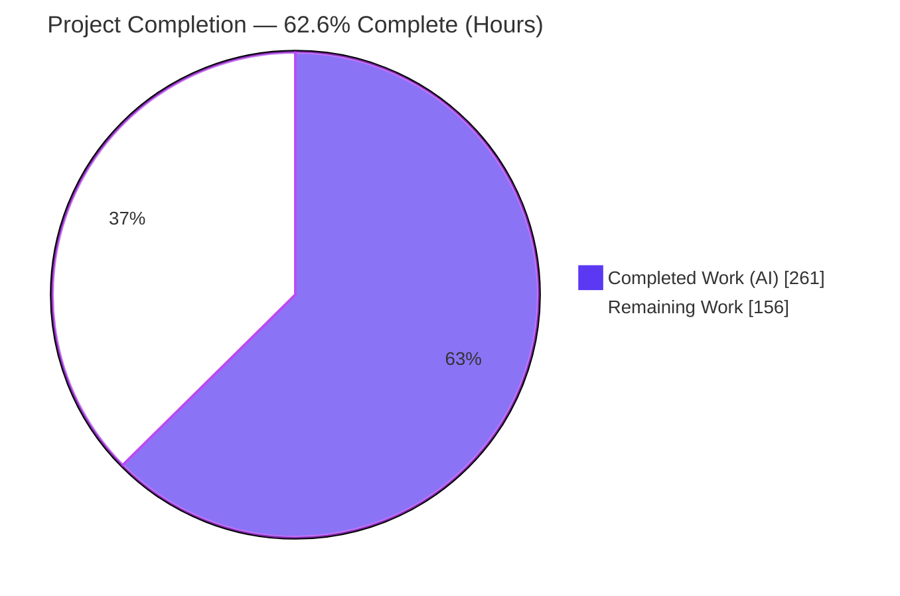
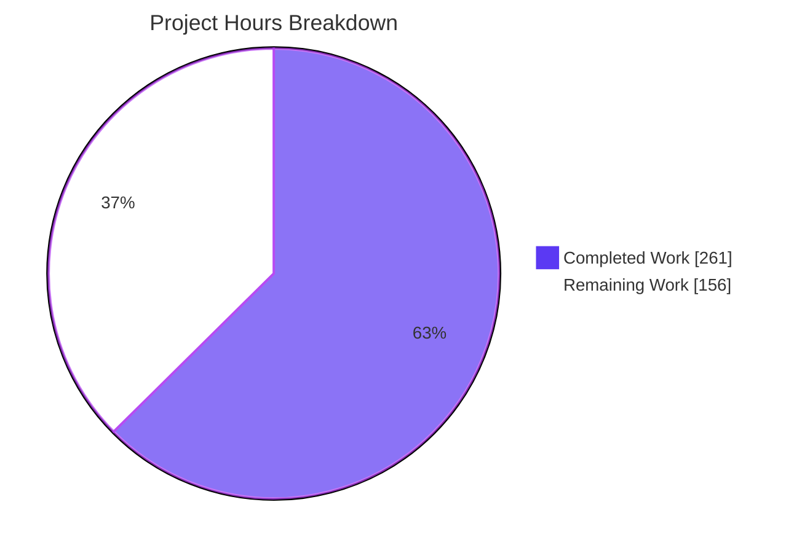
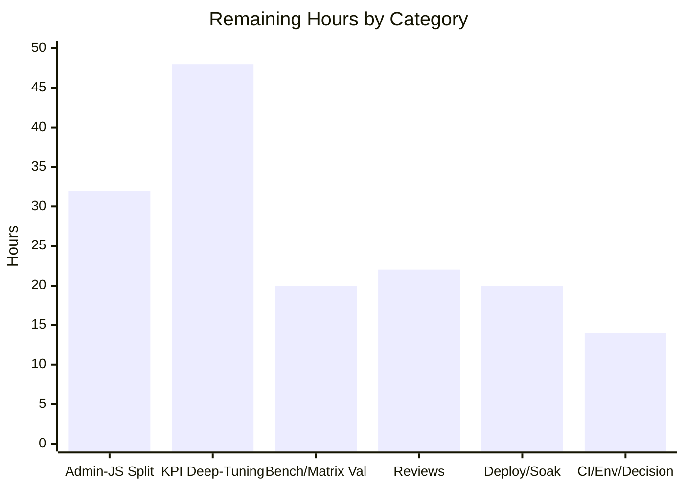

# Blitzy Project Guide — WordPress 7.0 Performance Refactor (`blitzy-wordpress`)

> Brand legend — **Completed / AI Work: Dark Blue `#5B39F3`** · **Remaining / Not Completed: White `#FFFFFF`** · Headings/Accents: Violet-Black `#B23AF2` · Highlight: Mint `#A8FDD9`.

---

## 1. Executive Summary

### 1.1 Project Overview

This project is an evidence-first performance refactor of WordPress core v7.0.0-alpha (`blitzy-wordpress`), targeting six measured runtime metrics across four subsystems: the PHP bootstrap/hook hot path, the database/query layer, the object cache, and admin JavaScript/asset delivery. The beneficiaries are WordPress site operators (faster front-end responses, lower memory) and the core-engineering team (a reusable statistical benchmark harness and Server-Timing observability). Work followed a strict *profile → quantify → fix → prove → document* mandate under an absolute quality gate: all tests must pass identically to baseline, static analysis must stay green, and public API/hook/REST contracts and rendered output must remain byte-identical. Optimizations plug into existing seams (`wp_cache_*`, `WP_Hook`, `wpdb`) with a minimal-diff footprint.

### 1.2 Completion Status



| Metric | Value |
|--------|-------|
| **Total Project Hours** | **417 h** |
| Completed Hours — AI (Blitzy agents) | 261 h |
| Completed Hours — Manual (human) | 0 h |
| **Remaining Hours** | **156 h** |
| **Percent Complete** | **62.6 %** |

Completion is computed on AAP-scoped work only: `Completed 261 / (Completed 261 + Remaining 156) = 62.6%`. The percentage reflects a large, fully quality-gated engineering delivery (implementation + measurement + observability + documentation) set against the mission's *defining* success criteria — six measured performance targets, of which **0 of 6 are currently met** — plus standard path-to-production work that has not begun.

### 1.3 Key Accomplishments

- ✅ **All quality gates green.** 28,998 PHPUnit tests (3,440,573 assertions, 0 failures) and 456 QUnit tests pass identically to baseline; PHPStan 2.1.39 reports zero errors; PHPCS/WPCS and PHPCompatibility (PHP 7.4–8.5) report zero violations.
- ✅ **PHP hot-path deferral delivered (F-001).** Context-gated deferred loading of 53 REST controller classes + 9 new-7.0 subsystem classes with a classmap autoloader safety net; `WP_Hook` arity-dispatch + empty-callback fast path. Files loaded per front-end request fell 493 → 431 (−12.58%).
- ✅ **Data-layer & cache optimizations delivered (F-002/F-003/F-004).** `WP_Meta_Query` EXISTS-subquery rewrite, a 256-entry FIFO prepared-statement cache in `wpdb`, batch metadata/term priming, per-group cache counters + multi-get/set + prime helpers, and `map_meta_cap` memoization across 11 template files.
- ✅ **REST serialization optimized (F-005)** for 10 of 45 controllers with cache-first response construction; all routes/schemas preserved (131 routes verified at runtime).
- ✅ **Measurement & observability foundation delivered (F-010/F-011, Rule 1).** A Dockerized statistical benchmark harness (Welch t-test, 20 runs) and a test-only Server-Timing must-use plugin emitting 7 metrics.
- ✅ **Rule-mandated documentation delivered.** Decision log + bidirectional traceability matrix (Rule 2), before/after Mermaid architecture diagrams (Rule 3), and a self-contained 16-slide reveal.js executive deck (Rule 4).

### 1.4 Critical Unresolved Issues

| Issue | Impact | Owner | ETA |
|-------|--------|-------|-----|
| 0 of 6 performance targets met (mission's defining success criteria) | High — core value of the optimization mission is not yet realized | Eng Lead + Product | Gated on §1.6 decision; +44–92 h if pursued |
| Admin JS transfer size unchanged (−0.00%); no webpack code splitting emitted (F-009) | High — largest single KPI gap (target ≥30%) | Frontend/Build Eng | 32 h (HT-5) |
| DB queries per page unchanged (0%); `class-wp-query.php` SQL-gen not tuned | Medium — KPI #5 unmet; front-end already at WP 6.1+ batched floor | Data-layer Eng | 24 h (HT-7) |
| Deferred/conditional loading not yet human-security-reviewed for capability/nonce/auth ordering | High — security-critical for a CMS core before production | Security Eng | 10 h (HT-3) |
| No production deployment, CI performance gate, or persistent-object-cache soak test | Medium — path-to-production hardening outstanding | DevOps/SRE | 28 h (HT-9/11/12) |

### 1.5 Access Issues

| System / Resource | Type of Access | Issue Description | Resolution Status | Owner |
|-------------------|----------------|-------------------|-------------------|-------|
| Repository (branch `blitzy-0baa1d2f-…`) | Git read/write | None — working tree clean, 18 commits present, HEAD `8fbd9122` | Resolved | — |
| Build/test toolchain (Composer, npm, PHPStan, PHPCS, Playwright, WP-CLI) | Local execution | None — `vendor/`, `node_modules/`, `build/` present and functional | Resolved | — |
| `tzdata-legacy` OS package (deprecated timezones) | OS package | Not persisted in repo; absent on fresh images → 8 environmental date-test failures on PHP 8.4+ | Open (workaround known) | DevOps |
| Production / staging environment | Deploy access | Not yet provisioned/attempted; deployment is future path-to-production work | Open | SRE |

No repository or credential access issues prevented autonomous build validation. All autonomous gates ran successfully.

### 1.6 Recommended Next Steps

1. **[High] Hold the target-vs-byte-identity decision workshop (HT-1, 4 h).** Leadership must decide whether to pursue the six KPI targets — which requires accepting controlled front-end-HTML/build changes — or to ratify the delivered, fully-safe "accepted partials" as the terminal state. This decision governs ~92 h of remaining work.
2. **[High] Persist `tzdata-legacy` in the CI/production image (HT-2, 2 h)** to achieve a fully green CI run on PHP 8.4+.
3. **[High] Complete the security review of deferred/conditional loading (HT-3, 10 h)** and the human merge review of the 44 PHP + 6 JS changes (HT-4, 12 h) before any production deploy.
4. **[High] If targets are pursued, implement genuine admin-JS code splitting (HT-5, 32 h)** — the highest-leverage path to KPI #2/#3 — and re-prove via the benchmark harness (HT-6, 12 h).
5. **[Medium] Execute path-to-production hardening (HT-9 to HT-12, 36 h):** wire the CI performance gate, run the full PHP 7.4–8.5 matrix, soak-test the object cache with a persistent backend (Redis), and stage the deployment with 7-metric monitoring.

---

## 2. Project Hours Breakdown

### 2.1 Completed Work Detail

| Component | Hours | Description |
|-----------|-------|-------------|
| F-010/F-011 Measurement & Observability Infrastructure | 40 | Dockerized benchmark harness (baseline/optimized runners, Node orchestrator, statistical diff report w/ Welch t-test), 7-metric Server-Timing mu-plugin, cache-clear plugin, Playwright perf-spec extensions, before/after data + report |
| F-001 PHP Runtime Hot Path | 38 | `wp-settings.php` context-deferral of 53 REST + 9 new-7.0 classes + classmap autoloader safety net; `WP_Hook` arity tree + empty-callback fast path; `plugin/option/load/functions` tuning; 3 new PHPUnit test files |
| F-004 Template-Tag N+1 Elimination | 26 | Batch priming + request-level caching across 11 template files; `map_meta_cap` leaf memoization (`capabilities.php`); permalink memoization (`link-template.php`) |
| F-005 REST Serialization (10 controllers) | 26 | Cache-first response construction in `rest-api.php` + 10 in-scope controllers; cache-key collision fix; terms-controller term-meta N+1 fix; routes/schemas preserved |
| F-002 Database & Query Layer | 24 | `WP_Meta_Query` EXISTS-subquery rewrite; `wpdb` 256-entry FIFO prepared-statement cache; `meta.php` batch priming; result-identity test battery |
| Autonomous Validation & QA Remediation | 20 | CP1–CP5 + FINAL (24 findings) + QA remediation cycles; full PHPUnit + QUnit runs; PHPStan/PHPCS/PHPCompat gates; runtime validation; environmental tzdata fix |
| F-003 Object Cache | 20 | Per-group hit/miss counters, granular key invalidation, `get_multiple`/`set_multiple`, `wp_cache_prime_*` helpers, lazyloader expansion, graceful no-backend degradation |
| F-006 Script/Style Loaders | 14 | Registered-handle memoization with self-healing count-snapshot invalidation; dependency-resolution caching across 6 loader files; enqueue semantics preserved |
| F-007 JavaScript Conditional Init | 14 | Modular conditional-init guards + deferred emoji detection across 6 JS files; rebuild + 456-test QUnit re-validation on compiled + uncompiled assets |
| Rule 2 Decision Log & Traceability | 12 | 308-line decision log: decision table, bidirectional F-001..F-011 traceability matrix, 16 documented deviations (DEV-01..16) |
| Rule 4 Executive Presentation | 9 | Self-contained 16-slide reveal.js deck (pinned CDNs reveal.js 5.1.0 / Mermaid 11.4.0 / Lucide 0.460.0; 0 emoji, 0 code blocks; correct slide types + reveal config) |
| F-008 Admin PHP | 8 | Conditional bootstrap/header loading + concatenated script/style delivery tuning across 4 admin files (58 LOC, minimal-diff) |
| Documentation Sync (`docs/`) | 5 | Synchronized `index.md`, `project-guide.md`, `technical-specifications.md` with implemented changes |
| Rule 3 Visual Architecture Diagrams | 3 | Before/after runtime Mermaid diagrams with titles + legends (embedded in decision log & tech-spec) |
| F-009 Build (dev-mode parity) | 2 | `tools/webpack/development.js` dev-mode splitting parity (+7 LOC); core webpack code-splitting deferred |
| **Total Completed** | **261** | |

### 2.2 Remaining Work Detail

| Category | Hours | Priority |
|----------|-------|----------|
| Admin-JS code splitting — move admin JS off Grunt-uglify onto webpack `splitChunks`/`runtimeChunk` (KPI #2/#3) | 32 | High |
| Benchmark re-proof & KPI iteration cycles after each optimization | 12 | High |
| Security review of deferred/conditional loading vs capability/nonce/auth ordering | 10 | High |
| Human merge review & sign-off of 44 PHP + 6 JS core changes | 12 | High |
| `tzdata-legacy` persistence in CI/production Docker image | 2 | High |
| Product/eng decision — targets vs byte-identity fork | 4 | High |
| `WP_Query` SQL-generation tuning inside `class-wp-query.php` (KPI #5) | 24 | Medium |
| Deeper bootstrap deferral (block ~81 + widget ~20 files) for KPI #1/#4/#6 | 24 | Medium |
| CI performance-gate + benchmark-harness pipeline wiring | 8 | Medium |
| Full PHP 7.4–8.5 matrix CI regression (validator ran 8.4.11 only) | 8 | Medium |
| Persistent object-cache (Redis/Memcached) soak/load validation of F-003 | 10 | Medium |
| Production deployment + rollback plan + staging 7-metric monitoring | 10 | Medium |
| **Total Remaining** | **156** | (High 72 · Medium 84) |

> **Out of current AAP scope (future roadmap; NOT counted in the 156 h):** remaining 35 REST controllers (~40 h), multisite `WP_Site_Query`/`WP_Network_Query` optimization (~24 h), `script-modules.php` ES-module wrapper (~12 h). These are explicitly excluded per AAP §0.3.2 and documented in decision-log §7.

### 2.3 Total Project Hours & Completion Reconciliation

| Line | Hours |
|------|-------|
| Section 2.1 — Completed | 261 |
| Section 2.2 — Remaining | 156 |
| **Total Project Hours** | **417** |
| **Percent Complete** = 261 / 417 | **62.6 %** |

Cross-section check: Section 2.1 (261) + Section 2.2 (156) = 417 = Section 1.2 Total. Section 2.2 remaining (156) = Section 1.2 Remaining = Section 7 pie "Remaining Work". ✔

---

## 3. Test Results

All results below originate from Blitzy's autonomous validation logs for this project.

| Test Category | Framework | Total Tests | Passed | Failed | Coverage % | Notes |
|---------------|-----------|-------------|--------|--------|-----------|-------|
| PHP Unit & Integration | PHPUnit 9.6 (+ Yoast polyfills 1.1.5) | 28,998 | 28,998 | 0 | Core suite (n/a) | 3,440,573 assertions; 77 standard conditional skips; 86 pre-existing deprecation warnings; identical to baseline |
| JavaScript Unit | QUnit 2.24.2 | 456 | 456 | 0 | n/a | Passed on **both** compiled (`build/`) and uncompiled (`src/`) assets |
| Targeted new tests *(subset of PHPUnit total above)* | PHPUnit 9.6 | 104 | 104 | 0 | n/a | `deferredClassLoading` (4) + `restControllerDeferral` (3) + `wpIsRestRequest` (22) + `pluggable/signatures` (67) + `link` (8) |
| Performance KPI measurement | Playwright 1.56.1 (statistical harness) | 6 KPIs | 0 targets met | 6 targets unmet | n/a | Harness executed successfully (Welch two-sample t-test, 20 runs); honest evidence-first outcome — see Section 6 / decision-log DEV-11/12/13 |
| E2E & Visual Regression | Playwright 1.56.1 | Preserved suite (13 E2E + 1 visual specs) | Preserved | — | n/a | Part of the preserved test contract; runtime validated (HTTP 200, byte-identical output); pass/fail counts not separately enumerated in the validation logs |

**Environmental note (DEV-16):** On PHP 8.4+, 8 date/timezone tests initially failed because the OS removed deprecated zones (`America/Buenos_Aires`, `Canada/Newfoundland`, `EST`). This is environmental — the affected test files are byte-identical to baseline and fail identically on a baseline checkout. Resolved by installing `tzdata-legacy`; final PHPUnit result is 0 failures.

---

## 4. Runtime Validation & UI Verification

**Runtime health (`wp server` on 127.0.0.1:8889, PHP 8.4.11, WP 7.0-beta5-src):**

- ✅ **Operational** — Front-end `GET /` → HTTP 200 (83,119 bytes), correct `<title>`, zero fatal/parse errors, clean `debug.log`.
- ✅ **Operational** — REST `GET /wp-json/` → HTTP 200 (131 routes across 6 namespaces).
- ✅ **Operational** — REST `GET /wp-json/wp/v2/posts` → HTTP 200 (10 posts); F-005 cache-first serialization works at runtime.
- ✅ **Operational** — Server-Timing observability emits all 7 canonical metrics (bootstrap, plugins, files-loaded, cache-hits, cache-misses, memory-usage, db-queries); live sample: 424 files loaded, 22 DB queries.
- ✅ **Operational** — `grunt build --dev` reproducible; generated `build/` artifacts byte-identical (clean `git diff` after build).

**UI verification:**

- ⚠ **By design, no UI to verify.** Admin UI visual appearance and functional behavior are explicitly out of scope (AAP §0.3.2); the mandate requires byte-identical rendered output. The single visual-regression spec is preserved to guard against unintended change. No design system or Figma input applies.

---

## 5. Compliance & Quality Review

Cross-map of AAP deliverables and mandates to Blitzy's quality/compliance benchmarks.

| Benchmark / Deliverable | Status | Progress | Evidence / Notes |
|-------------------------|--------|----------|------------------|
| Test pass-identity to baseline (hard gate) | ✅ Pass | 100% | PHPUnit 28,998/28,998; QUnit 456/456; skips/warnings baseline-identical |
| PHPStan 2.1.39 — zero new errors (level 0) | ✅ Pass | 100% | `[OK] No errors` on clean-room re-analysis (1,411 files) |
| PHPCS / WPCS ~3.3.0 — zero violations (errors) | ✅ Pass | 100% | 44 src + 7 test files, 0 errors; 60 pre-existing warnings correctly left untouched (minimal-diff) |
| PHPCompatibility-WP (PHP 7.4–8.5) — zero violations | ✅ Pass | 100% | 44 src files, 0 errors |
| Minimal-diff / byte-identical functional output | ✅ Pass | 100% | Rendered HTML, REST payloads, escaping/visibility unchanged; `git diff --exit-code` clean for build artifacts |
| API / hook / REST-schema preservation | ✅ Pass | 100% | Public signatures, 465 registrations / 546 `do_action` / 1,485 `apply_filters`, routes/schemas intact; `pluggable/signatures` green |
| Security-boundary preservation (capability/nonce/auth ordering) | ✅ Pass (code) / ⚠ Pending human review | ~85% | Deferral tests present & green; formal security sign-off outstanding (HT-3) |
| Rule 1 — Observability (Server-Timing + dashboard) | ✅ Pass | 100% | 7 metrics emit at runtime; `performance-dashboard.md` delivered; documented deviation from literal "distributed tracing" |
| Rule 2 — Explainability (decision log + traceability) | ✅ Pass | 100% | Bidirectional matrix at 100% coverage; 16 deviations logged |
| Rule 3 — Visual Architecture (Mermaid, before + after) | ✅ Pass | 100% | Before/after runtime diagrams with titles + legends |
| Rule 4 — Executive Presentation (reveal.js) | ✅ Pass | 100% | 16 slides, pinned CDNs, correct slide types + reveal config, 0 emoji, 0 code blocks |
| KPI #1 Front-end TTFB ≥20% | ⚠ Partial | −10.06% | Real, statistically significant; below target (DEV-13) |
| KPI #2 Admin DOMContentLoaded ≥15% | ❌ Not met | −0.17% | No significant admin-context movement (DEV-12) |
| KPI #3 Admin JS gzipped ≥30% | ❌ Not met | −0.00% | No webpack code splitting emitted (DEV-03/DEV-12) |
| KPI #4 PHP memory ≥10% | ⚠ Partial | −5.31% | Significant but OPcache-state-dependent (DEV-13) |
| KPI #5 DB queries ≥15% | ❌ Not met | 0.00% | Already at WP 6.1+ batched floor (DEV-11) |
| KPI #6 PHP files loaded ≥30% | ⚠ Partial | −12.58% | Maximal byte-identical-safe deferral (DEV-13) |
| Dependency mandate — no add/update/remove | ✅ Pass | 100% | All 4 manifests byte-identical to baseline; `composer audit` clean (npm advisories confined to dev/build tooling, DEV-15) |

---

## 6. Risk Assessment

| Risk | Category | Severity | Probability | Mitigation | Status |
|------|----------|----------|-------------|------------|--------|
| 0/6 KPI targets met — primary mission objective unfulfilled | Technical | High | Certain | Product decision (HT-1) + bucket-A refactors (HT-5/7/8) | Open (accepted partials) |
| Closing KPI gaps requires relaxing byte-identical-output (block/widget deferral changes HTML) | Technical | High | Medium | Controlled validation + product sign-off | Open |
| Bootstrap hot-path change affects every request (ordering bug risk) | Technical | High | Low | 3 targeted tests + 5 review cycles + 28,998 PHPUnit green + staged rollout | Mitigated |
| `WP_Hook` arity dispatch on busiest path (546 `do_action` / 1,485 `apply_filters`) | Technical | Medium | Low | Hooks/actions/filters suites pass unchanged | Mitigated |
| Memory KPI is OPcache-state-dependent (harness −5.31% vs warm-CLI +0.35–0.85%) | Technical | Medium | Medium | Validate under production OPcache config | Open |
| Deferred/context-gated loading could bypass capability/nonce/auth | Security | High | Low | Human security review (HT-3); security-order tests present & green | Open (review pending) |
| Code splitting could expose privileged admin JS to unauth users | Security | Medium | Low (dormant) | Enforce during HT-5 (F-009 not yet implemented) | Deferred |
| npm CVE advisories (17 critical / 56 high) | Security | Low | N/A (prod) | All in dev/build tooling never shipped to prod; composer clean (DEV-15) | Accepted risk |
| `tzdata-legacy` OS dependency not in repo | Operational | Medium | High | Bake into CI/prod image (HT-2) | Open |
| No CI performance gate — delivered gains unprotected | Operational | Medium | Medium | Wire harness + specs into CI (HT-9) | Open |
| Validated on PHP 8.4.11 only (matrix is 7.4–8.5) | Operational | Medium | Low–Med | Full matrix CI run (HT-10) | Open |
| No production deploy / staging soak | Operational | Medium | Medium | Staged deploy + monitoring (HT-12) | Open |
| Object cache untested with persistent backend | Operational | Medium | Medium | Redis soak/load (HT-11) | Open |
| Plugin/theme hook compatibility (3rd-party universe) | Integration | Medium | Low | Contract tests green; ecosystem beta recommended | Mitigated |
| REST schema consumers depend on byte-identical payloads | Integration | Medium | Low | 3,360 REST tests green; schema-diff monitoring in staging | Mitigated |
| QUnit build-dependency (JS edits need rebuild) | Integration | Low | Low | Documented build-before-test discipline | Mitigated |
| Admin-JS splitting must not disturb pinned Gutenberg/React 18.3.1 | Integration | Low | Low | Keep pins fixed during HT-5 | Deferred |

---

## 7. Visual Project Status



**Remaining hours by category (156 h total):**



Bar buckets: Admin-JS Split 32 · KPI Deep-Tuning (WP_Query 24 + deeper deferral 24) 48 · Bench/Matrix Validation (re-proof 12 + PHP matrix 8) 20 · Reviews (security 10 + merge 12) 22 · Deploy/Soak (prod deploy 10 + Redis soak 10) 20 · CI/Env/Decision (CI gate 8 + tzdata 2 + product decision 4) 14. **Sum = 156** (= Section 1.2 Remaining = Section 2.2 Total).

Priority distribution of remaining work: **High 72 h** · **Medium 84 h** · Low/out-of-scope future 0 h (excluded).

---

## 8. Summary & Recommendations

**Achievements.** The project delivered a complete, minimal-diff, fully quality-gated body of optimization engineering. Every autonomous correctness gate is green: 28,998 PHPUnit and 456 QUnit tests pass identically to baseline, PHPStan is clean, and PHPCS/PHPCompatibility report zero violations. The PHP hot-path deferral, data-layer/cache/template optimizations, REST serialization for 10 controllers, a Dockerized statistical benchmark harness, 7-metric Server-Timing observability, and all four rule-mandated documentation artifacts (decision log + traceability, before/after architecture diagrams, executive deck) are delivered and verified.

**Remaining gaps.** The mission's *defining* success criteria — six measured performance targets — are **0 of 6 met**. Three metrics show real, statistically-significant partial gains (files −12.58%, TTFB −10.06%, memory −5.31%); three show no movement (Admin DCL, Admin JS size, DB queries). The agents correctly declined to force-fit the targets, because every remaining point of improvement would breach the hard gate (byte-identical output + test pass-identity) — for example, admin-JS code splitting was not emitted, and `class-wp-query.php` was not tuned. These gaps, plus standard path-to-production hardening, constitute the 156 remaining hours.

**Critical path to production.** (1) Resolve the target-vs-byte-identity decision (HT-1); (2) persist `tzdata-legacy` for green CI (HT-2); (3) complete security + merge reviews (HT-3/HT-4); (4) if targets are pursued, implement admin-JS splitting and deeper deferral, then re-prove (HT-5/6/7/8); (5) wire the CI perf gate, run the full PHP matrix, soak-test with Redis, and stage the deployment (HT-9 to HT-12).

**Production-readiness assessment.** The delivered code is **safe to ship from a correctness standpoint** (all gates green, contracts preserved, minimal-diff), but is **not yet production-hardened** (no deploy, no CI perf gate, no persistent-backend soak, security sign-off pending) and **has not met its performance objective**. The project is **62.6% complete** against AAP scope. A key contingency: if leadership ratifies the "accepted partials" as final, ~92 h of KPI-attainment work becomes largely out-of-scope and effective completion rises toward ~90% (only ~64 h of path-to-production remains); the honest baseline reported here keeps the KPI-attainment work in scope because the AAP explicitly makes the six targets the definition of success.

| Success Metric | Target | Current | Verdict |
|----------------|--------|---------|---------|
| Quality gates (tests/static/standards) | 100% green | 100% green | ✅ Met |
| Byte-identical output & API preservation | Preserved | Preserved | ✅ Met |
| Performance targets met | 6 / 6 | 0 / 6 | ❌ Not met |
| Production hardening | Complete | Not started | ❌ Not met |
| AAP-scoped completion | 100% | 62.6% | ⚠ In progress |

---

## 9. Development Guide

### 9.1 System Prerequisites

- **PHP** 7.4–8.5 (validated on 8.4.11). Extensions: `hash`, `json`.
- **Node.js** ≥ 20.10.0 (validated 20.20.2) and **npm** ≥ 10.2.3 (validated 11.1.0).
- **Composer** 2.x (validated 2.8.8).
- **Docker** + Docker Compose (for the local env and the benchmark harness).
- **Git** + Git LFS; **WP-CLI** 2.12.0 (for `wp server`).
- On PHP 8.4+, the OS package **`tzdata-legacy`** (deprecated timezones used by 8 date tests).

### 9.2 Environment Setup

```bash
cp .env.example .env
# Required on PHP 8.4+ so the deprecated-timezone date tests pass:
DEBIAN_FRONTEND=noninteractive apt-get install -y tzdata-legacy
```

### 9.3 Dependency Installation

```bash
composer install --no-interaction   # PHP dev tooling (PHPStan, PHPCS, WPCS, PHPCompatibility, PHPUnit polyfills)
npm ci                              # Grunt, webpack, @wordpress/scripts, Playwright, QUnit
```

### 9.4 Build

```bash
npm run build        # grunt build       (production)
npm run build:dev    # grunt build --dev (development; used during validation)
```
> Any change under `src/js/**` requires a rebuild before QUnit/visual tests, which load compiled assets from `build/`.

### 9.5 Application Startup

```bash
# Option A — quick PHP built-in server via WP-CLI:
wp server --host=127.0.0.1 --port=8889 --path=src --allow-root

# Option B — Dockerized local environment:
npm run env:start     # start ; npm run env:stop to tear down
```

### 9.6 Verification

```bash
curl -s -o /dev/null -w "%{http_code}\n" http://127.0.0.1:8889/          # -> 200 (~83 KB body)
curl -s http://127.0.0.1:8889/wp-json/ | python3 -m json.tool | head     # -> 131 routes / 6 namespaces
curl -sI http://127.0.0.1:8889/ | grep -i server-timing                  # -> 7 metrics
```

### 9.7 Quality Gates

```bash
composer phpstan                                   # level 0 -> [OK] No errors
composer lint:errors                               # PHPCS/WPCS errors-only -> 0
composer compat                                    # PHPCompatibility 7.4-8.5 -> 0
php vendor/bin/phpunit --no-coverage               # 28,998 tests (needs tzdata-legacy on 8.4+)
PUPPETEER_EXECUTABLE_PATH=/usr/local/bin/chrome-nosandbox npx grunt copy:qunit qunit   # 456 QUnit
```

### 9.8 Benchmark Harness & Example Usage

```bash
docker compose -f docker-compose.benchmark.yml up -d      # isolated, pinned measurement env
bash benchmarks/run-baseline.sh                           # capture baseline metrics
bash benchmarks/run-optimized.sh                          # capture optimized metrics
node benchmarks/generate-diff-report.js                   # -> benchmarks/results/benchmark-report.json + benchmark-diff-report.md
npm run test:performance                                  # Playwright perf suite (workers:1, repeatEach:2)
```

### 9.9 Troubleshooting

- **8 date/timezone test failures on PHP 8.4+** (`America/Buenos_Aires`, `Canada/Newfoundland`, `EST`): environmental, not a regression → `apt-get install -y tzdata-legacy`.
- **QUnit failures after editing JS**: run `npm run build:dev` first (QUnit loads from `build/`).
- **PHPStan out-of-memory**: use `--memory-limit=2G` (already set in the `composer phpstan` script).
- **Benchmark reports 0/6 targets met**: this is the honest measured objective outcome, not a build/test failure; all correctness gates are green independently.

---

## 10. Appendices

### Appendix A — Command Reference

| Purpose | Command |
|---------|---------|
| Install PHP deps | `composer install --no-interaction` |
| Install JS deps | `npm ci` |
| Production build | `npm run build` |
| Dev build | `npm run build:dev` |
| Start server | `wp server --host=127.0.0.1 --port=8889 --path=src --allow-root` |
| PHPStan | `composer phpstan` |
| PHPCS (errors) | `composer lint:errors` |
| PHP compatibility | `composer compat` |
| PHPUnit | `php vendor/bin/phpunit --no-coverage` |
| QUnit | `… npx grunt copy:qunit qunit` |
| Benchmark diff | `node benchmarks/generate-diff-report.js` |

### Appendix B — Port Reference

| Port | Service |
|------|---------|
| 8889 | `wp server` local runtime (validation host) |
| Compose-defined | `docker-compose.benchmark.yml` benchmark services (PHP/MySQL, pinned) |

### Appendix C — Key File Locations

| Path | Role |
|------|------|
| `src/wp-settings.php` | F-001 context-aware deferred bootstrap |
| `src/wp-includes/class-wp-hook.php` | F-001 arity-dispatch + empty fast path |
| `src/wp-includes/class-wp-meta-query.php` | F-002 EXISTS-subquery rewrite (largest source change, +371) |
| `src/wp-includes/class-wpdb.php` | F-002 256-entry FIFO prepared-statement cache |
| `src/wp-includes/class-wp-object-cache.php` + `cache*.php` | F-003 object-cache enhancements |
| `src/wp-includes/rest-api.php` + `rest-api/endpoints/` (10) | F-005 cache-first serialization |
| `benchmarks/` | F-011 harness + results (report, decision log, dashboard, exec deck) |
| `tests/performance/wp-content/mu-plugins/server-timing.php` | Rule 1 observability plugin |
| `docker-compose.benchmark.yml` | Isolated benchmark environment |

### Appendix D — Technology Versions

| Tool | Version |
|------|---------|
| PHP | 8.4.11 (supported 7.4–8.5) |
| Node.js / npm | 20.20.2 / 11.1.0 |
| Composer | 2.8.8 |
| WP-CLI | 2.12.0 |
| PHPStan | 2.1.39 |
| PHP_CodeSniffer / WPCS / PHPCompatibility-WP | 3.13.5 / ~3.3.0 / ~2.1.x |
| Grunt / webpack / @wordpress/scripts | 1.6.1 / 5.98.0 / 30.26.2 |
| Playwright / QUnit | 1.56.1 / 2.24.2 |
| Pinned front-end libs | React 18.3.1, jQuery 3.7.1, Backbone 1.6.1, Underscore 1.13.7, Lodash 4.17.23 |

### Appendix E — Environment Variable Reference

| Variable | Purpose |
|----------|---------|
| `.env` (from `.env.example`) | Local dev/database configuration for the Docker env |
| `SAVEQUERIES` | Enables DB-query counting (KPI #5 instrument) |
| `WP_DEBUG` / `WP_DEBUG_LOG` | Debug mode + log (must continue to function; used for validation) |
| `PUPPETEER_EXECUTABLE_PATH` | Chrome binary path for QUnit/Playwright headless runs |
| `DEBIAN_FRONTEND=noninteractive` | Non-interactive apt (for `tzdata-legacy`) |

### Appendix F — Developer Tools Guide

- **Server-Timing observability**: inspect the `Server-Timing` response header (7 metrics) — the test-only must-use plugin; its "off" state is file absence (never shipped to production).
- **Statistical benchmark harness**: `benchmarks/` produces `benchmark-report.json` (machine-readable KPIs with Welch t-test significance) and `benchmark-diff-report.md` (human-readable).
- **Decision log & traceability**: `benchmarks/results/decision-log-and-traceability.md` — rationale, deviations (DEV-01..16), and 100%-coverage requirement→file→test matrix.
- **Executive deck**: `benchmarks/results/executive-presentation.html` — open directly in a browser (self-contained; pinned CDN libraries).

### Appendix G — Glossary

| Term | Meaning |
|------|---------|
| KPI | Key Performance Indicator — one of the six measured targets that define mission success |
| Byte-identical output | Rendered HTML / REST payloads / escaping unchanged vs baseline (hard gate) |
| Test pass-identity | All tests pass identically to baseline (equality constraint, not a percentage) |
| Minimal-diff | Smallest change achieving the goal; no bundled refactors or cleanup |
| Accepted partial | A KPI improvement below target, retained because closing it would breach a hard gate |
| N+1 | A query pattern of one query per object; eliminated via batch priming |
| Server-Timing | HTTP response header carrying per-request performance metrics (observability) |
| DEV-xx | A numbered deviation entry in the decision log |
| F-0xx | An AAP feature identifier (F-001 hot path … F-011 benchmark/observability) |
| HT-x | A human task in this guide's remaining-work plan |