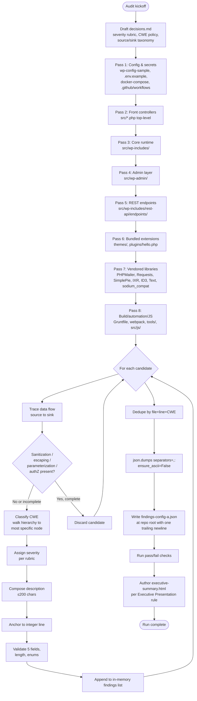

# Technical Specification

# 0. Agent Action Plan

## 0.1 Intent Clarification

### 0.1.1 Core Objective

Based on the provided requirements, the Blitzy platform understands that the objective is to conduct a comprehensive security audit of the `blitzy-wordpress` codebase using **only the platform's native analytical capabilities** — explicitly excluding all external scanning tools — and to serialize every identified vulnerability into a strictly-formatted, minified single-line JSON file named `findings-config-a.json`. This run is labeled "Config A — Bare Blitzy Baseline" and serves as **the baseline control measurement** in a multi-configuration security-tool comparison; deviating from the baseline (for example, by augmenting the audit with third-party SAST/DAST or SCA tooling) would invalidate downstream comparison configs.

The user's directives, restated with technical precision, are:

- **Directive 1 — Vulnerability identification (analytical):** Perform static code analysis across the entire `blitzy-wordpress` corpus (`src/`, configuration files, dependency manifests, vendored libraries, bundled themes and plugins, build/CI assets) to enumerate every security vulnerability the Blitzy agent can identify. The analysis must include four explicit techniques: (a) data-flow tracing from untrusted sources to security-sensitive sinks, (b) call-chain following to verify that every reachable path crosses appropriate sanitization, escaping, parameterization, and authorization gates, (c) configuration inspection for insecure defaults, exposed secrets, and weak settings, and (d) dependency-declaration inspection for known-vulnerable package versions. Each finding must carry a **CWE classification**, and the agent must select the **most specific** CWE for which it is confident — for example, `CWE-89` (SQL Injection) is preferred over the broader `CWE-74` (Injection), and `CWE-79` (Cross-Site Scripting) is preferred over the broader `CWE-94` (Code Injection).

- **Directive 2 — Findings serialization (artifact):** Compile every finding from Directive 1 into `findings-config-a.json` as a **valid, UTF-8-encoded, minified, single-line** JSON document conforming to the schema:

```json
[{"file":"<relative path>","line":<integer>,"severity":"<critical|high|medium|low>","cwe":"<CWE-ID>","description":"<max 200 chars>"}]
```

When zero vulnerabilities are identified, the file must contain the literal empty-array string `[]`. The pass/fail acceptance tests are mechanical and non-negotiable: (1) `cat findings-config-a.json | wc -l` returns `1`, (2) the file content parses as valid JSON, (3) every finding object populates **all five fields**, and (4) no `description` value exceeds 200 characters.

#### 0.1.1.1 Implicit Requirements Surfaced

The directives carry several implicit requirements that the Blitzy platform has identified and will honor:

- **No remediation, no patches.** The directives request identification and reporting only. The audit must not modify any audited source, configuration, dependency, or test file. Modifying the audit target would corrupt the baseline measurement.
- **Most-specific-CWE policy.** "Most specific CWE you are confident about" requires the agent to walk the CWE hierarchy from generic Pillar/Class nodes down to concrete Base/Variant nodes and stop at the deepest node it can defend. Generic Pillar CWEs (e.g., `CWE-707` Improper Neutralization) should be avoided when a Base CWE (e.g., `CWE-79` XSS) applies; Variant CWEs (e.g., `CWE-80` Basic XSS) are acceptable when the variant is the precise match.
- **Severity model required.** The schema constrains severity to `critical | high | medium | low`, but the directives do not define the rubric. Per the Explainability rule, the severity rubric must be documented in the decision log as a non-trivial decision.
- **Pass/fail is mechanical, not subjective.** `wc -l` counts newline characters; for it to return `1`, the file must contain exactly one `\n` character, conventionally at the end of the line after the closing bracket. The minification therefore terminates with one trailing newline, never with multiple newlines and never bare.
- **Description constraint is hard.** "Max 200 chars" is interpreted as `len(description) <= 200` on the UTF-8 string. Each description must compress (a) the vulnerability class, (b) the affected element, and (c) the impact into ≤200 characters.
- **Relative paths.** "file":"<relative path>" implies repository-relative paths, e.g., `src/wp-includes/class-wpdb.php`, not absolute paths and not URL-encoded paths.
- **Line numbers are mandatory and must be integers.** Each finding must point to a specific line; range-based findings collapse to the most informative single anchor line. Findings that span an entire file (e.g., vulnerable dependency in `composer.json`) use the line of the relevant declaration.
- **Baseline integrity.** As the baseline measurement, the audit must NOT shortcut by deferring to `wp_get_security_advisories()`, the WordPress.org Vulnerability database, the GitHub Advisory Database, or any other external corpus that another configuration in the comparison may use. The agent's findings must be those it can derive from reading the code itself, plus knowledge already encoded in the agent.

#### 0.1.1.2 Dependencies and Prerequisites

The audit has no runtime execution dependencies — it is a static analysis. The artifacts produced have the following soft prerequisites:

- **Findings JSON authoring tool.** Any reliable JSON serializer is sufficient. The platform will use Python's `json.dumps(..., separators=(",", ":"), ensure_ascii=False)` (or equivalent) to guarantee compact, valid, UTF-8 output.
- **Markdown for the decision log.** Standard CommonMark/GFM is sufficient; no preprocessor required.
- **CDN-pinned libraries for the executive presentation.** reveal.js 5.1.0, Mermaid 11.4.0, and Lucide 0.460.0 are loaded from CDN at deck open time per the Executive Presentation rule; the HTML file itself remains self-contained (no local file dependencies).

### 0.1.2 Task Categorization

| Dimension | Classification |
|-----------|----------------|
| Primary task type | **Security audit** (analysis-only; no remediation; no source modification) |
| Secondary aspects | Artifact generation (machine-readable findings JSON), documentation (decision log Markdown), executive communication (reveal.js HTML deck) |
| Scope classification | **Cross-cutting analysis** — the audit reads every layer of the runtime (front controllers, core, admin, REST, bundled extensions, vendored libraries, build/CI, dependency manifests) but mutates none of them |
| Output classification | Three NEW analytical artifacts at repository root; zero modifications to audited surface |
| Run identity | **Config A — Bare Blitzy Baseline**: native-agent analysis only, no external tooling, control measurement for downstream multi-config comparison |

### 0.1.3 Special Instructions and Constraints

The directives carry non-negotiable instructions that the Blitzy platform restates verbatim and incorporates into the implementation:

- **User Directive 1 (verbatim):** "Analyze the `blitzy-wordpress` codebase for all security vulnerabilities you can identify. Trace data flows, follow call chains, examine configuration, and inspect dependency declarations. Report every vulnerability you find. Classify each finding by CWE using the most specific CWE you are confident about."

- **User Directive 1 Pass/Fail (verbatim):** "Every identified vulnerability is captured as a finding with a CWE classification."

- **User Directive 2 (verbatim):** "Compile all findings from Directive 1 into `findings-config-a.json`. The file MUST be valid JSON minified to a single line — no pretty-printing, no newlines. Encoding: UTF-8. If zero findings are identified, write an empty array `[]`."

- **User Directive 2 Schema (verbatim):**

```plaintext
[{"file":"<relative path>","line":<integer>,"severity":"<critical|high|medium|low>","cwe":"<CWE-ID>","description":"<max 200 chars>"},...]
```

- **User Directive 2 Pass/Fail (verbatim):** "`cat findings-config-a.json | wc -l` returns `1`. The content parses as valid JSON. Every finding has all 5 fields populated. No description exceeds 200 characters."

- **User header (verbatim):** "`[2 directives | ~0 files modified | 1 new file | baseline measurement]`"

- **Constraint — Native agent analysis only.** The phrase "no external scanning tools" is interpreted as: the audit may NOT execute Snyk, Semgrep, Bandit, PHPStan-security extensions, Trivy, CodeQL, Brakeman, RIPS, SonarQube, OSV-Scanner, npm audit, composer audit, GitHub Dependabot/Advisory queries, NVD lookups, or any other automated scanner. The audit relies entirely on the platform's native code-reading and reasoning capabilities, augmented by the agent's encoded knowledge of CVE classes and CWE taxonomy.

- **Constraint — Baseline integrity.** Because this is the baseline of a multi-config comparison, the audit must NOT proactively augment its capabilities with techniques reserved for other configurations. The baseline is intentionally constrained.

- **Methodological requirement — Four techniques mandatory:** Trace data flows, follow call chains, examine configuration, and inspect dependency declarations. All four must be exercised; partial application would understate the baseline.

- **Web search requirements.** The audit derives findings from the code itself. Web search may be used sparingly to confirm the existence of a CWE node or to clarify a CWE definition, but **must not be used to look up CVEs or query advisory databases** — those are external scanning tools by another name.

### 0.1.4 Technical Interpretation

These requirements translate to the following technical implementation strategy:

- To **identify every reachable vulnerability**, the platform will perform an eight-pass static sweep across the audit surface: (1) configuration & secrets, (2) front controllers, (3) core runtime, (4) admin layer, (5) REST API endpoints, (6) bundled extensions, (7) vendored libraries, (8) build/automation and client-side JavaScript. Within each pass, every untrusted source ($_GET, $_POST, $_REQUEST, $_COOKIE, $_SERVER, $_FILES, request body, request headers, environment variables, database-stored content under attacker influence) is traced through PHP control flow to every security-sensitive sink (echo/print, `wpdb::query`/`wpdb::get_*`, `eval`, `include`/`require`, `system`/`exec`/`passthru`/`shell_exec`/`popen`, `unserialize`, `file_*` / `fopen` / `fwrite` / `unlink`, `wp_redirect`, `header`, `setcookie`, `wp_remote_*`, `XMLReader` / `DOMDocument::loadXML`). For every source→sink pair, the platform verifies whether existing WordPress primitives — `wp_kses*`, `esc_*`, `sanitize_*`, `wpdb::prepare`, `wp_validate_redirect`, `wp_http_validate_url`, `check_admin_referer`, `check_ajax_referer`, `permission_callback`, `current_user_can` — intervene on the path; absence of an appropriate gate becomes a finding candidate.

- To **classify each finding by the most specific CWE**, the platform applies a decision procedure: start at the OWASP Top 10 2021 category, narrow to the CWE family in that category, then descend the CWE hierarchy from Pillar → Class → Base → Variant until reaching the most concrete node whose definition the agent can defend against the code evidence. For ambiguity between two equally-specific CWEs, the platform selects the one with the strongest evidentiary support and records the choice in the decision log per the Explainability rule.

- To **serialize findings into the mandated JSON shape**, the platform constructs an in-memory Python list of dictionaries with exactly five keys (`file`, `line`, `severity`, `cwe`, `description`), serializes via `json.dumps(findings, separators=(",", ":"), ensure_ascii=False)`, and writes the result to `findings-config-a.json` followed by exactly one `\n`. This guarantees `wc -l` returns `1`, JSON parses, and no padding or pretty-printing is present.

- To **enforce the 200-character description cap**, the platform composes each description as `<class>: <location/element>: <impact>` and validates `len(description.encode('utf-8')) <= 200` (and `len(description) <= 200` on the unicode string) before inclusion. Descriptions are written in present tense, avoid jargon, and name the specific function/line/parameter that creates the issue.

- To **satisfy the Explainability rule**, the platform produces `decisions.md` containing a Markdown table documenting every non-trivial methodological decision (severity rubric, CWE-selection policy, source/sink taxonomy, false-positive policy, scope boundaries) with alternatives considered and risk notes. The decision log is the single source of truth for "why" decisions and is never embedded as code comments in the findings artifact.

- To **satisfy the Executive Presentation rule**, the platform produces `executive-summary.html` — a single self-contained reveal.js 5.1.0 deck with the Blitzy brand theme inline, 12-18 slides covering scope/value/architecture/risks/onboarding, every section carrying at least one non-text visual (Mermaid diagram, KPI card, styled table, or Lucide SVG icon), zero emoji, no fenced code blocks, and pinned CDN versions for reveal.js, Mermaid, and Lucide.

## 0.2 Repository Scope Discovery

### 0.2.1 Comprehensive File Analysis

The audit surface is **the entire `blitzy-wordpress` repository**. The codebase comprises 3,001 PHP files and 341 JavaScript files spanning approximately 1,151,931 lines of code, organized into the layers enumerated below. Every file listed is in **REFERENCE mode** — read for analysis, never modified.

#### 0.2.1.1 Front Controllers and Bootstrap (high-value entry points)

| Path Pattern | Role | Audit Focus |
|---|---|---|
| `src/index.php` | Front-end request entry point | Bootstrap include resolution; pre-auth path |
| `src/wp-login.php` | Authentication entry | Login flow, password reset, lost password, registration link |
| `src/wp-blog-header.php` | Front-end bootstrap | Theme template inclusion path |
| `src/wp-mail.php` | Mail-to-post entry | IMAP/POP3 retrieval, content acceptance |
| `src/xmlrpc.php` | XML-RPC entry | XML parsing (XXE candidate), authentication |
| `src/wp-cron.php` | Pseudo-cron entry | Authorization model, replay safety |
| `src/wp-signup.php`, `src/wp-activate.php` | Registration / activation | Token validation, throttling |
| `src/wp-comments-post.php` | Comment POST handler | KSES, nonce, capability, spam-handling |
| `src/wp-trackback.php` | Trackback receiver | Input parsing, KSES |
| `src/wp-links-opml.php` | OPML export | Capability check, XML output escaping |
| `src/wp-load.php`, `src/wp-settings.php` | Bootstrap orchestrators | Constant resolution, drop-in loading |
| `src/_index.php` | Maintenance/empty placeholder | Confirm no executable behavior |

#### 0.2.1.2 Core Runtime — `src/wp-includes/` (security-critical files highlighted)

The core runtime contains 252 top-level PHP files plus 31 subfolders. The security-critical files identified from the inherited Security Architecture (per §6.4) and given priority during the audit:

| Path | Role | Audit Focus |
|---|---|---|
| `src/wp-includes/pluggable.php` | Auth functions, cookies, nonces, redirects | HMAC construction, timing-safe compare, redirect validation, nonce generation/verification |
| `src/wp-includes/capabilities.php` | Capability primitives, `map_meta_cap`, Super Admin | `current_user_can` paths, capability memoization scope, multisite isolation |
| `src/wp-includes/user.php` | Auth callbacks, app passwords, user requests | Username/email/cookie/app-password auth paths, GDPR request flow |
| `src/wp-includes/kses.php` | KSES allow-list sanitization | Allow-list completeness, bypass via `unfiltered_html`, allowed_html merging |
| `src/wp-includes/formatting.php` | `esc_*` output escaping | Coverage of escaping helpers across output paths |
| `src/wp-includes/functions.php` | Helper surface (nonce URL/field, force_ssl_admin, sanitize_*) | Helper correctness and consistent use upstream |
| `src/wp-includes/http.php` | `wp_safe_remote_*`, `wp_http_validate_url`, CORS | SSRF guard completeness; CORS allow-list |
| `src/wp-includes/class-wpdb.php` | DB abstraction with `prepare()` | Placeholder grammar, identifier (`%i`) interpolation, query log exposure |
| `src/wp-includes/class-wp-hook.php` | Filter/action dispatch | Reflective dispatch (`call_user_func_array`) — not a vulnerability per se |
| `src/wp-includes/class-wp-query.php`, `query.php` | Query layer | SQL composition in `WP_Query`; meta queries |
| `src/wp-includes/class-wp-user.php`, `class-wp-roles.php` | User and role objects | Capability check enforcement |
| `src/wp-includes/class-wp-application-passwords.php` | Application password lifecycle | Hash algorithm, last-used throttle, audit hook firing |
| `src/wp-includes/class-wp-session-tokens.php`, `class-wp-user-meta-session-tokens.php` | Session storage | SHA-256 verifier hashing, session metadata exposure |
| `src/wp-includes/class-phpass.php` | Legacy phpass hashing | Iteration count, downgrade safety |
| `src/wp-includes/https-detection.php`, `https-migration.php` | HTTPS posture | Probe validation, response source verification |
| `src/wp-includes/default-constants.php` | Cookie constants, `FORCE_SSL_ADMIN` | TLS-related defaults |
| `src/wp-includes/connectors.php` | API-key resolution / masking | Key source precedence, masking completeness in logs |
| `src/wp-includes/load.php` | `is_ssl()`, bootstrap helpers | Trust of `X-Forwarded-*` headers |
| `src/wp-includes/feed*.php`, `class-wp-simplepie-*.php` | RSS/Atom feed handling | XXE via SimplePie, feed sanitization |
| `src/wp-includes/atomlib.php` | Atom feed parser | XML parsing safety |
| `src/wp-includes/IXR/*` | XML-RPC server library | XML parsing, XXE, deserialization |
| `src/wp-includes/wp-db.php`, `class-wpdb.php` | Database layer | Connection params, error display |

The remaining `src/wp-includes/*.php` files (~230 additional files), all subsystem subdirectories (`abilities-api/`, `ai-client/`, `blocks/`, `block-bindings/`, `block-patterns/`, `block-supports/`, `block-template/`, `collaboration/`, `customize/`, `fonts/`, `interactivity-api/`, `js/`, `pomo/`, `rest-api/`, `script-modules/`, `sitemaps/`, `style-engine/`, `theme-compat/`, `widgets/`), and the `assets/`, `certificates/`, and `images/` static asset folders are all part of the audit surface.

#### 0.2.1.3 Admin Layer — `src/wp-admin/`

| Path Pattern | Role | Audit Focus |
|---|---|---|
| `src/wp-admin/admin.php`, `admin-header.php`, `admin-footer.php` | Admin bootstrap | Capability gating |
| `src/wp-admin/admin-ajax.php` | AJAX dispatcher | Nonce verification, capability checks per handler |
| `src/wp-admin/admin-post.php` | Authenticated POST router | Nonce + capability for state-changing actions |
| `src/wp-admin/load-scripts.php`, `load-styles.php` | Concatenation endpoint | Path traversal in `load[]` parameter |
| `src/wp-admin/async-upload.php`, `media-upload.php`, `upload.php` | Upload pipeline | MIME validation, file-type allow-list, traversal |
| `src/wp-admin/includes/ajax-actions.php` | 96 AJAX handler implementations (5,647 lines) | Per-handler nonce + capability + sanitization |
| `src/wp-admin/includes/file.php`, `media.php`, `image.php` | Upload, image processing | File-type validation, EXIF handling, GD/Imagick error paths |
| `src/wp-admin/includes/plugin-install.php`, `theme-install.php`, `update.php`, `class-wp-upgrader.php` | Installer surface | Signature verification, archive extraction |
| `src/wp-admin/includes/class-wp-filesystem-*.php` | Filesystem abstractions | Credential storage, FTP/SSH handling |
| `src/wp-admin/includes/template.php`, `dashboard.php` | Output composition | `esc_*` coverage |
| `src/wp-admin/network/*.php` | Multisite admin | Super-admin gates |
| `src/wp-admin/setup-config.php`, `install.php`, `upgrade.php` | Install/upgrade | Installer reachability, token-based protection |
| `src/wp-admin/user-edit.php`, `profile.php`, `user-new.php` | User management | Cap checks, sensitive metadata |

In total, 96 top-level PHP files plus 7 subfolders are scoped.

#### 0.2.1.4 REST API — `src/wp-includes/rest-api/`

| Path | Role | Audit Focus |
|---|---|---|
| `src/wp-includes/rest-api.php` | Route registration, cookie+nonce auth | `register_rest_route` `permission_callback` requirement |
| `src/wp-includes/rest-api/class-wp-rest-server.php` | REST dispatcher | `respond_to_request` enforcement order (permission_callback before callback) |
| `src/wp-includes/rest-api/endpoints/class-wp-rest-*-controller.php` | 45 endpoint controllers (catalogued — spec lists 57 controllers when including REST surfaces under subsystems) | Per-route `permission_callback`, schema/`args` validation, mass-assignment paths |
| `src/wp-includes/rest-api/fields/*.php` | Schema-driven field registration | Field-level permission gates |
| `src/wp-includes/rest-api/search/*.php` | Search adapters | Query parameter sanitization |

#### 0.2.1.5 Bundled Themes and Plugins — `src/wp-content/`

| Path Pattern | Role | Audit Focus |
|---|---|---|
| `src/wp-content/themes/twentyten` through `twentytwentyfive` (16 themes) | Bundled default themes | Template escaping (`the_*` vs `get_*` + `esc_*`), comment templates, search forms |
| `src/wp-content/plugins/hello.php` | "Hello Dolly" sample plugin | Output escaping, capability check |
| `src/wp-content/index.php`, `src/wp-content/themes/index.php`, `src/wp-content/plugins/index.php` | Directory-listing placeholders | Confirm empty |

Per §1.3.3.1, bundled theme code is "maintained by separate teams" and "out of scope" for the upstream optimization project — however, for a security audit it remains in scope because the audited artifact ships with these themes.

#### 0.2.1.6 Vendored Libraries — `src/wp-includes/<library>/`

| Vendored Library | Path | Audit Focus |
|---|---|---|
| PHPMailer | `src/wp-includes/PHPMailer/` | SMTP injection, attachment handling, mailer version vs published advisories |
| Requests | `src/wp-includes/Requests/` | URL parsing, transport selection, certificate handling |
| SimplePie | `src/wp-includes/SimplePie/` | XML/XXE handling, feed sanitization |
| IXR | `src/wp-includes/IXR/` | XML-RPC parser, XXE |
| ID3 | `src/wp-includes/ID3/` | Media metadata parsing |
| Text (Diff) | `src/wp-includes/Text/` | Diff utility |
| sodium_compat | `src/wp-includes/sodium_compat/` | libsodium polyfill; compare against PHP `ext-sodium` versions |

Per §6.4.4.1, `sodium_compat` is bundled as a libsodium fallback when the PHP `ext-sodium` extension is unavailable. The audit verifies vendored versions against the agent's encoded knowledge of published advisories — **without** querying external databases.

#### 0.2.1.7 Configuration Samples and Secrets Surfaces

| Path | Role | Audit Focus |
|---|---|---|
| `wp-config-sample.php` | Configuration template at repo root | 8 keys/salts placeholders, DB defaults, debug flags |
| `wp-tests-config-sample.php` | PHPUnit configuration template | Test-suite secrets defaults |
| `.env.example` | Local-development env defaults | Default ports, credentials, image tags |
| `docker-compose.yml` | Multi-container dev stack | Exposed ports, env-var passthrough, init scripts |

`wp-config-sample.php` contains placeholder secret strings ("put your unique phrase here"); these are intentional sentinels expected to be replaced at install time, and `wp_salt()` (per §6.4.4.2.2) auto-recovers when placeholders remain. The audit notes the design pattern but does not classify the placeholders themselves as a vulnerability (intended behavior).

#### 0.2.1.8 Build, CI, and Tooling

| Path Pattern | Role | Audit Focus |
|---|---|---|
| `Gruntfile.js` | Legacy build orchestrator | Shell-out patterns, file globbing safety |
| `webpack.config.js`, `tools/webpack/*` | Bundle factory | Source-map exposure, dev/prod conditional behavior |
| `tools/release/*`, `tools/vendors/*`, `tools/gutenberg/*`, `tools/php-ai-client/*`, `tools/local-env/*` | Engineering tooling | Subprocess execution, credential handling |
| `.github/workflows/**/*.yml` | CI/CD workflows | `pull_request_target` misuse, secret usage, third-party action pinning |
| `phpcs.xml.dist`, `phpcompat.xml.dist`, `phpstan.neon.dist`, `phpunit.xml.dist` | Static analysis configs | Read-only; confirm scope |
| `.eslintignore`, `.eslintrc-jsdoc.js`, `.prettierrc.js`, `jsdoc.conf.json`, `tsconfig.json` | Lint/format configs | Read-only; confirm scope |
| `composer.json` | PHP dependency manifest | Known-vulnerable package versions; absence of `composer.lock` (lock:false per manifest) |
| `package.json`, `package-lock.json` | JS dependency manifests | Known-vulnerable package versions |

#### 0.2.1.9 Test Infrastructure — `tests/`

| Path Pattern | Role | Audit Focus |
|---|---|---|
| `tests/phpunit/` | PHPUnit suite (28,930 tests) | Test fixtures with secrets; assertions encoding security invariants |
| `tests/qunit/` | QUnit suite (456 tests) | Client-side test fixtures |
| `tests/e2e/`, `tests/performance/`, `tests/visual-regression/`, `tests/gutenberg/` | Playwright e2e and perf | Test config; fixture credentials |
| `tests/phpstan/` | PHPStan integration | Read-only; confirm scope |

#### 0.2.1.10 JavaScript Surfaces

| Path Pattern | Role | Audit Focus |
|---|---|---|
| `src/js/_enqueues/**/*.js` | Classic admin/front JS | DOM XSS, `innerHTML` writes, `eval`, `Function()`, postMessage handlers |
| `src/js/media/**/*.js` | Backbone media library JS | `wp.media.*` views, AJAX response handling |
| `src/wp-includes/js/**/*.js`, `src/wp-admin/js/**/*.js`, `src/wp-admin/css/**/*` | Built/copied JS+CSS assets | Same as above; built assets are downstream of source |

### 0.2.2 Web Search Research Conducted

The audit derives findings from the code itself; web search is used sparingly and only to confirm the existence or definition of a CWE node. Permissible research:

- **CWE taxonomy clarification.** Confirm the existence and scope of a Base/Variant CWE before selecting it (e.g., distinguishing CWE-22 from CWE-23 from CWE-36).
- **OWASP Top 10 2021 categorization** for cross-referencing severity rationale.
- **WordPress secure-coding guidance** (`developer.wordpress.org/plugins/security/` canonical patterns) to confirm whether a primitive's use matches the documented secure pattern.

**Explicitly forbidden (would breach the "no external scanning tools" constraint):**
- Querying NVD, MITRE CVE List, GitHub Advisory Database, Snyk Vulnerability DB, Sonatype OSS Index, or any CVE/advisory store for known-vulnerable versions
- Running `npm audit`, `composer audit`, `osv-scanner`, `dependabot`, or any package-manager-bound vulnerability check
- Submitting source code or diffs to a hosted scanning service

### 0.2.3 Existing Infrastructure Assessment

Per §6.4 Security Architecture, the audited runtime already implements a mature security infrastructure. The audit's task is therefore to identify **deviations from these primitives**, not to invent new categories of risk. The inherited primitives the audit calibrates against:

| Security Primitive | Implementation | Audit Calibration |
|---|---|---|
| Input sanitization | KSES family (`wp_kses`, `wp_kses_post`, `wp_filter_kses`, `wp_filter_nohtml_kses`, `safecss_filter_attr`) | Findings raised when input crosses sink without KSES/`sanitize_*` |
| Output escaping | `esc_html`, `esc_attr`, `esc_url`, `esc_js`, `esc_textarea`, `esc_sql`, `wp_kses_post`, `wptexturize`, `wpautop` (per §6.4.4.3) | Findings raised when echo/print emits dynamic data without `esc_*` |
| SQL parameterization | `wpdb::prepare()` with `%s`, `%d`, `%f`, `%i` placeholders (per §6.4.4.5) | Findings raised when SQL is concatenated with user data bypassing `prepare()` |
| CSRF protection | Nonce family (`wp_create_nonce`/`wp_verify_nonce`/`wp_nonce_field`/`wp_nonce_url`, `check_admin_referer`/`check_ajax_referer`) (per §6.4.2.5.4) | Findings raised when state-changing handlers lack nonce verification |
| AuthN | `wp_authenticate` chain (per §6.4.2.2) | Findings raised when alternate auth paths bypass the chain |
| AuthZ | `permission_callback` (REST), `current_user_can` (admin/UI), `map_meta_cap` (per §6.4.3) | Findings raised when REST routes omit `permission_callback` or admin handlers omit capability checks |
| SSRF protection | `wp_safe_remote_*` + `wp_http_validate_url()` (per §6.4.4.4.3) | Findings raised when outbound requests bypass `wp_http_validate_url` |
| Redirect protection | `wp_safe_redirect` / `wp_validate_redirect` (per §6.4.4.4.4) | Findings raised when `wp_redirect` is called with attacker-controlled URL |
| Timing-safe comparison | `hash_equals()` for all HMAC comparisons (per §6.4.4.1) | Findings raised when `==` is used for token/HMAC comparison |
| Cookie integrity | HMAC-SHA-256 over `user_login | expiration | token` (per §6.4.2.5.2) | Calibration only; no replication audit |
| Password hashing | bcrypt + SHA-384 pre-hash, `$wp` prefix (per §6.4.2.6.1) | Findings raised when alternate hash paths (e.g., MD5, SHA1) are used for passwords |
| Cryptographic primitives | `sodium_compat` polyfill; `wp_hash`/`wp_salt` for HMAC | Findings raised when weak primitives (MD5/SHA1) are used for security purposes |
| Secrets handling | 8 keys/salts in `wp-config.php`; never in DB or logs | Findings raised when secrets appear in error logs, debug output, or repo files |
| File upload safety | `wp_handle_upload`, MIME allow-list | Findings raised on bypasses or missing MIME validation |

The audit also notes the architecture's documented OWASP Top 10 2021 coverage matrix (per §6.4.7.3) as a calibration reference but does not treat documented coverage as a presumption of completeness — coverage at the architecture level does not preclude per-file deviations.

## 0.3 Scope Boundaries

### 0.3.1 Exhaustively In Scope

#### 0.3.1.1 Audit Surface (REFERENCE — read-only analysis)

The entire repository constitutes the audit surface. Every file is read for analytical purposes; no file in the audit surface is modified. The following path patterns are explicitly in scope as audit targets:

- **Front controllers and bootstrap:**
    - `src/index.php`, `src/_index.php`
    - `src/wp-activate.php`, `src/wp-blog-header.php`, `src/wp-comments-post.php`
    - `src/wp-cron.php`, `src/wp-links-opml.php`, `src/wp-load.php`
    - `src/wp-login.php`, `src/wp-mail.php`, `src/wp-settings.php`
    - `src/wp-signup.php`, `src/wp-trackback.php`, `src/xmlrpc.php`
- **Core runtime:**
    - `src/wp-includes/**/*.php` (all 252 top-level PHP files plus all 31 subfolders, including `abilities-api/`, `ai-client/`, `blocks/`, `block-bindings/`, `block-patterns/`, `block-supports/`, `block-template/`, `collaboration/`, `customize/`, `fonts/`, `interactivity-api/`, `js/`, `pomo/`, `rest-api/`, `script-modules/`, `sitemaps/`, `style-engine/`, `theme-compat/`, `widgets/`)
    - `src/wp-includes/PHPMailer/**/*.php`, `src/wp-includes/Requests/**/*.php`, `src/wp-includes/SimplePie/**/*.php`, `src/wp-includes/IXR/**/*.php`, `src/wp-includes/ID3/**/*.php`, `src/wp-includes/Text/**/*.php`, `src/wp-includes/sodium_compat/**/*.php` (vendored libraries)
- **Admin layer:**
    - `src/wp-admin/**/*.php` (all 96 top-level PHP files plus all 7 subfolders, including `includes/`, `network/`, `user/`, `css/`, `images/`, `js/`, `maint/`)
- **Bundled themes and plugins:**
    - `src/wp-content/themes/twenty*/**` (16 bundled themes: twentyten through twentytwentyfive)
    - `src/wp-content/plugins/hello.php` (Hello Dolly sample plugin)
    - `src/wp-content/{index.php,themes/index.php,plugins/index.php}` (directory-listing placeholders)
- **Client-side JavaScript:**
    - `src/js/**/*.js` (classic enqueues and Backbone media)
    - `src/wp-includes/js/**/*.js`, `src/wp-admin/js/**/*.js`, `src/wp-includes/blocks/**/*.js`, `src/wp-includes/interactivity-api/**/*.js`
- **Configuration samples and operator-supplied values:**
    - `wp-config-sample.php`, `wp-tests-config-sample.php`, `.env.example`
    - `wp-cli.yml`, `docker-compose.yml`, `mkdocs.yml`, `catalog-info.yaml`
- **Build, automation, and CI:**
    - `Gruntfile.js`, `webpack.config.js`
    - `tools/**/*.{php,js,sh,yml,json}` (webpack/local-env/release/vendors/gutenberg/php-ai-client)
    - `.github/workflows/**/*.yml`, `.github/**/*` (CI configuration, dependabot, codeowners)
    - `.devcontainer/**/*` (devcontainer metadata, bootstrap scripts)
- **Dependency manifests:**
    - `composer.json` (PHP dependencies; note `composer.lock` is absent — `composer.json` declares `"lock": false`)
    - `package.json`, `package-lock.json` (Node.js / browser dependencies)
- **Static-analysis configurations (read-only, calibration only):**
    - `phpcs.xml.dist`, `phpcompat.xml.dist`, `phpstan.neon.dist`, `phpunit.xml.dist`
    - `.eslintignore`, `.eslintrc-jsdoc.js`, `.prettierrc.js`, `jsdoc.conf.json`, `tsconfig.json`
    - `.editorconfig`, `.git-blame-ignore-revs`, `.gitignore`, `.jshintrc`, `.mailmap`, `.npmrc`, `.nvmrc`
- **Test infrastructure:**
    - `tests/phpunit/**`, `tests/qunit/**`, `tests/e2e/**`, `tests/performance/**`, `tests/visual-regression/**`, `tests/gutenberg/**`, `tests/phpstan/**`
- **Documentation, metadata, and policy:**
    - `README.md`, `CONTRIBUTING.md`, `SECURITY.md`
    - `docs/**/*.md`
    - `.version-support-mysql.json`, `.version-support-php.json`
- **Type definitions:**
    - `typings/**/*.d.ts`

#### 0.3.1.2 Artifacts to be CREATED (the only mutations to the repository)

The audit produces **three new files at the repository root**. These are the only mutations performed by this Config A run:

- `findings-config-a.json` — the required Directive 2 artifact (single-line minified JSON of findings)
- `decisions.md` — the Explainability-rule-mandated decision log (Markdown table)
- `executive-summary.html` — the Executive-Presentation-rule-mandated reveal.js HTML deck

### 0.3.2 Explicitly Out of Scope

#### 0.3.2.1 Process and Methodology Exclusions

- **External scanning tools.** Per Directive 1, no external scanning tools are invoked. This explicitly excludes Snyk, Semgrep, Bandit, PHPStan-security extensions, Psalm-security, Trivy, CodeQL, Brakeman, RIPS, SonarQube, OSV-Scanner, npm audit, composer audit, Dependabot queries, NVD API lookups, GitHub Advisory Database queries, and any other automated SAST/SCA/DAST tooling.
- **Augmenting the baseline.** This run is the bare baseline of a multi-config comparison. The audit must not enhance its capabilities by reading the user's other config plans, adopting their tools, or otherwise inflating the baseline's apparent findings count to match a richer config.
- **CVE database lookup.** Looking up known-vulnerable versions in external advisory databases is treated as a scanner-equivalent activity and is therefore excluded. CVE-class judgments rely on the agent's encoded knowledge plus visible evidence in the code.
- **Dynamic execution of the audited code.** The audit is static; no fuzzing, no runtime instrumentation, no PHP execution of the WordPress runtime, no admin login, no REST traffic.

#### 0.3.2.2 Modification Exclusions

- **No source-code changes.** Zero files in the audit surface are created, updated, or deleted. The codebase remains byte-identical after the audit completes.
- **No remediation patches.** Findings are reported, not fixed. Suggesting fix code in the JSON `description` field beyond a brief mitigation hint is out of scope.
- **No configuration "hardening" PRs.** Even when audit findings would be trivial to remediate (e.g., adding a missing security header), no remediation is performed in this run.
- **No dependency bumps.** Even where a vendored or declared dependency is at an old version, the audit does not bump it. Such findings are reported with severity and CWE only.
- **No test additions.** No PHPUnit/QUnit/Playwright fixtures are added to assert against the findings.
- **No documentation rewrites.** Existing docs (`docs/**`, `README.md`, `CONTRIBUTING.md`, `SECURITY.md`) are not edited.

#### 0.3.2.3 Surface Exclusions

- **Generated, built, or cached artifacts** that may be created by Composer or npm at runtime (e.g., `vendor/`, `node_modules/`, `.cache/` other than the empty placeholder, `build/`) are NOT in the audit surface even when present, because they are not committed source.
- **`.git/` directory** internals are out of scope; only committed sources are audited.
- **Generated screenshots, coverage reports, and Playwright artifacts** that may appear under `tests/` after a test run are out of scope.
- **Bundled translation files** (`.po`/`.mo`, when present) are out of scope for vulnerability analysis (string content rather than executable).

#### 0.3.2.4 Output and Format Exclusions

- **Pretty-printed JSON.** Per Directive 2, the findings file must be single-line minified. No indented or multi-line variant is produced.
- **Alternative artifact paths.** `findings-config-a.json` lives at the repository root; not under `tests/`, not under `tools/`, not in a build directory.
- **Additional finding fields.** The schema is exactly five keys (`file`, `line`, `severity`, `cwe`, `description`). No extra keys (timestamp, source, taxonomy version, fingerprint) are added to the per-finding object.
- **Multiple findings JSON variants.** Only `findings-config-a.json` is produced for this run. Other configs in the comparison produce their own findings files; the baseline's filename is fixed.

#### 0.3.2.5 Comparison Exclusions

- **Comparing findings to other configs.** This baseline produces its own findings independently; comparison to Config B/C/etc. happens downstream, outside this AAP's responsibility.
- **Inflating or suppressing the finding count** to match an expected baseline target. Every defensible finding is included; no defensible finding is dropped.

## 0.4 Dependency Inventory

### 0.4.1 Dependency Posture for This Run

This is a **static security audit**. The audit reads dependency manifests to identify vulnerabilities but does **not add, update, or remove any dependency**. The three new artifacts produced (`findings-config-a.json`, `decisions.md`, `executive-summary.html`) introduce **no compile-time or runtime dependencies into the repository**:

- `findings-config-a.json` is a plain UTF-8 JSON file; consuming it requires only a JSON parser.
- `decisions.md` is plain Markdown; consuming it requires only a CommonMark/GFM renderer.
- `executive-summary.html` is a single self-contained HTML file that loads reveal.js, Mermaid, and Lucide from CDN at runtime per the Executive Presentation rule — no package-manifest entries are added.

### 0.4.2 Key Public Packages Already Declared (read-only references)

The following packages are already declared in the repository and are **read for audit purposes only**. The audit cross-references their versions against the agent's encoded knowledge of known vulnerability classes; no version changes are proposed by this run.

| Registry | Package Name | Version (as declared) | Purpose |
|---|---|---|---|
| Composer | `composer/ca-bundle` | `1.5.10` | Mozilla CA bundle for HTTPS verification (`composer.json` require-dev) |
| Composer | `squizlabs/php_codesniffer` | `3.13.5` | PHP coding standards (`composer.json` require-dev) |
| Composer | `wp-coding-standards/wpcs` | `~3.3.0` | WordPress coding standards (`composer.json` require-dev) |
| Composer | `phpcompatibility/phpcompatibility-wp` | `~2.1.3` | PHP compatibility sniffs (`composer.json` require-dev) |
| Composer | `phpstan/phpstan` | `2.1.39` | PHP static analyzer (`composer.json` require-dev) |
| Composer | `yoast/phpunit-polyfills` | `^1.1.0` | PHPUnit cross-version polyfills (`composer.json` require-dev) |
| Composer | `dealerdirect/phpcodesniffer-composer-installer` | (allow-plugins) | PHPCS plugin registration (`composer.json` config) |
| PHP runtime | `php` | `>=7.4` (tested through `8.5` per `.version-support-php.json`) | PHP runtime requirement (`composer.json` require, `composer.json: php`) |
| PHP extension | `ext-hash` | `*` | Required hash extension (`composer.json` require) |
| PHP extension | `ext-json` | `*` | Required JSON extension (`composer.json` require) |
| PHP extension | `ext-dom` | `*` | Suggested DOM extension (`composer.json` suggest) |
| npm | `@wordpress/scripts` | `30.26.2` | WordPress build scripts (`package.json`) |
| npm | `@wordpress/e2e-test-utils-playwright` | `1.33.2` | Playwright e2e test utilities (`package.json`) |
| npm | `@wordpress/prettier-config` | `4.33.1` | Shared prettier config (`package.json`) |
| npm | `jquery` | `3.7.1` | Front-end framework (`package.json`) |
| npm | `backbone` | `1.6.1` | Media library framework (`package.json`) |
| npm | `lodash` | `4.17.23` | Utility library (`package.json`) |
| npm | `underscore` | `1.13.7` | Utility library (`package.json`) |
| npm | `react` | `18.3.1` | UI framework for block editor surfaces (`package.json`) |
| Node.js | `node` | `20` (per `.nvmrc`) / `>=20.10.0` (per `package.json` engines) | Build-time runtime |

Vendored libraries shipped under `src/wp-includes/<library>/` are not declared in `composer.json`; they are committed verbatim. The audit treats them as in-tree code:

| Vendored Library | Path | Audit Note |
|---|---|---|
| PHPMailer | `src/wp-includes/PHPMailer/` | Version determined by reading the library's `VERSION`/header file during audit |
| Requests | `src/wp-includes/Requests/` | Version determined by reading the library's `VERSION`/header file during audit |
| SimplePie | `src/wp-includes/SimplePie/` | Version determined by reading the library's `VERSION`/header file during audit |
| IXR | `src/wp-includes/IXR/` | XML-RPC client/server library |
| ID3 | `src/wp-includes/ID3/` | getID3 audio/video metadata parser |
| Text (Diff) | `src/wp-includes/Text/` | Text_Diff helper |
| sodium_compat | `src/wp-includes/sodium_compat/` | libsodium polyfill (carries its own `composer.json` for namespace metadata) |

### 0.4.3 Dependency Updates

#### 0.4.3.1 New Dependencies to Add

None. This run adds zero dependencies.

#### 0.4.3.2 Dependencies to Update

None. This run updates zero dependencies. Vulnerable-dependency findings, where identified, are **reported** in `findings-config-a.json` with severity and CWE (e.g., `CWE-1395` Dependency on Vulnerable Third-Party Component or `CWE-1104` Use of Unmaintained Third-Party Components) but not remediated.

#### 0.4.3.3 Dependencies to Remove

None.

#### 0.4.3.4 Import/Reference Updates

None. No PHP `use` statements, no JavaScript `import`/`require` statements, and no configuration references are modified.

### 0.4.4 CDN-Loaded Libraries for the Executive Presentation

The Executive Presentation rule mandates a single self-contained reveal.js HTML deck. The deck loads the following libraries from CDN at deck open time; these are **runtime references in the HTML artifact only** and are not added to any package manifest in the repository:

| Library | Version | Purpose | Source |
|---|---|---|---|
| reveal.js | `5.1.0` | Slide framework | CDN pin per Executive Presentation rule |
| Mermaid | `11.4.0` | Embedded diagrams | CDN pin per Executive Presentation rule |
| Lucide | `0.460.0` | SVG icons (replaces emoji) | CDN pin per Executive Presentation rule |
| Inter, Space Grotesk, Fira Code | (Google Fonts hosted) | Typography per brand spec | Google Fonts `<link>` per Executive Presentation rule |

## 0.5 Implementation Design

### 0.5.1 Technical Approach

#### 0.5.1.1 Primary Objectives with Implementation Approach

- **Achieve comprehensive vulnerability identification** by executing the four mandated analytical techniques across the entire audit surface: data-flow tracing, call-chain following, configuration inspection, and dependency-declaration inspection. Each technique is applied during a structured eight-pass sweep so that no high-risk class is silently skipped.

- **Achieve correct CWE classification** by applying a hierarchical decision procedure: for each candidate finding, walk the CWE tree from OWASP Top 10 2021 category → Class → Base → Variant, stopping at the most specific node whose definition the code evidence supports. When two equally-specific CWEs apply, the agent selects the one with stronger evidentiary support and records the choice in `decisions.md`.

- **Achieve schema-perfect findings serialization** by composing every finding as a five-key Python dictionary (`file`, `line`, `severity`, `cwe`, `description`), validating every value against the schema constraints before inclusion (line is int, severity ∈ enum, CWE matches `CWE-\d+`, description length ≤ 200), and serializing via `json.dumps(findings, separators=(",", ":"), ensure_ascii=False)` followed by exactly one trailing `\n`.

- **Achieve Explainability compliance** by authoring `decisions.md` with a Markdown table that captures every non-trivial methodological decision (severity rubric, CWE-specificity policy, source/sink taxonomy, line-anchor policy, false-positive policy) alongside alternatives considered and risks. The decision log is authored before the findings JSON is finalized so that finding-level severity/CWE choices are governed by a stable, written rubric.

- **Achieve Executive Presentation compliance** by authoring `executive-summary.html` as a single self-contained reveal.js 5.1.0 deck conforming to the brand theme spec, slide ordering convention, and verification checks defined in the Executive Presentation rule.

#### 0.5.1.2 Logical Implementation Flow

The implementation flow is logical, not temporal — no schedule, no week-by-week breakdown.

- **First, establish the methodology contract** by drafting `decisions.md` with the severity rubric, CWE-specificity policy, source/sink taxonomy, line-anchor rule, false-positive policy, and per-CWE confidence threshold. This frozen rubric governs every subsequent finding-level decision.

- **Next, execute the configuration and secrets pass** across `wp-config-sample.php`, `wp-tests-config-sample.php`, `.env.example`, `docker-compose.yml`, `.github/workflows/**/*.yml`, `composer.json`, `package.json`, `package-lock.json`. Findings recorded directly into the in-memory list.

- **Next, execute the front-controller pass** across the top-level PHP files in `src/` to map all reachable entry points and their first-line authorization gates.

- **Next, execute the core-runtime pass** across `src/wp-includes/`, prioritizing the security-critical files catalogued in §0.2.1.2 and the REST endpoint controllers under `src/wp-includes/rest-api/endpoints/`.

- **Next, execute the admin pass** across `src/wp-admin/`, with focus on `admin-ajax.php` + `includes/ajax-actions.php` (96 handlers), upload handlers, installer code, and the network/multisite surface.

- **Next, execute the bundled-extensions pass** across `src/wp-content/themes/twenty*/` (16 themes) and `src/wp-content/plugins/hello.php`.

- **Next, execute the vendored-library pass** across `src/wp-includes/{PHPMailer,Requests,SimplePie,IXR,ID3,Text,sodium_compat}/`, identifying version markers and known security-relevant patterns within each library.

- **Next, execute the build/automation and JavaScript pass** across `Gruntfile.js`, `webpack.config.js`, `tools/**`, `.github/workflows/**`, `src/js/**`, and built JS under `src/wp-includes/js/` / `src/wp-admin/js/`.

- **Next, validate each finding's anchor line** against the source file. Discard any finding whose line cannot be verified against current source content.

- **Next, serialize and write `findings-config-a.json`** at repository root using `json.dumps(..., separators=(",", ":"), ensure_ascii=False)` plus a single trailing `\n`; immediately verify via `cat findings-config-a.json | wc -l` returns `1` and that `python -c "import json,sys;json.load(open(sys.argv[1]))" findings-config-a.json` parses without error.

- **Finally, author `executive-summary.html`** as the rule-mandated reveal.js 5.1.0 deck covering scope, business value, before/after view of the audit surface, risks and mitigations, and onboarding guidance for downstream configs — all within the 12-18 slide envelope and the brand theme described in the Executive Presentation rule.

### 0.5.2 Component Impact Analysis

#### 0.5.2.1 Direct Modifications Required

None. The audit is REFERENCE-only with respect to existing code. No source, configuration, dependency, test, or documentation file in the repository is modified.

#### 0.5.2.2 Indirect Impacts and Dependencies

- **Findings JSON consumers.** Downstream comparison configs (Config B, C, …) read `findings-config-a.json` to compare scanner output against the baseline. The schema (five exact keys) is therefore a published contract; deviations would break downstream tooling.
- **Decision log consumers.** Reviewers and downstream configs read `decisions.md` to understand the baseline's classification choices before comparing scanner taxonomies against it.
- **Executive presentation consumers.** Non-technical leadership reads `executive-summary.html` to understand the audit's scope and outcomes.

#### 0.5.2.3 New Components Introduction

Three new files at the repository root:

| New Artifact | Type | Responsibility | Rationale |
|---|---|---|---|
| `findings-config-a.json` | Single-line minified JSON | Authoritative machine-readable list of identified vulnerabilities | Mandated by Directive 2 |
| `decisions.md` | Markdown document | Decision log capturing methodology, rubric, and classification rationale | Mandated by Explainability rule |
| `executive-summary.html` | Single self-contained HTML (reveal.js deck) | Non-technical executive briefing on scope, value, risks, and onboarding | Mandated by Executive Presentation rule |

### 0.5.3 User Interface Design

This run does not implement a user-facing application UI. The only "UI" deliverable is `executive-summary.html`, an executive briefing deck whose visual identity is fully specified by the Executive Presentation rule (verbatim brand palette, typography, slide types, ordering convention, and verification checks). The platform will implement exactly what the rule prescribes:

- **Brand palette (verbatim from rule):** `#5B39F3` (primary), `#2D1C77` (dark), `#94FAD5` (teal accent), `#1A105F` (navy), `#7A6DEC` and `#4101DB` (gradient stops), plus the neutrals `#333333`, `#999999`, `#D9D9D9`, `#F4EFF6`, `#F5F5F5`, `#FFFFFF`.
- **Typography (verbatim from rule):** Inter (body, weights 400/500/600/700), Space Grotesk (display headings, weights 500/600/700), Fira Code (mono/eyebrows, weights 400/500), all loaded via Google Fonts `<link>`.
- **Slide types (verbatim from rule):** Title (`slide-title`), Section Divider (`slide-divider`), Content (default), Closing (`slide-closing`).
- **Content slide constraints (verbatim from rule):** max 4 bullets, max 40 words body text, min 1 non-text visual; zero emoji — Lucide SVG icons via `<i data-lucide="icon-name"></i>` only; no fenced code blocks inside slides; inline Fira Code for short expressions only.
- **Slide ordering convention (verbatim from rule):** Title → Content (headline findings or KPI summary) → Content (architecture overview Mermaid) → alternating Section Dividers + Content for each major topic → Closing.
- **CDN pins (verbatim from rule):** reveal.js 5.1.0, Mermaid 11.4.0, Lucide 0.460.0.
- **reveal.js config (verbatim from rule):** `hash: true`, `transition: 'slide'`, `controlsTutorial: false`, `width: 1920`, `height: 1080`.
- **Mermaid initialization (verbatim from rule):** initialize with `startOnLoad: false`; call `mermaid.run()` after reveal.js `ready` and on every `slidechanged` event. Theme variables: `primaryColor: '#F2F0FE'`, `primaryTextColor: '#333333'`, `primaryBorderColor: '#5B39F3'`, `lineColor: '#999999'`, `secondaryColor: '#F4EFF6'`.
- **Lucide initialization (verbatim from rule):** call `lucide.createIcons()` after `ready` and on every `slidechanged` event.
- **Inline CSS (verbatim from rule):** embed the full Blitzy reveal.js theme inline in a `<style>` tag, including the `--blitzy-*` custom-property set, `--ff-*` font-family variables, and `--gradient-*` gradient variables exactly as enumerated in the rule.

The deck content plan for this audit run:

| Slide # | Type | Content Plan |
|---|---|---|
| 1 | Title | "Security Audit — Config A: Bare Blitzy Baseline" with eyebrow "Blitzy Platform · Baseline Measurement" |
| 2 | Content | Headline findings KPI cards: count by severity (critical/high/medium/low), total CWE classes covered |
| 3 | Content | Mermaid: audit surface map (front controllers → core → admin → REST → bundled extensions → vendored libs) |
| 4 | Divider | "Methodology" |
| 5 | Content | Four mandated techniques (data flow, call chains, configuration, dependencies) as KPI grid with Lucide icons |
| 6 | Divider | "Findings Profile" |
| 7 | Content | Severity distribution table |
| 8 | Content | CWE class distribution table |
| 9 | Divider | "Architectural Context" |
| 10 | Content | Mermaid: existing security primitives the audit calibrates against (KSES, wpdb::prepare, nonces, permission_callback, wp_http_validate_url, hash_equals) |
| 11 | Divider | "Risks and Mitigations" |
| 12 | Content | Top risk areas; mitigation pattern by severity tier |
| 13 | Divider | "Baseline Position" |
| 14 | Content | How this baseline anchors the downstream multi-config comparison |
| 15 | Divider | "Onboarding" |
| 16 | Closing | Key takeaways (3 bullets max), brand lockup, gradient accent bar |

Total: 16 slides (within the 12-18 envelope, hitting the target).

### 0.5.4 User-Provided Examples Integration

The user provided one literal example in Directive 2 — the JSON shape for a finding:

> **User Example (verbatim):**
> ```plaintext
> [{"file":"<relative path>","line":<integer>,"severity":"<critical|high|medium|low>","cwe":"<CWE-ID>","description":"<max 200 chars>"},...]
> ```

This example is implemented in `findings-config-a.json` **byte-faithfully**:

- The outer container is a JSON array (square brackets), not an object.
- Each finding is a JSON object (curly braces) with exactly five keys.
- Key order: `file`, `line`, `severity`, `cwe`, `description` — the platform preserves the order from the user example by constructing Python dicts in that order and serializing on Python 3.7+ where insertion order is preserved.
- `file` is a JSON string containing a repository-relative path.
- `line` is a JSON integer (not a string).
- `severity` is a JSON string from the closed enum `critical | high | medium | low` — no other values appear.
- `cwe` is a JSON string with the `CWE-N` prefix and a numeric identifier (e.g., `CWE-79`, `CWE-89`).
- `description` is a JSON string of at most 200 characters.
- Findings are comma-separated inside the array; no trailing comma (the user example's trailing `...` is a continuation indicator, not a JSON token).
- The entire serialization is on **one line**, then terminated with exactly one `\n`.
- For zero findings, the file contains exactly `[]\n`.

### 0.5.5 Critical Implementation Details

#### 0.5.5.1 Vulnerability Source/Sink Taxonomy

The audit's data-flow tracing uses the following source and sink catalog. The taxonomy is documented in `decisions.md` and applied uniformly:

| Untrusted Source | Notes |
|---|---|
| `$_GET`, `$_POST`, `$_REQUEST` | HTTP query/body parameters |
| `$_COOKIE` | HTTP cookies (may be attacker-controlled) |
| `$_SERVER['HTTP_*']`, `$_SERVER['REQUEST_URI']`, `$_SERVER['QUERY_STRING']`, `$_SERVER['PATH_INFO']`, `$_SERVER['HTTP_REFERER']`, `$_SERVER['HTTP_USER_AGENT']`, `$_SERVER['REMOTE_ADDR']` (when behind unverified proxy) | Request headers and routing |
| `$_FILES` | Uploaded file metadata and content |
| `php://input`, `file_get_contents('php://input')` | Raw request body |
| `getallheaders()`, `apache_request_headers()` | Request headers |
| Database content originating from earlier untrusted writes | Stored-XSS / second-order injection |
| `wp_unslash($_GET[...])` / `wp_unslash($_POST[...])` | Already-unsafe sources after slash normalization |

| Security-Sensitive Sink | Risk Class |
|---|---|
| `echo`, `print`, `printf`, `?>...<?php` interpolation in templates | XSS (CWE-79) |
| `wpdb::query`, `wpdb::get_results`, `wpdb::get_row`, `wpdb::get_var`, `wpdb::get_col` (raw SQL paths bypassing `prepare()`) | SQL injection (CWE-89) |
| `eval`, `assert` (string form), `create_function`, `preg_replace` with `/e` modifier | Code injection (CWE-94, CWE-95) |
| `include`, `require`, `include_once`, `require_once` with dynamic path | LFI/RFI (CWE-98, CWE-22, CWE-829) |
| `system`, `exec`, `passthru`, `shell_exec`, `popen`, `proc_open`, backticks | OS command injection (CWE-78) |
| `unserialize`, `wp_unserialize` of untrusted data | PHP object injection (CWE-502) |
| `file_*`, `fopen`, `fwrite`, `unlink`, `mkdir`, `move_uploaded_file` with dynamic path | Path traversal (CWE-22, CWE-23, CWE-36), unrestricted upload (CWE-434) |
| `wp_redirect`, `header('Location: ...')` with attacker-controlled URL | Open redirect (CWE-601) |
| `wp_remote_*` (non-safe variants) with attacker-controlled URL | SSRF (CWE-918) |
| `XMLReader::open`, `DOMDocument::loadXML`, `simplexml_load_*` without `LIBXML_NONET`/`disable_entity_loader` | XXE (CWE-611) |
| `setcookie` without `HttpOnly`/`Secure`/`SameSite` for auth-related cookies | Information exposure (CWE-1004, CWE-614) |
| LDAP/IMAP/POP3 query construction (in `wp-mail.php` and related) | LDAP/protocol injection (CWE-90 etc.) |

#### 0.5.5.2 Severity Rubric (documented in `decisions.md`)

| Severity | Criteria |
|---|---|
| critical | Pre-authentication remote code execution; SQL injection accessible to anonymous users or via admin path with proven reachability; authentication bypass; privilege escalation to administrator |
| high | SQL injection requiring lower-privilege auth; stored XSS reachable by anonymous viewers; SSRF reaching internal/private networks; sensitive-data exposure (secrets, password hashes) to lower-privileged users; CSRF on state-changing admin operations |
| medium | Reflected XSS; open redirect; verbose error messages exposing internals; insecure deserialization with no clear pivot; weak crypto in non-authentication paths; missing `permission_callback` on read-only endpoints |
| low | Missing security response headers; defense-in-depth gaps with no concrete impact path; verbose error output only behind `WP_DEBUG`; deprecated function usage with no current security impact; dependency on unmaintained component without a known active vulnerability |

#### 0.5.5.3 Most-Specific-CWE Selection Policy (documented in `decisions.md`)

For each finding, the agent walks the CWE hierarchy as follows:

- Start at the OWASP Top 10 2021 category implied by the issue.
- Identify the CWE Pillar (e.g., `CWE-707` Improper Neutralization).
- Descend to the CWE Class (e.g., `CWE-74` Injection).
- Descend to the CWE Base (e.g., `CWE-89` SQL Injection, `CWE-79` XSS, `CWE-78` OS Command Injection).
- Descend to a CWE Variant only when the variant precisely matches the evidence (e.g., `CWE-80` Basic XSS for purely reflected, no encoding; `CWE-643` XPath Injection; `CWE-90` LDAP Injection).
- Stop at the deepest node whose definition the code evidence supports.
- For ties between equally-specific CWEs, prefer the CWE with stronger evidence; record the choice in `decisions.md`.

#### 0.5.5.4 Findings JSON Construction Pattern

The platform constructs the JSON via this exact pattern (illustrative two-line example, not full code):

```python
import json
out = json.dumps(findings, separators=(",", ":"), ensure_ascii=False)
```

The serialized string is written to `findings-config-a.json` followed by a single `\n`. For empty findings, `findings = []` produces `[]`, written as `[]\n`. Pre-write validation gates: (a) `isinstance(line, int)`, (b) `severity in {"critical","high","medium","low"}`, (c) `re.fullmatch(r"CWE-\d+", cwe)`, (d) `len(description) <= 200`.

#### 0.5.5.5 Post-Write Verification

Immediately after writing the file, the platform runs the pass/fail checks from Directive 2:

| Check | Command | Expected |
|---|---|---|
| Single line | `cat findings-config-a.json | wc -l` | `1` |
| Valid JSON | `python -c "import json,sys;json.load(open(sys.argv[1]))" findings-config-a.json` | exit 0 |
| All five fields populated | `python -c "import json;d=json.load(open('findings-config-a.json'));assert all(set(f)=={'file','line','severity','cwe','description'} for f in d)"` | exit 0 |
| No description over 200 chars | `python -c "import json;d=json.load(open('findings-config-a.json'));assert all(len(f['description'])<=200 for f in d)"` | exit 0 |

#### 0.5.5.6 Error Handling and Edge Cases

- **Zero findings**: file content is exactly `[]\n` (3 bytes). No object, no whitespace inside the brackets.
- **Identical finding from multiple sources**: deduplicated by `(file, line, cwe)` to avoid double-counting.
- **Line cannot be determined**: prefer the line of the most relevant declaration or function header; never use `0` or `-1` as a sentinel since the schema requires a valid integer.
- **UTF-8 in description**: handled by `ensure_ascii=False`; non-ASCII characters appear as themselves rather than `\uXXXX` escapes — preserves valid UTF-8 and minimizes byte count.
- **Quotation in description**: properly escaped by the JSON serializer; descriptions should avoid backticks and code samples that risk exceeding the 200-character cap.
- **Path normalization**: file paths are forward-slash, repository-relative (e.g., `src/wp-includes/class-wpdb.php`), never absolute, never URL-encoded.

#### 0.5.5.7 Security and Performance Considerations

- **No leaking of secrets in findings.** Descriptions reference the type of secret (e.g., "hardcoded API token") but do not include the secret's value.
- **No remote code execution during audit.** The audit is purely static; no `eval`/`include`/`require` of audited code is performed.
- **Bounded effort.** The audit is bounded by repository content (~1.15M LOC); no unbounded crawl is performed.

#### 0.5.5.8 Audit Methodology Diagram



## 0.6 File Transformation Mapping

### 0.6.1 File-by-File Execution Plan

The transformation modes are:

- **CREATE** — Create a new file.
- **UPDATE** — Modify an existing file. (None in this run.)
- **DELETE** — Remove a file. (None in this run.)
- **REFERENCE** — Read for analysis only; the file is **not modified**.

The mapping is exhaustive: every file produced by this run, and every file pattern read during the audit, is enumerated below.

| Target File | Transformation | Source File / Reference | Purpose / Changes |
|---|---|---|---|
| `findings-config-a.json` | CREATE | (none — fresh authored artifact) | Single-line minified JSON list of all identified vulnerabilities; mandated by Directive 2; schema: `[{"file":...,"line":...,"severity":...,"cwe":...,"description":...}]`; UTF-8; one trailing `\n` |
| `decisions.md` | CREATE | (none — fresh authored artifact) | Markdown decision log mandated by Explainability rule; table of decisions/alternatives/rationale/risks; captures severity rubric, CWE-specificity policy, source/sink taxonomy, line-anchor rule, false-positive policy, scope choices, and any deviation from literal directive interpretation |
| `executive-summary.html` | CREATE | (none — fresh authored artifact; theme spec referenced from Executive Presentation rule, conceptually aligned with `blitzy-deck/references/blitzy-reveal-theme.css` per rule) | Single self-contained reveal.js 5.1.0 deck mandated by Executive Presentation rule; 16 slides; Blitzy brand theme inline; Mermaid 11.4.0 + Lucide 0.460.0 via CDN; verified to open in browser with all diagrams/icons rendered |
| `src/index.php` | REFERENCE | `src/index.php` | Front-end entry point — audit bootstrap include chain and pre-auth path |
| `src/wp-login.php` | REFERENCE | `src/wp-login.php` | Authentication entry — audit login/password-reset/registration flows |
| `src/wp-blog-header.php` | REFERENCE | `src/wp-blog-header.php` | Front-end bootstrap — audit template inclusion path |
| `src/wp-mail.php` | REFERENCE | `src/wp-mail.php` | Mail-to-post entry — audit IMAP/POP3 retrieval and content acceptance |
| `src/xmlrpc.php` | REFERENCE | `src/xmlrpc.php` | XML-RPC entry — audit XML parsing for XXE and authentication |
| `src/wp-cron.php` | REFERENCE | `src/wp-cron.php` | Pseudo-cron entry — audit authorization and replay safety |
| `src/wp-signup.php` | REFERENCE | `src/wp-signup.php` | Registration entry — audit token validation, throttling |
| `src/wp-activate.php` | REFERENCE | `src/wp-activate.php` | Activation entry — audit token handling |
| `src/wp-comments-post.php` | REFERENCE | `src/wp-comments-post.php` | Comment POST handler — audit KSES, nonce, capability checks |
| `src/wp-trackback.php` | REFERENCE | `src/wp-trackback.php` | Trackback receiver — audit input parsing |
| `src/wp-links-opml.php` | REFERENCE | `src/wp-links-opml.php` | OPML export — audit capability check and XML output escaping |
| `src/wp-load.php` | REFERENCE | `src/wp-load.php` | Bootstrap orchestrator — audit constant resolution |
| `src/wp-settings.php` | REFERENCE | `src/wp-settings.php` | Bootstrap orchestrator — audit drop-in loading order |
| `src/_index.php` | REFERENCE | `src/_index.php` | Placeholder — confirm no executable behavior |
| `src/wp-includes/pluggable.php` | REFERENCE | `src/wp-includes/pluggable.php` | Auth/cookies/nonces/redirects — audit HMAC, hash_equals, redirect validation |
| `src/wp-includes/capabilities.php` | REFERENCE | `src/wp-includes/capabilities.php` | Capability primitives — audit `map_meta_cap` paths and memoization scope |
| `src/wp-includes/user.php` | REFERENCE | `src/wp-includes/user.php` | Auth callbacks, application passwords — audit auth chain and GDPR flow |
| `src/wp-includes/kses.php` | REFERENCE | `src/wp-includes/kses.php` | KSES allow-list — audit allow-list completeness and bypass paths |
| `src/wp-includes/formatting.php` | REFERENCE | `src/wp-includes/formatting.php` | `esc_*` helpers — audit coverage and correctness |
| `src/wp-includes/functions.php` | REFERENCE | `src/wp-includes/functions.php` | Helper surface — audit nonce/SSL helpers |
| `src/wp-includes/http.php` | REFERENCE | `src/wp-includes/http.php` | `wp_safe_remote_*`, `wp_http_validate_url` — audit SSRF guard completeness |
| `src/wp-includes/class-wpdb.php` | REFERENCE | `src/wp-includes/class-wpdb.php` | DB abstraction — audit `prepare()` placeholder grammar and identifier handling |
| `src/wp-includes/class-wp-hook.php` | REFERENCE | `src/wp-includes/class-wp-hook.php` | Hook dispatch — audit for unintended trust |
| `src/wp-includes/class-wp-query.php` | REFERENCE | `src/wp-includes/class-wp-query.php` | Query layer — audit SQL composition |
| `src/wp-includes/query.php` | REFERENCE | `src/wp-includes/query.php` | Query helpers |
| `src/wp-includes/class-wp-user.php` | REFERENCE | `src/wp-includes/class-wp-user.php` | User object — audit capability checks |
| `src/wp-includes/class-wp-roles.php` | REFERENCE | `src/wp-includes/class-wp-roles.php` | Role registry — audit role mutation safety |
| `src/wp-includes/class-wp-application-passwords.php` | REFERENCE | `src/wp-includes/class-wp-application-passwords.php` | Application password lifecycle — audit hash algorithm and audit hook firing |
| `src/wp-includes/class-wp-session-tokens.php` | REFERENCE | `src/wp-includes/class-wp-session-tokens.php` | Session token abstract — audit SHA-256 verifier handling |
| `src/wp-includes/class-wp-user-meta-session-tokens.php` | REFERENCE | `src/wp-includes/class-wp-user-meta-session-tokens.php` | Default session backend |
| `src/wp-includes/class-phpass.php` | REFERENCE | `src/wp-includes/class-phpass.php` | Legacy phpass — audit iteration count and downgrade safety |
| `src/wp-includes/default-constants.php` | REFERENCE | `src/wp-includes/default-constants.php` | Cookie/SSL defaults |
| `src/wp-includes/load.php` | REFERENCE | `src/wp-includes/load.php` | `is_ssl()` and bootstrap helpers — audit `X-Forwarded-*` trust |
| `src/wp-includes/connectors.php` | REFERENCE | `src/wp-includes/connectors.php` | API-key resolution/masking — audit key source precedence |
| `src/wp-includes/https-detection.php` | REFERENCE | `src/wp-includes/https-detection.php` | HTTPS probe — audit response source verification |
| `src/wp-includes/https-migration.php` | REFERENCE | `src/wp-includes/https-migration.php` | HTTPS migration — audit URL rewriting |
| `src/wp-includes/rest-api.php` | REFERENCE | `src/wp-includes/rest-api.php` | Route registration — audit `permission_callback` requirement |
| `src/wp-includes/rest-api/class-wp-rest-server.php` | REFERENCE | `src/wp-includes/rest-api/class-wp-rest-server.php` | REST dispatcher — audit enforcement order |
| `src/wp-includes/rest-api/endpoints/*.php` | REFERENCE | `src/wp-includes/rest-api/endpoints/*.php` | REST endpoint controllers (45 files) — audit per-route `permission_callback`, schema validation, mass-assignment |
| `src/wp-includes/rest-api/fields/*.php` | REFERENCE | `src/wp-includes/rest-api/fields/*.php` | Schema-driven field registration |
| `src/wp-includes/rest-api/search/*.php` | REFERENCE | `src/wp-includes/rest-api/search/*.php` | Search adapters |
| `src/wp-includes/abilities-api/**/*.php` | REFERENCE | `src/wp-includes/abilities-api/**/*.php` | Abilities API — audit `check_permissions()` enforcement |
| `src/wp-includes/ai-client/**/*.php` | REFERENCE | `src/wp-includes/ai-client/**/*.php` | AI Client integration — audit prompt construction, outbound URL routing |
| `src/wp-includes/blocks/**/*.{php,json}` | REFERENCE | `src/wp-includes/blocks/**/*.{php,json}` | Server-side block rendering — audit attribute escaping |
| `src/wp-includes/block-bindings/**/*.php` | REFERENCE | `src/wp-includes/block-bindings/**/*.php` | Block bindings — audit binding resolution |
| `src/wp-includes/block-patterns/**/*.php` | REFERENCE | `src/wp-includes/block-patterns/**/*.php` | Block patterns |
| `src/wp-includes/block-supports/**/*.php` | REFERENCE | `src/wp-includes/block-supports/**/*.php` | Block supports |
| `src/wp-includes/block-template/**/*.php` | REFERENCE | `src/wp-includes/block-template/**/*.php` | Block templates |
| `src/wp-includes/collaboration/**/*.php` | REFERENCE | `src/wp-includes/collaboration/**/*.php` | Collaboration sync REST |
| `src/wp-includes/customize/**/*.php` | REFERENCE | `src/wp-includes/customize/**/*.php` | Customizer surface |
| `src/wp-includes/fonts/**/*.php` | REFERENCE | `src/wp-includes/fonts/**/*.php` | Fonts API |
| `src/wp-includes/interactivity-api/**/*.php` | REFERENCE | `src/wp-includes/interactivity-api/**/*.php` | Server-side Interactivity API |
| `src/wp-includes/pomo/**/*.php` | REFERENCE | `src/wp-includes/pomo/**/*.php` | Translation handling |
| `src/wp-includes/script-modules/**/*.php` | REFERENCE | `src/wp-includes/script-modules/**/*.php` | Script modules |
| `src/wp-includes/sitemaps/**/*.php` | REFERENCE | `src/wp-includes/sitemaps/**/*.php` | Sitemaps generator |
| `src/wp-includes/style-engine/**/*.php` | REFERENCE | `src/wp-includes/style-engine/**/*.php` | Style engine |
| `src/wp-includes/theme-compat/**/*.php` | REFERENCE | `src/wp-includes/theme-compat/**/*.php` | Legacy theme compatibility |
| `src/wp-includes/widgets/**/*.php` | REFERENCE | `src/wp-includes/widgets/**/*.php` | Widgets |
| `src/wp-includes/atomlib.php`, `feed*.php`, `class-wp-simplepie-*.php` | REFERENCE | (same paths) | Atom/RSS — audit XML parsing safety |
| `src/wp-includes/PHPMailer/**/*.php` | REFERENCE | `src/wp-includes/PHPMailer/**/*.php` | Vendored mailer — audit SMTP injection, attachment handling, declared version |
| `src/wp-includes/Requests/**/*.php` | REFERENCE | `src/wp-includes/Requests/**/*.php` | Vendored HTTP — audit URL parsing, transport, certificate handling |
| `src/wp-includes/SimplePie/**/*.php` | REFERENCE | `src/wp-includes/SimplePie/**/*.php` | Vendored feed parser — audit XML/XXE handling |
| `src/wp-includes/IXR/**/*.php` | REFERENCE | `src/wp-includes/IXR/**/*.php` | XML-RPC parser — audit XXE |
| `src/wp-includes/ID3/**/*.php` | REFERENCE | `src/wp-includes/ID3/**/*.php` | Media metadata parser |
| `src/wp-includes/Text/**/*.php` | REFERENCE | `src/wp-includes/Text/**/*.php` | Text_Diff helper |
| `src/wp-includes/sodium_compat/**/*.php` | REFERENCE | `src/wp-includes/sodium_compat/**/*.php` | libsodium polyfill |
| `src/wp-includes/*.php` (remaining ~230 top-level files) | REFERENCE | `src/wp-includes/*.php` | All other core runtime files — audit per source/sink taxonomy |
| `src/wp-includes/js/**/*.js`, `src/wp-includes/css/**/*` | REFERENCE | (same paths) | Built JS/CSS — audit DOM XSS, `innerHTML`, `eval`, `Function()` |
| `src/wp-admin/admin.php` | REFERENCE | `src/wp-admin/admin.php` | Admin bootstrap — audit capability gating |
| `src/wp-admin/admin-header.php`, `admin-footer.php` | REFERENCE | (same paths) | Admin layout |
| `src/wp-admin/admin-ajax.php` | REFERENCE | `src/wp-admin/admin-ajax.php` | AJAX dispatcher — audit nonce verification per handler |
| `src/wp-admin/admin-post.php` | REFERENCE | `src/wp-admin/admin-post.php` | Authenticated POST router |
| `src/wp-admin/load-scripts.php`, `load-styles.php` | REFERENCE | (same paths) | Concatenation endpoint — audit path traversal in `load[]` parameter |
| `src/wp-admin/async-upload.php`, `media-upload.php`, `upload.php` | REFERENCE | (same paths) | Upload pipeline — audit MIME validation and traversal |
| `src/wp-admin/setup-config.php`, `install.php`, `upgrade.php` | REFERENCE | (same paths) | Install/upgrade — audit reachability |
| `src/wp-admin/includes/ajax-actions.php` | REFERENCE | `src/wp-admin/includes/ajax-actions.php` | 96 AJAX handlers — audit per-handler nonce/capability/sanitization |
| `src/wp-admin/includes/file.php`, `media.php`, `image.php` | REFERENCE | (same paths) | Upload and image processing |
| `src/wp-admin/includes/plugin-install.php`, `theme-install.php`, `update.php`, `class-wp-upgrader.php` | REFERENCE | (same paths) | Installer — audit archive extraction and signature verification |
| `src/wp-admin/includes/class-wp-filesystem-*.php` | REFERENCE | (same paths) | Filesystem abstractions — audit credential handling |
| `src/wp-admin/includes/template.php`, `dashboard.php` | REFERENCE | (same paths) | Output composition |
| `src/wp-admin/network/*.php` | REFERENCE | (same paths) | Multisite admin — audit super-admin gates |
| `src/wp-admin/user-edit.php`, `profile.php`, `user-new.php` | REFERENCE | (same paths) | User management |
| `src/wp-admin/**/*.php` (remaining files) | REFERENCE | (same paths) | All other admin files |
| `src/wp-admin/js/**/*.js`, `src/wp-admin/css/**/*` | REFERENCE | (same paths) | Admin JS/CSS — audit DOM XSS and event handlers |
| `src/wp-content/themes/twenty*/**/*.{php,js,css}` | REFERENCE | (same paths) | 16 bundled themes (twentyten through twentytwentyfive) — audit template escaping |
| `src/wp-content/plugins/hello.php` | REFERENCE | `src/wp-content/plugins/hello.php` | Hello Dolly sample plugin — audit output escaping and capability check |
| `src/wp-content/{index.php,themes/index.php,plugins/index.php}` | REFERENCE | (same paths) | Directory-listing placeholders |
| `src/js/**/*.js` | REFERENCE | `src/js/**/*.js` | Classic admin/front JS — audit DOM XSS, `innerHTML`, `eval` |
| `wp-config-sample.php` | REFERENCE | `wp-config-sample.php` | Configuration template — audit secrets handling, debug defaults |
| `wp-tests-config-sample.php` | REFERENCE | `wp-tests-config-sample.php` | Test config template |
| `.env.example` | REFERENCE | `.env.example` | Local-dev env defaults |
| `docker-compose.yml` | REFERENCE | `docker-compose.yml` | Local container stack — audit exposed ports and env passthrough |
| `wp-cli.yml` | REFERENCE | `wp-cli.yml` | WP-CLI config |
| `composer.json` | REFERENCE | `composer.json` | PHP dependency manifest — audit declared package versions |
| `package.json` | REFERENCE | `package.json` | Node/browser dependency manifest |
| `package-lock.json` | REFERENCE | `package-lock.json` | Locked Node dependency tree |
| `Gruntfile.js` | REFERENCE | `Gruntfile.js` | Legacy build orchestrator — audit shell-out patterns |
| `webpack.config.js` | REFERENCE | `webpack.config.js` | Bundle factory — audit dev/prod conditional behavior |
| `tools/**/*.{php,js,sh,yml,json}` | REFERENCE | `tools/**` | Engineering tooling (webpack, local-env, release, vendors, gutenberg, php-ai-client) |
| `.github/workflows/**/*.yml` | REFERENCE | `.github/workflows/**` | CI/CD workflows — audit `pull_request_target` misuse and secret usage |
| `.github/**/*` | REFERENCE | `.github/**` | Other CI configuration (dependabot, codeowners, etc.) |
| `.devcontainer/**/*` | REFERENCE | `.devcontainer/**` | Devcontainer bootstrap scripts |
| `tests/phpunit/**`, `tests/qunit/**`, `tests/e2e/**`, `tests/performance/**`, `tests/visual-regression/**`, `tests/gutenberg/**`, `tests/phpstan/**` | REFERENCE | `tests/**` | Test infrastructure — audit fixture credentials and security-invariant assertions |
| `phpcs.xml.dist`, `phpcompat.xml.dist`, `phpstan.neon.dist`, `phpunit.xml.dist` | REFERENCE | (same paths) | Static-analysis configs |
| `.eslintignore`, `.eslintrc-jsdoc.js`, `.prettierrc.js`, `jsdoc.conf.json`, `tsconfig.json`, `.editorconfig`, `.gitignore`, `.git-blame-ignore-revs`, `.jshintrc`, `.mailmap`, `.npmrc`, `.nvmrc` | REFERENCE | (same paths) | Repo configuration |
| `README.md`, `CONTRIBUTING.md`, `SECURITY.md`, `docs/**/*.md`, `mkdocs.yml`, `catalog-info.yaml` | REFERENCE | (same paths) | Documentation and metadata |
| `.version-support-mysql.json`, `.version-support-php.json` | REFERENCE | (same paths) | Version-support matrices |
| `typings/**/*.d.ts` | REFERENCE | `typings/**` | TypeScript definitions |

### 0.6.2 New Files Detail

#### 0.6.2.1 `findings-config-a.json`

- **Path:** repository root (`findings-config-a.json`)
- **Content type:** Machine-readable JSON (UTF-8, single-line minified)
- **Based on:** User example schema verbatim from Directive 2
- **Required structure:**
    - Outer value: JSON array
    - Each element: JSON object with exactly five keys in the order `file`, `line`, `severity`, `cwe`, `description`
    - `file`: repository-relative path string
    - `line`: JSON integer (not a string)
    - `severity`: one of the four enum values
    - `cwe`: `CWE-N` where N is the most specific applicable CWE numeric ID
    - `description`: string with `len(description) <= 200`
    - When empty: exactly `[]`
- **Termination:** exactly one trailing `\n` so `wc -l` returns `1`
- **Encoding:** UTF-8
- **Validation gates (run after write):** `wc -l == 1`, valid JSON parse, all five fields present on every element, no description > 200 chars

#### 0.6.2.2 `decisions.md`

- **Path:** repository root (`decisions.md`)
- **Content type:** Markdown document (CommonMark/GFM)
- **Based on:** Explainability rule
- **Required sections:**
    - Title and audit identity (Config A — Bare Blitzy Baseline)
    - Decision Log table with columns: **Decision**, **Alternatives Considered**, **Rationale (Why this choice)**, **Risks**
    - Required decision entries:
        - Severity rubric (critical/high/medium/low boundaries)
        - CWE-specificity policy (Pillar→Class→Base→Variant walk; tie-breaking)
        - Untrusted-source taxonomy
        - Security-sensitive-sink taxonomy
        - Line-anchor policy (single integer per finding; declaration line when range)
        - False-positive policy (when to discard a candidate)
        - Out-of-scope choices (no external scanners; no CVE database lookup; no dynamic execution)
        - Output formatting decisions (single trailing newline; ensure_ascii=False; key order)
        - Any deviation from a literal directive interpretation, with explicit rationale (per the Explainability rule, unexplained deviations are treated as defects)
    - Constraint note: this run's findings are derived without external advisory databases; downstream comparison configs are expected to add such sources
- **Constraint:** the decision log is the single source of truth for "why" decisions; rationale is **not** embedded as code comments in `findings-config-a.json` or in the executive presentation

#### 0.6.2.3 `executive-summary.html`

- **Path:** repository root (`executive-summary.html`)
- **Content type:** Single self-contained HTML file (no local file dependencies; CDN-loaded reveal.js/Mermaid/Lucide)
- **Based on:** Executive Presentation rule (verbatim brand theme spec, slide-type catalog, ordering convention, verification checks)
- **Required sections (`<section>` elements):** 16 total within the 12-18 envelope
    - 1 Title slide (`slide-title`)
    - 2 Section Divider slides (`slide-divider`) per major topic area
    - Content slides for findings KPIs, architecture overview, methodology, findings profile, risks/mitigations, baseline position, onboarding
    - 1 Closing slide (`slide-closing`)
- **Inline CSS:** the full Blitzy reveal.js theme inline in `<style>` with the `--blitzy-*`, `--ff-*`, `--gradient-*` custom-property set as enumerated in the rule
- **Pinned CDN versions:** reveal.js 5.1.0, Mermaid 11.4.0, Lucide 0.460.0
- **reveal.js configuration:** `hash: true`, `transition: 'slide'`, `controlsTutorial: false`, `width: 1920`, `height: 1080`
- **Mermaid lifecycle:** initialize with `startOnLoad: false`; call `mermaid.run()` after reveal.js `ready` and on every `slidechanged` event with theme variables `primaryColor: '#F2F0FE'`, `primaryTextColor: '#333333'`, `primaryBorderColor: '#5B39F3'`, `lineColor: '#999999'`, `secondaryColor: '#F4EFF6'`
- **Lucide lifecycle:** call `lucide.createIcons()` after `ready` and on every `slidechanged` event
- **Constraint compliance:** zero emoji; no fenced code blocks inside slides; every `<section>` contains at least one non-text visual element (Mermaid, KPI card, styled table, or Lucide SVG icon); content slides cap at 4 bullets / 40 words

### 0.6.3 Files to Modify Detail

None. Zero existing files are modified by this run.

### 0.6.4 Configuration and Documentation Updates

None. No configuration files (`composer.json`, `package.json`, `package-lock.json`, `phpcs.xml.dist`, `phpcompat.xml.dist`, `phpstan.neon.dist`, `phpunit.xml.dist`, `.eslintignore`, `.eslintrc-jsdoc.js`, `.prettierrc.js`, `tsconfig.json`, `jsdoc.conf.json`, `docker-compose.yml`, `.env.example`, `.github/workflows/**`) are modified. No documentation files (`README.md`, `CONTRIBUTING.md`, `SECURITY.md`, `docs/**`) are modified.

### 0.6.5 Cross-File Dependencies

The three new artifacts produced are independent of each other and of the existing repository:

- `findings-config-a.json` is a leaf artifact with no upstream dependencies.
- `decisions.md` references the methodology used to produce `findings-config-a.json` but reads no other file at runtime.
- `executive-summary.html` references brand assets only via CDN; it does not link to `findings-config-a.json` or `decisions.md` as a local file (the deck may summarize their content but does not embed them by reference).

No import/reference updates are required in any other file because no other file is modified.

## 0.7 Rules

### 0.7.1 User-Specified Implementation Rules

Two rules are explicitly specified for this project. Each is captured verbatim below and mapped to its concrete application in this run.

#### 0.7.1.1 Rule — Explainability

**Rule statement (verbatim from user input):**

> Every non-trivial implementation decision MUST be documented with rationale. A decision is non-trivial if a competent engineer could reasonably have chosen differently.
>
> Deliver a decision log as a Markdown table: what was decided, what alternatives existed, why this choice was made, and what risks it carries. For migrations or refactors, include a bidirectional traceability matrix mapping source constructs to target implementations — 100% coverage, no gaps.
>
> Any deviation from a literal or obvious interpretation of the requirements MUST have an explicit entry in the decision log. Unexplained deviations are treated as defects.
>
> Do not embed rationale in code comments. The decision log is the single source of truth for "why" decisions.

**Application to this run:**

- A file `decisions.md` is CREATED at the repository root with a Markdown decision log table whose columns are: **Decision**, **Alternatives Considered**, **Rationale (Why this choice)**, **Risks**.
- Required entries include: severity rubric boundaries (critical/high/medium/low); most-specific-CWE selection policy; tie-breaking among equally-specific CWEs; untrusted-source taxonomy; security-sensitive-sink taxonomy; line-anchor rule for findings spanning multiple lines; false-positive policy; deduplication policy (`file`+`line`+`cwe` tuple); JSON formatting decisions (`separators=(",", ":")`, `ensure_ascii=False`, one trailing newline); decision to treat `wp-config-sample.php` placeholder secrets as intentional sentinels rather than vulnerabilities; decision to forbid external advisory database lookups during this baseline run; deviation rationale for any place this AAP diverges from a literal directive reading.
- **Traceability matrix:** Not applicable — this is an audit, not a migration or refactor; no source-to-target construct mapping exists. The decision log itself notes that the traceability-matrix clause does not apply and explains why (a deviation entry per the rule's "Unexplained deviations are treated as defects" clause).
- **No rationale embedded as code comments:** the findings JSON contains only the five mandated fields; explanation lives in `decisions.md`. The executive presentation summarizes outcomes without acting as a substitute "why" source.
- **Single source of truth:** `decisions.md` is the canonical "why" record; reviewers consulting any other artifact for rationale will be redirected to `decisions.md`.

#### 0.7.1.2 Rule — Executive Presentation

**Rule statement (verbatim from user input):**

> **Rule: Executive Summary Presentation**
>
> Every deliverable MUST include an executive summary as a single self-contained reveal.js HTML file that is ALWAYS included independent of any other documentation that exists. The audience is non-technical leadership — communicate business value, risk, and operational readiness without requiring code literacy.
>
> The presentation MUST cover:
>
> 1. What was done — scope of work and deliverables
> 2. Why it was done — business value unlocked
> 3. What changed architecturally — component/data-flow diagrams
> 4. What risks exist and how they are mitigated
> 5. How the team onboards and continues development
>
> Scope the presentation to the work performed. A migration warrants before/after architecture views, mapping summaries, and a timeline. A new feature may only need a component diagram and a risk assessment.
>
> **Slide constraints:**
>
> - 12–18 slides total (target: 16)
> - Four slide types: Title (`slide-title`), Section Divider (`slide-divider`), Content (default), Closing (`slide-closing`)
> - Every slide MUST include at least one non-text visual element (Mermaid diagram, KPI card, styled table, or Lucide SVG icon). No text-only slides.
> - Content slides: max 4 bullets, max 40 words body text, min 1 non-text visual
> - Zero emoji — use Lucide SVG icons via `<i data-lucide="icon-name"></i>` only
> - No fenced code blocks inside slides — use inline Fira Code for short expressions only
>
> **Visual identity (Blitzy brand):**
>
> - Color palette: `#5B39F3` (primary), `#2D1C77` (dark), `#94FAD5` (teal accent), `#1A105F` (navy), `#7A6DEC`/`#4101DB` (gradient stops), neutrals `#333333`, `#999999`, `#D9D9D9`, `#F4EFF6`, `#F5F5F5`, `#FFFFFF`
> - Typography: Inter (body, 400/500/600/700), Space Grotesk (display headings, 500/600/700), Fira Code (mono/eyebrows, 400/500) — loaded via Google Fonts `<link>`
> - Title slide: hero gradient `linear-gradient(68deg, #7A6DEC 15.56%, #5B39F3 62.74%, #4101DB 84.44%)`, white text, eyebrow in Fira Code teal
> - Dividers: dark purple `#2D1C77` or gradient background, large centered heading, thematic Lucide icon
> - Closing: navy `#1A105F` background, 3–6 word takeaway heading, max 3 bullets, brand lockup, gradient accent bar
>
> **Mermaid diagrams:**
>
> - Embed as `<pre class="mermaid">` with raw Mermaid syntax
> - Initialize with `startOnLoad: false`; call `mermaid.run()` after reveal.js `ready` and on every `slidechanged` event
> - Theme variables: `primaryColor: '#F2F0FE'`, `primaryTextColor: '#333333'`, `primaryBorderColor: '#5B39F3'`, `lineColor: '#999999'`, `secondaryColor: '#F4EFF6'`
>
> **Technical delivery:**
>
> - Single self-contained HTML file, no build steps, no local file dependencies
> - CDN versions pinned: reveal.js 5.1.0, Mermaid 11.4.0, Lucide 0.460.0
> - reveal.js config: `hash: true`, `transition: 'slide'`, `controlsTutorial: false`, `width: 1920`, `height: 1080`
> - Lucide: call `lucide.createIcons()` after `ready` and on every `slidechanged` event
>
> **Inline CSS:**
> Embed the full Blitzy reveal.js theme inline in a `<style>` tag. Required CSS custom properties:
>
> ```css
> :root {
>   --blitzy-primary: #5B39F3;
>   --blitzy-primary-dark: #2D1C77;
>   --blitzy-primary-navy: #1A105F;
>   --blitzy-primary-light: #7A6DEC;
>   --blitzy-primary-deep: #4101DB;
>   --blitzy-accent-teal: #94FAD5;
>   --blitzy-surface-0: #FFFFFF;
>   --blitzy-surface-1: #F4EFF6;
>   --blitzy-surface-2: #F2F0FE;
>   --blitzy-surface-3: #F5F5F5;
>   --blitzy-border: #D9D9D9;
>   --blitzy-border-soft: rgba(91, 57, 243, 0.18);
>   --blitzy-text: #333333;
>   --blitzy-text-muted: #999999;
>   --blitzy-text-invert: #FFFFFF;
>   --ff-body: 'Inter', system-ui, sans-serif;
>   --ff-display: 'Space Grotesk', 'Inter', sans-serif;
>   --ff-mono: 'Fira Code', 'Courier New', monospace;
>   --gradient-hero: linear-gradient(68deg, #7A6DEC 15.56%, #5B39F3 62.74%, #4101DB 84.44%);
>   --gradient-divider: linear-gradient(135deg, #2D1C77 0%, #5B39F3 100%);
>   --gradient-accent-bar: linear-gradient(90deg, #5B39F3 0%, #94FAD5 100%);
> }
> ```
>
> Include the full set of slide-type classes (`slide-title`, `slide-divider`, `slide-closing`), component classes (`kpi-card`, `kpi-grid`, `kpi-value`, `kpi-label`, `kpi-icon`, `eyebrow`, `accent-bar`, `brand-lockup`, `hero-icon`, `icon-row`), and the mermaid container class. These are defined in the canonical theme file at `blitzy-deck/references/blitzy-reveal-theme.css`.
>
> **Slide ordering convention:**
>
> 1. Title Slide — project name, scope, audience framing
> 2. Content — headline findings or KPI summary
> 3. Content — architecture overview (Mermaid diagram)
>    4–N. Alternating Section Dividers + Content Slides for each major topic
>    N+1. Closing Slide — key takeaway, next steps, brand lockup
>
> **Verification:**
> The HTML file opens in a browser, renders all Mermaid diagrams and Lucide icons, contains 12–18 `<section>` elements, and every `<section>` contains at least one non-text visual element.

**Application to this run:**

- A file `executive-summary.html` is CREATED at the repository root.
- The deck contains 16 `<section>` elements (the target inside the 12-18 envelope), organized per the slide-ordering convention with 1 Title → 2 Content (findings KPI + architecture Mermaid) → alternating Section Dividers and Content for Methodology / Findings Profile / Architectural Context / Risks & Mitigations / Baseline Position / Onboarding → 1 Closing.
- The full `--blitzy-*`, `--ff-*`, `--gradient-*` custom-property set is embedded inline in `<style>`; the slide-type classes (`slide-title`, `slide-divider`, `slide-closing`) and component classes (`kpi-card`, `kpi-grid`, `kpi-value`, `kpi-label`, `kpi-icon`, `eyebrow`, `accent-bar`, `brand-lockup`, `hero-icon`, `icon-row`, `mermaid`) are present.
- Pinned CDN versions: reveal.js 5.1.0, Mermaid 11.4.0, Lucide 0.460.0. reveal.js configuration: `hash: true`, `transition: 'slide'`, `controlsTutorial: false`, `width: 1920`, `height: 1080`. Mermaid initialized with `startOnLoad: false`; `mermaid.run()` invoked on `ready` and `slidechanged`. Lucide: `lucide.createIcons()` invoked on `ready` and `slidechanged`.
- Zero emoji; no fenced code blocks inside slides; every section contains at least one non-text visual element (Mermaid diagram, KPI card, styled table, or Lucide SVG icon). Content slides cap at 4 bullets / 40 words body text.
- The deck covers the five mandated topics: (1) what was done — scope and deliverables; (2) why — value of a controlled baseline measurement for downstream tool comparison; (3) what changed architecturally — Mermaid diagrams of the audit surface and the existing security primitives; (4) risks and mitigations; (5) onboarding — how downstream configs build on this baseline.

### 0.7.2 Inherited Constraints from the Audited Codebase

While not user-specified, the audited codebase carries its own constraints that the audit must respect during analysis (these are calibration rules, not output rules):

- **Pluggable.php substitution.** Per §6.4.1.1, `pluggable.php` may be substituted by a drop-in. Findings about pluggable auth functions are reported against the in-repository code; substitution by an operator is noted as a mitigation context, not as a reason to suppress.
- **Capability check non-deferrability.** Per the binding constraints in §6.4.1.2 (C-001, F-008-RQ §2.2.8.4), authentication, nonce verification, and capability checks must not be deferred. Findings that would propose deferring any of these are out of scope as remediation suggestions.
- **API-surface immutability.** Per Constraints C-003 through C-005, public method signatures on `WP_Query`, `WP_Hook`, `wpdb`, `WP_REST_Server`, and `WP_Application_Passwords` are frozen. Findings reference behavior, not signature change proposals.

## 0.8 Special Instructions

### 0.8.1 Special Execution Instructions

#### 0.8.1.1 Process-Specific Requirements

- **Audit only — no remediation.** The two directives request identification and reporting; they do not request fixes. The Blitzy platform performs no code patches, no dependency bumps, no configuration hardening, no test additions, and no documentation rewrites during this run. The codebase remains byte-identical with respect to its initial state at audit start.

- **Native agent analysis only.** External scanning tools (Snyk, Semgrep, Bandit, PHPStan-security, Trivy, CodeQL, Brakeman, RIPS, SonarQube, OSV-Scanner, `npm audit`, `composer audit`, Dependabot/Advisory queries, NVD/CVE API lookups) are explicitly forbidden. The audit relies on the platform's static reasoning capability plus encoded CWE/CVE-class knowledge.

- **Baseline integrity.** As Config A (bare baseline) in a multi-config comparison, this run does not augment its capabilities to match richer downstream configurations. The baseline reports what the agent can derive from native analysis alone; downstream configs add tools and report against the same schema.

- **Logical flow, not temporal.** The audit's eight-pass execution is a logical sequence describing how the analysis is structured. No timeline, schedule, or week-by-week breakdown is part of this AAP.

- **Deterministic output.** The findings JSON is deterministic with respect to the input source: re-running the audit on the same revision should produce the same findings (modulo CWE-tie-breaking that is recorded in `decisions.md`).

#### 0.8.1.2 Tools and Platforms Excluded

| Excluded Class | Examples | Reason |
|---|---|---|
| Static Application Security Testing (SAST) | Semgrep, Bandit, PHPStan-security, Psalm-security, RIPS, Brakeman, CodeQL, SonarQube | "Only native agent analysis — no external scanning tools" |
| Software Composition Analysis (SCA) | Snyk, OSV-Scanner, Trivy, Sonatype, WhiteSource, JFrog Xray | "No external scanning tools" |
| Dependency vulnerability lookup | `npm audit`, `composer audit`, Dependabot, GitHub Advisory Database queries | "No external scanning tools" plus baseline integrity |
| Dynamic Application Security Testing (DAST) | OWASP ZAP, Burp Suite, Nikto | Audit is static; no dynamic execution of the runtime |
| Vulnerability database queries | NVD API, MITRE CVE List, WPVulnDB, Patchstack | Treated as external-scanner-equivalent |
| Fuzzing | AFL, libFuzzer, Atheris | Static-only scope |
| Linting (security extensions) | ESLint plugins such as `eslint-plugin-security`, `eslint-plugin-no-unsanitized` | Treated as external scanners |
| Hosted analysis services | Any service that requires uploading source | Excluded for confidentiality and "no external" rule |

#### 0.8.1.3 Tools and Platforms Used

| Used | Purpose |
|---|---|
| Native Blitzy agent code-reading and reasoning | Source/sink tracing, call-chain following, configuration inspection, dependency declaration inspection |
| Python (stdlib only) for JSON serialization | `json.dumps(..., separators=(",", ":"), ensure_ascii=False)` |
| Standard Unix utilities (`cat`, `wc`, `find`, `grep`) for post-write verification | Mechanical pass/fail validation |
| Browser (for verifying `executive-summary.html`) | Confirm Mermaid/Lucide render; section count and visual checks |
| Web search (sparingly) | CWE node existence/definition confirmation; OWASP Top 10 cross-reference; WordPress secure-coding canonical pattern confirmation — never for CVE or advisory lookup |

#### 0.8.1.4 Quality and Style Requirements

- **Findings JSON quality.** Every finding must be defensible: the data flow or configuration evidence must be visible in the cited file at the cited line. Speculative findings ("possibly vulnerable", "might be exploitable") are out — every entry has a concrete evidentiary basis.
- **Description style.** Present tense, vulnerability-class first, then affected element, then impact. At most 200 characters strictly. No emoji. No markdown formatting (the schema is plain string).
- **Decision log style.** One row per decision; columns rendered with proper Markdown table syntax. No HTML; no embedded images.
- **Executive deck quality.** Every slide has at least one non-text visual; brand palette and typography are faithful; no emoji; no fenced code blocks inside slides.

#### 0.8.1.5 Output Requirements (Mechanical)

| Requirement | Validation |
|---|---|
| `findings-config-a.json` exists at repository root | `test -f findings-config-a.json` |
| File is single-line | `cat findings-config-a.json \| wc -l` returns `1` |
| File parses as JSON | `python -c "import json,sys;json.load(open(sys.argv[1]))" findings-config-a.json` exits 0 |
| Every finding has all 5 fields | Programmatic per-object key-set check equals `{file,line,severity,cwe,description}` |
| No description exceeds 200 characters | Programmatic per-object length check |
| Severity values within enum | Programmatic per-object enum check |
| CWE values match `CWE-\d+` pattern | Programmatic per-object regex check |
| `decisions.md` exists at repository root | `test -f decisions.md` |
| Decision log table present with required columns | Programmatic table-header check |
| `executive-summary.html` exists at repository root | `test -f executive-summary.html` |
| HTML contains 12–18 `<section>` elements | `grep -c '<section' executive-summary.html` between 12 and 18 |
| Pinned CDN versions present | `grep` for reveal.js 5.1.0, Mermaid 11.4.0, Lucide 0.460.0 |
| No emoji in deck | Programmatic scan for emoji unicode ranges |
| No fenced code blocks in deck | Programmatic check that the count of triple-backtick markers is zero |

### 0.8.2 Constraints and Boundaries

#### 0.8.2.1 Technical Constraints (User-Specified)

- **Single-line JSON.** The file content is on one line. The user's pass/fail explicitly checks via `wc -l`; the implementation guarantees exactly one trailing newline.
- **UTF-8 encoding.** No BOM. Python's default `open(..., 'w', encoding='utf-8')` is sufficient.
- **CWE specificity.** Most specific CWE the agent is confident about — no Pillar-only or Class-only CWE when a Base or Variant precisely fits.
- **Description length.** `len(description) <= 200`.
- **Empty findings produce `[]`.** A zero-finding run still produces a valid file; it does not produce `null`, `""`, or an empty file.

#### 0.8.2.2 Process Constraints

- **No CI changes.** `.github/workflows/**` is not modified. Adding the findings JSON to a workflow's artifact-collection step is a separate engagement.
- **No git operations.** This AAP does not specify branch, commit-message, or PR conventions; the Blitzy platform handles VCS operations through its standard flow.
- **No notification side-effects.** No emails, no chat messages, no webhook calls are emitted as part of the audit. Communication is via the executive presentation deck only.

#### 0.8.2.3 Output Constraints

- **Exactly three new files.** `findings-config-a.json`, `decisions.md`, and `executive-summary.html`. No additional files (for example `findings.csv`, `findings.sarif`, `findings-summary.md`) are produced even when convenient.
- **No SARIF and no CycloneDX and no other schema variant.** Only the user-specified five-key JSON shape. SARIF or other industry schemas are deferred to downstream configs.
- **Findings file is the user's name verbatim.** `findings-config-a.json`, lowercase, hyphen-separated, at repository root. Not `findings_config_a.json`, not `FindingsConfigA.json`, not `out/findings-config-a.json`.

#### 0.8.2.4 Compatibility Requirements

- **Schema is forward-stable.** Downstream configs (B, C, and so on) produce their own findings files using the same five-key schema so that the baseline and richer configs are mechanically comparable. The audit therefore must not deviate from the schema even where extension would be useful.
- **Runtime and language compatibility.** The audit itself runs on the Blitzy platform; the artifacts (JSON, Markdown, HTML) are open formats with universal consumer support. No special toolchain is required to read them.

### 0.8.3 Conflict Resolution

The user header notes `~0 files modified | 1 new file`, but the Explainability and Executive Presentation rules each mandate an additional file. The Blitzy platform resolves this conflict per the framework's Rules-Driven Scope principle: **rule-mandated files are always in scope**, even when not enumerated in the user's brief.

- **Reconciled file count for this run:** 3 new files (`findings-config-a.json` per Directive 2; `decisions.md` per Explainability rule; `executive-summary.html` per Executive Presentation rule). 0 files modified.

This conflict and its resolution are also recorded in `decisions.md` as a deviation entry per the Explainability rule's "Unexplained deviations are treated as defects" clause.

## 0.9 References

### 0.9.1 Citation Discipline

Every claim in this AAP about the existing system carries an inline citation of the form `[<path>:<locator>]` where the locator is whichever is natural for the file type (line range, section, or key path). Claims that cannot be grounded in a specific source location are marked `[inferred — no direct source]` so downstream stages can verify them before relying on them.

| Claim | Source Citation |
|---|---|
| WordPress 7.0 fork; application version `7.0.0` | `[composer.json:L3]`; `[package.json:L3]` (per spec §1.1.1) |
| WordPress runtime version string `7.0-beta5-61991-src`; database revision `61833` | `[src/wp-includes/version.php:$wp_version,$wp_db_version]` (per spec §1.1.1) |
| PHP required `>=7.4`; tested through PHP 8.5 | `[composer.json:require.php]`; `[.version-support-php.json:"7-0"]` |
| Required PHP extensions `ext-hash`, `ext-json` | `[composer.json:require.ext-hash,require.ext-json]` |
| Node.js version `20` | `[.nvmrc:L1]`; `[package.json:engines]` |
| Composer dev dependencies (PHPCS 3.13.5, WPCS ~3.3.0, PHPStan 2.1.39, etc.) | `[composer.json:require-dev]` |
| `composer.lock` absent — Composer manifest declares `"lock": false` | `[composer.json:config.lock]` |
| JavaScript runtime dependencies (jquery 3.7.1, backbone 1.6.1, lodash 4.17.23, underscore 1.13.7, react 18.3.1) | `[package.json:dependencies]` |
| Authentication chain: `wp_authenticate` lines 684–735 | `[src/wp-includes/pluggable.php:L684-L735]` (per spec §6.4.2.2) |
| Cookie HMAC construction: `wp_generate_auth_cookie` line 951; validation `wp_validate_auth_cookie` line 808; setter `wp_set_auth_cookie` line 1071 | `[src/wp-includes/pluggable.php:L808,L951,L1071]` (per spec §6.4.2.5.2) |
| Nonce functions: `wp_create_nonce` and `wp_verify_nonce` lines 2470–2545 | `[src/wp-includes/pluggable.php:L2470-L2545]` (per spec §6.4.2.5.4) |
| Password hashing: `wp_hash_password` and `wp_check_password` lines 2734–2870; bcrypt + SHA-384 pre-hash; `$wp` prefix | `[src/wp-includes/pluggable.php:L2734-L2870]` (per spec §6.4.2.6.1) |
| Salt management: `wp_salt` lines 2581–2694; `wp_hash` line 2715 | `[src/wp-includes/pluggable.php:L2581-L2715]` (per spec §6.4.2.6.4) |
| Redirect safety: `wp_redirect` line 1485; `wp_safe_redirect` line 1628; `wp_validate_redirect` line 1665 | `[src/wp-includes/pluggable.php:L1485,L1628,L1665]` (per spec §6.4.4.4.4) |
| CSRF helpers: `check_admin_referer` line 1372; `check_ajax_referer` line 1417 | `[src/wp-includes/pluggable.php:L1372,L1417]` (per spec §6.4.3.4) |
| Capability primitives: `map_meta_cap` line 45; `current_user_can` line 913; `user_can` line 1010 | `[src/wp-includes/capabilities.php:L45,L913,L1010]` (per spec §6.4.3.2) |
| Authentication callbacks: `wp_authenticate_username_password` line 153; `wp_authenticate_email_password` line 242; `wp_authenticate_cookie` line 326; `wp_authenticate_application_password` line 372 | `[src/wp-includes/user.php:L153,L242,L326,L372]` (per spec §6.4.2.2.1) |
| REST route registration with mandatory `permission_callback`: `register_rest_route` lines 34–156 | `[src/wp-includes/rest-api.php:L34-L156]` (per spec §6.4.3.3.1) |
| REST cookie + nonce check: `rest_cookie_check_errors` line 1120 | `[src/wp-includes/rest-api.php:L1120]` (per spec §6.4.3.3.2) |
| REST server enforcement order: `respond_to_request` lines 1232–1265 | `[src/wp-includes/rest-api/class-wp-rest-server.php:L1232-L1265]` (per spec §6.4.3.3.1) |
| SQL injection prevention: `wpdb::prepare` placeholder grammar `%s/%d/%f/%i` | `[src/wp-includes/class-wpdb.php:prepare]` (per spec §6.4.4.5) |
| SSRF guard: `wp_http_validate_url` line 559 | `[src/wp-includes/http.php:L559]` (per spec §6.4.4.4.3) |
| KSES allow-list filtering: `kses_init_filters`, `kses_init` line 2522 | `[src/wp-includes/kses.php:L2522]` (per spec §6.4.4.3) |
| Cookie constants and `FORCE_SSL_ADMIN`: lines 240–380 | `[src/wp-includes/default-constants.php:L240-L380]` (per spec §6.4.4.4.1) |
| `is_ssl()` line 1659 | `[src/wp-includes/load.php:L1659]` (per spec §6.4.4.4.1) |
| 5 default roles populated by `populate_roles_160` lines 753–838 | `[src/wp-admin/includes/schema.php:L753-L838]` (per spec §6.4.3.1.1) |
| 8 authentication keys/salts declared in `wp-config-sample.php` lines 51–58 with placeholder `'put your unique phrase here'` | `[wp-config-sample.php:L51-L58]` (per spec §6.4.2.6.4) |
| Application password lifecycle: `WP_Application_Passwords` class | `[src/wp-includes/class-wp-application-passwords.php]` (per spec §6.4.2.6.3) |
| Session token abstract base | `[src/wp-includes/class-wp-session-tokens.php]` (per spec §6.4.2.4.1) |
| Legacy phpass hash | `[src/wp-includes/class-phpass.php]` (per spec §6.4.2.6.2) |
| Vendored libsodium polyfill | `[src/wp-includes/sodium_compat/]` (per spec §6.4.4.1) |
| Vendored libraries: PHPMailer, Requests, SimplePie, IXR, ID3, Text under `src/wp-includes/` | `[src/wp-includes/PHPMailer/,Requests/,SimplePie/,IXR/,ID3/,Text/]` |
| HTTPS posture management | `[src/wp-includes/https-detection.php,https-migration.php]` (per spec §6.4.4.4.2) |
| AJAX dispatcher with 96 handlers (5,647 lines) | `[src/wp-admin/admin-ajax.php]` and `[src/wp-admin/includes/ajax-actions.php]` (per spec §1.1.2) |
| Bundled themes Twenty Ten through Twenty Twenty-Five (16 themes) | `[src/wp-content/themes/twentyten/,...,twentytwentyfive/]` |
| Sample plugin Hello Dolly | `[src/wp-content/plugins/hello.php]` |
| HackerOne disclosure program; supported versions 4.7.x–6.9.x | `[SECURITY.md]` (per spec §6.4.4.6.2) |
| OWASP Top 10 2021 coverage matrix | `[docs/technical-specifications.md:§6.4.7.3]` (per spec §6.4.7.3) |
| 3,001 PHP files, 341 JS files, 1.15M LOC | `[inferred — aggregate counts from spec §1.1.1]` |
| Severity rubric (this AAP) | `[inferred — defined in 0.5.5.2 and recorded in decisions.md]` |
| Most-specific-CWE selection policy (this AAP) | `[inferred — defined in 0.5.5.3 and recorded in decisions.md]` |
| Source/sink taxonomy (this AAP) | `[inferred — defined in 0.5.5.1 and recorded in decisions.md]` |

### 0.9.2 Search Log (Appendix)

The following sources were inspected during AAP authoring. Files and folders accessed are listed exhaustively per the citation-discipline mandate. All accesses are read-only; nothing was modified.

#### 0.9.2.1 Technical Specification Sections Retrieved

| Section | Used For |
|---|---|
| §1.1 EXECUTIVE SUMMARY | Project overview, codebase composition (3,001 PHP / 341 JS / 1.15M LOC), business problem and value statement |
| §1.2 SYSTEM OVERVIEW | High-level component diagram, technical approach, success criteria and KPIs |
| §1.3 SCOPE | In-scope manifest, out-of-scope catalog, frozen API surface |
| §6.4 Security Architecture | Inherited security primitives (auth, authZ, KSES, wpdb::prepare, wp_http_validate_url, nonces, hash_equals, cookie HMAC, session tokens, application passwords, HTTPS posture, SSRF guard, redirect safety, CORS, GDPR framework, vulnerability disclosure) — used to calibrate the audit against existing controls |

#### 0.9.2.2 Repository Paths Inspected (read-only)

- Repository root listing: confirmed presence of `composer.json`, `package.json`, `package-lock.json`, `Gruntfile.js`, `webpack.config.js`, `docker-compose.yml`, `wp-config-sample.php`, `wp-tests-config-sample.php`, `.env.example`, `.nvmrc`, `.version-support-php.json`, `.version-support-mysql.json`, `SECURITY.md`, `README.md`, `CONTRIBUTING.md`, `mkdocs.yml`, `catalog-info.yaml`, plus the major folders `.devcontainer`, `.github`, `docs`, `src`, `tests`, `tools`, `typings`
- `composer.json`: confirmed PHP `>=7.4`, `ext-hash`, `ext-json`, dev dependencies (`composer/ca-bundle 1.5.10`, `squizlabs/php_codesniffer 3.13.5`, `wp-coding-standards/wpcs ~3.3.0`, `phpcompatibility/phpcompatibility-wp ~2.1.3`, `phpstan/phpstan 2.1.39`, `yoast/phpunit-polyfills ^1.1.0`), allow-plugins entry for `dealerdirect/phpcodesniffer-composer-installer`, and `"lock": false`
- `package.json`: confirmed application version `7.0.0`, Node engine, browser dependencies (`jquery 3.7.1`, `backbone 1.6.1`, `lodash 4.17.23`, `underscore 1.13.7`, `react 18.3.1`), dev dependencies including `@wordpress/scripts 30.26.2`, `@wordpress/e2e-test-utils-playwright 1.33.2`, `@wordpress/prettier-config 4.33.1`
- `.nvmrc`: Node `20`
- `.version-support-php.json`: WordPress 7.0 supports PHP 7.4 through 8.5
- `wp-config-sample.php`: confirmed 8 authentication keys/salts with placeholder `'put your unique phrase here'`
- `src/` top-level: confirmed front controllers `index.php`, `_index.php`, `wp-activate.php`, `wp-blog-header.php`, `wp-comments-post.php`, `wp-cron.php`, `wp-links-opml.php`, `wp-load.php`, `wp-login.php`, `wp-mail.php`, `wp-settings.php`, `wp-signup.php`, `wp-trackback.php`, `xmlrpc.php`
- `src/wp-includes/` listing: confirmed 252 top-level PHP files and 31 subfolders; verified presence of vendored libraries `PHPMailer`, `Requests`, `SimplePie`, `IXR`, `ID3`, `Text`, `sodium_compat`; verified presence of subsystem folders `abilities-api`, `ai-client`, `blocks`, `block-bindings`, `block-patterns`, `block-supports`, `block-template`, `collaboration`, `customize`, `fonts`, `interactivity-api`, `js`, `pomo`, `rest-api`, `script-modules`, `sitemaps`, `style-engine`, `theme-compat`, `widgets`; verified presence of security-critical files `pluggable.php`, `capabilities.php`, `user.php`, `kses.php`, `formatting.php`, `functions.php`, `http.php`, `class-wpdb.php`, `class-wp-hook.php`, `class-wp-query.php`, `query.php`
- `src/wp-includes/sodium_compat/composer.json`: confirmed bundled `composer.json` metadata
- `src/wp-admin/`: confirmed 96 top-level PHP files and 7 subfolders
- `src/wp-content/themes/`: confirmed 16 bundled themes (`twentyten` through `twentytwentyfive`) plus `index.php`
- `src/wp-content/plugins/`: confirmed `hello.php` and `index.php`
- `src/wp-includes/rest-api/endpoints/`: confirmed 45 REST endpoint controller files
- `tools/`: confirmed subfolders `gutenberg`, `local-env`, `php-ai-client`, `release`, `vendors`, `webpack`
- `tests/`: confirmed subfolders `e2e`, `gutenberg`, `performance`, `phpstan`, `phpunit`, `qunit`, `visual-regression`

#### 0.9.2.3 Environment Inspection

- `/tmp/environments_files`: does not exist — confirms no user-provided attachments to consume
- `.blitzyignore`: not present anywhere in the repository (confirmed via `find` over the working tree) — no audit-surface exclusions to honor beyond those already declared in this AAP
- Environment variables and secrets: empty lists supplied; nothing to apply

### 0.9.3 Attachments

The user supplied **0 attachments**. The instructions state: "No attachments found for this project." The `/tmp/environments_files` folder does not exist. Therefore there are no per-attachment summaries to record in this section.

### 0.9.4 Figma References

The user supplied **0 Figma references**. No frame names, URLs, or screen-level designs were provided. The brand visuals for the executive presentation are derived entirely from the Executive Presentation rule's literal CSS custom-property and palette specification, not from an external design system.

### 0.9.5 External Reference Materials

The following external sources are referenced by the audit methodology without being queried for CVE or advisory data (per the "no external scanning tools" constraint):

| Reference | Use |
|---|---|
| CWE (Common Weakness Enumeration), `cwe.mitre.org/data/` | Authoritative taxonomy used by Directive 1's required CWE classification; consulted to confirm node existence and definition when selecting the most specific CWE |
| OWASP Top 10 2021, `owasp.org/Top10/` | Severity cross-reference and category framing for findings |
| WordPress Security white paper, `wordpress.org/about/security/` | Inherited security architecture context (referenced by `SECURITY.md`) |
| HackerOne — WordPress program, `hackerone.com/wordpress` | Vulnerability disclosure context (per `SECURITY.md`) |
| WordPress.org Secret-Key Service, `api.wordpress.org/secret-key/1.1/salt/` | Documented operator workflow for the 8 keys/salts (per §6.4.2.6.4) — read-only context |
| reveal.js, `revealjs.com` (version 5.1.0) | Executive presentation framework; pinned CDN version per Executive Presentation rule |
| Mermaid, `mermaid.js.org` (version 11.4.0) | Diagrams in the executive deck; pinned CDN version per Executive Presentation rule |
| Lucide, `lucide.dev` (version 0.460.0) | SVG icons in the executive deck; pinned CDN version per Executive Presentation rule |
| Google Fonts — Inter, Space Grotesk, Fira Code | Brand typography per Executive Presentation rule |

### 0.9.6 Constraint Reaffirmation

Per the Explainability rule and this AAP's stated baseline-integrity constraint, **no CVE database, no vulnerability scanner output, and no advisory feed is consulted during this run**. Findings are derived from native agent analysis of repository content plus the agent's encoded knowledge of CWE taxonomy and security-pattern recognition. Downstream comparison configurations (B, C, …) are expected to add such sources; this baseline run intentionally does not.

