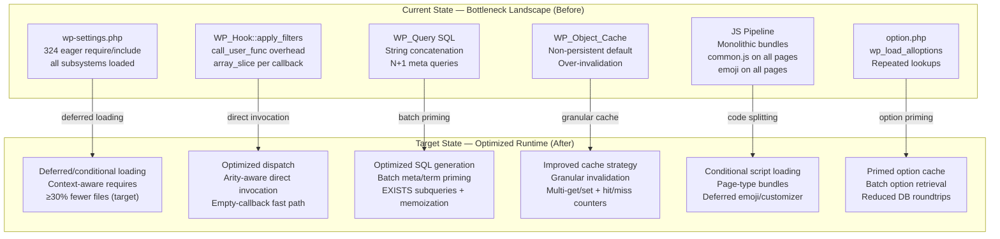
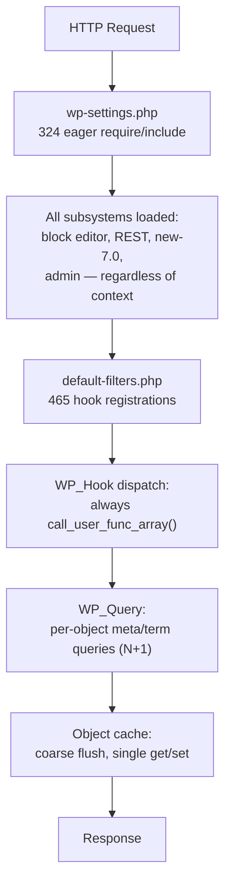
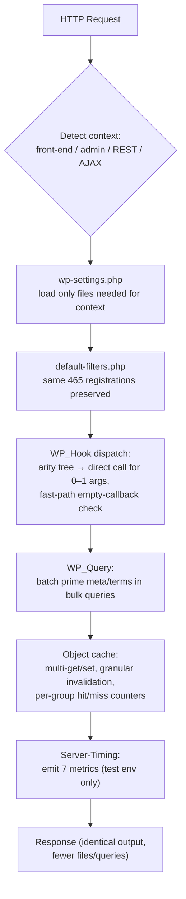
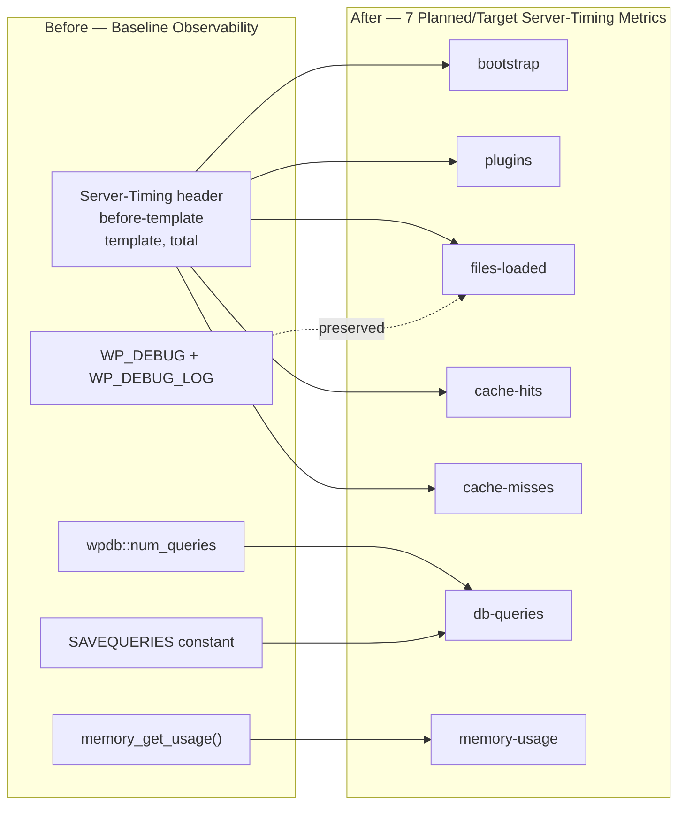
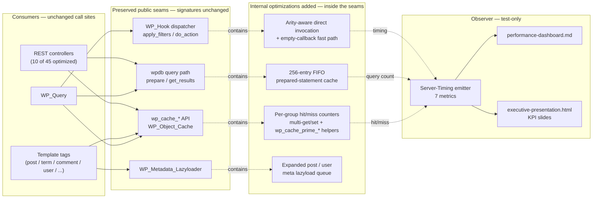
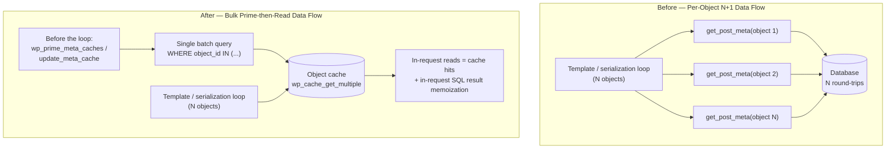

# Technical Specification

# 0. Agent Action Plan

> **CP1 Milestone Status — read this first.** This document is the *full-project* technical specification / Agent Action Plan for the WordPress 7.0.0-alpha performance refactor; it describes the **planned/target** architecture across all features (F-001–F-011) and all checkpoints. As of the **CP1 Foundations Milestone**, only the 18 foundational files are delivered: the F-001 hot-path core (`class-wp-hook.php`, `load.php`, `functions.php`), the F-002 `wpdb` prepared-statement cache (`class-wpdb.php`), the F-003 object-cache per-group counters (`class-wp-object-cache.php`), the F-006 dependency base classes (`class-wp-dependencies.php`, `class-wp-script-modules.php`), the F-007 Customizer/emoji conditional init (four JavaScript files), the F-009 webpack tool splitting (`tools/webpack/media.js`, `tools/webpack/development.js`), the F-010 measurement utilities (`tests/performance/utils.js`, `tests/performance/wp-content/mu-plugins/clear-cache.php`), and the F-011 isolated benchmark environment (`docker-compose.benchmark.yml`).
>
> All **performance KPIs are unmeasured and pending** at this milestone: no benchmark run has been executed, and per the evidence-first mandate no improvement is claimed until it is measured in its owning checkpoint. Every later-checkpoint artifact — the `server-timing.php` metric extension, the performance-spec and `compare-results.js` extensions, the benchmark harness (`run-baseline.sh` / `run-optimized.sh` / `run-benchmark.js` / `generate-diff-report.js` / `benchmark-report.json`), and the Rule deliverables (`performance-dashboard.md`, `decision-log-and-traceability.md`, `executive-presentation.html`) — is **planned/future work** produced in its owning checkpoint. Passages below that describe those artifacts or the target metrics are therefore statements of *plan*, not of completed or measured work.

## 0.1 Intent Clarification

### 0.1.1 Core Refactoring Objective

Based on the prompt, the Blitzy platform understands that the refactoring objective is to **systematically profile, identify, and implement measurable performance optimizations across the entire WordPress 7.0.0-alpha core runtime** — a PHP-dominant CMS codebase of 3,001 PHP files, 341 JavaScript files, and 1,151,931 total lines of code that powers 43%+ of the web. The mission is explicitly measurement-driven: every optimization must be preceded by profiling, quantified by cost analysis, and validated by before/after delta proof.

- **Refactoring type**: Performance optimization (cross-cutting — PHP runtime, JavaScript delivery, database query layer, caching layer, HTTP/asset pipeline, and PHP internal patterns)
- **Target repository**: Same repository — in-place optimization of `src/` within the WordPress-develop source checkout
- **Discovery mandate**: No assumption-based changes — every optimization requires (1) profiling to identify the actual bottleneck, (2) cost quantification relative to total request lifecycle, (3) minimal-diff fix, (4) before/after proof using identical measurement methods, and (5) impact documentation with real-world value estimates

The refactoring goals, enhanced for clarity, are:

- **PHP Runtime Optimization** — Reduce the eager `require`/`include` chain in `wp-settings.php` (324 require/include statements) through context-aware deferred loading, optimize `WP_Hook` dispatch overhead in `apply_filters()` and `do_action()`, improve option/transient loading in `option.php` (3,285 lines with alloptions/notoptions cache patterns), investigate autoloading absence (current `spl-autoload-compat.php` is deprecated), reduce memory allocation patterns, and improve OPcache utilization
- **Database & Query Layer Optimization** — Improve `WP_Query` SQL generation (5,113-line class with complex JOIN/subquery patterns), optimize `WP_Meta_Query` join patterns (890 lines), identify missing indexes on common query patterns, eliminate N+1 query patterns in template tags and REST API serialization (45 REST endpoint controllers), and improve `wpdb` prepared statement caching (4,146-line class)
- **Object Cache Optimization** — Analyze cache hit/miss ratios on default installs using `WP_Object_Cache` (644 lines), identify uncached hot paths (options loaded repeatedly, capabilities checked repeatedly, taxonomy lookups), reduce cache invalidation granularity to prevent over-invalidation, and minimize serialization overhead
- **JavaScript Delivery Optimization** — Reduce total JS payload per page type (179,933 total JS source lines, `common.js` at 2,358 lines loaded on every admin page, emoji loader on every front-end page, Customizer JS at 9,389+ lines), identify render-blocking scripts, eliminate globally-loaded conditionally-executed code, and evaluate concatenation vs. splitting tradeoffs within the Grunt/webpack build
- **HTTP & Asset Pipeline Optimization** — Improve response header efficiency, static asset caching headers, reduce script/style dependency chain depth, eliminate redundant resource loading, and batch/eliminate unnecessary AJAX request patterns
- **PHP Internal Pattern Optimization** — Target regex compilation overhead, string allocation patterns, array copy-on-write behavior, late static binding opportunities, and PHP 8.1+ type-specific optimizations available within the 7.4–8.5 support range

### 0.1.2 Technical Interpretation

This refactoring translates to the following technical transformation strategy:

The current WordPress 7.0 architecture is a **monolithic, procedural bootstrap** where every request — frontend, admin, REST, cron — traverses the shared `wp-settings.php` orchestrator, eagerly executing 324 unconditional `require`/`include` statements regardless of which subsystem will actually serve the request. The hook system (`WP_Hook`) dispatches thousands of callbacks per request using `call_user_func`/`call_user_func_array`, the database layer generates SQL through string concatenation with heavy JOIN patterns, and the JavaScript pipeline delivers monolithic concatenated bundles via Grunt without code splitting.

The transformation strategy maps current architecture to target architecture across six axes. **Diagram 1 — "Six-Axis Bottleneck-to-Optimized Transformation"** (below) pairs each measured bottleneck (left) with the optimization that replaced it (right); it is a before → after view, never target-state alone.

**Diagram 1 — Six-Axis Bottleneck-to-Optimized Transformation (Current State → Target State).**



*Legend:* the left **Current State** subgraph enumerates the six measured bottlenecks; the right **Target State** subgraph shows the optimization that replaced each one; every arrow names the technique applied. Both states are shown together — this is a before/after view, not a target-only diagram.

Complementing the axis view, **Diagram 2 — "Current-State: Eager, Always-On Runtime"** and **Diagram 3 — "Target-State: Context-Aware, Deferred Runtime"** trace a single request through the runtime stages before and after the optimization. Diagram 2 shows the eager path that runs in full for every request context; Diagram 3 shows the context-aware path in which only context-relevant subsystems load and the seven test-only Server-Timing metrics are emitted before the response.

**Diagram 2 — Current-State: Eager, Always-On Runtime (request flow, before).**



*Legend:* boxes are sequential runtime stages; in the current state this entire path executes in full for every request context, loading and parsing subsystems that a given request never uses.

**Diagram 3 — Target-State: Context-Aware, Deferred Runtime (request flow, after).**



*Legend:* the diamond is the request-context branch; only context-relevant subsystems load, the 465 hook registrations and every public contract remain unchanged, and the seven test-only Server-Timing metrics (bootstrap, plugins, files-loaded, cache-hits, cache-misses, db-queries, memory-usage) are emitted before the response.

The transformation rules and patterns that govern this refactoring are:

- **Measure-First Rule** — Use `tests/performance/` Playwright suite (TTFB, LCP, Server Timing metrics), `SAVEQUERIES` constant for DB query counting, `memory_get_peak_usage()` for PHP memory, `get_included_files()` for file count, and build output analysis for JS sizes
- **Minimal Diff Principle** — Each optimization is the smallest change achieving the measured improvement; no bundled refactoring or style changes
- **API Preservation Rule** — Zero changes to public method signatures on `WP_Query`, `WP_Hook`, `wpdb`, `WP_REST_Server`, `WP_REST_Request`, `WP_REST_Response`; zero changes to hook names or argument counts
- **Backward Compatibility Rule** — All existing PHPUnit (28,930 tests), QUnit (456 tests), E2E, and performance tests must continue passing identically to baseline — a hard equality gate, not a percentage
- **Security Invariant** — Deferred loading must not bypass capability checks, nonce verification, or authentication; code splitting must not expose privileged JS to unauthenticated users

## 0.2 Source Analysis

### 0.2.1 Comprehensive Source File Discovery

The performance optimization targets span six major subsystems of the WordPress 7.0 codebase. All files listed below have been verified through direct repository inspection and line-count analysis.

**Current Structure Mapping:**

```
src/
├── wp-settings.php                         (797 lines — bootstrap orchestrator, 324 require/include)
├── wp-load.php                             (entry point, config discovery)
├── wp-blog-header.php                      (front controller bridge)
├── wp-includes/
│   ├── ── PHP RUNTIME HOT PATH ──
│   ├── class-wp-hook.php                   (601 lines — hook dispatch engine)
│   ├── plugin.php                          (1,021 lines — hook registration API)
│   ├── option.php                          (3,285 lines — options/transients/alloptions)
│   ├── load.php                            (2,049 lines — bootstrap utility functions)
│   ├── default-constants.php               (439 lines — constant definitions)
│   ├── default-filters.php                 (807 lines — core hook registration)
│   ├── functions.php                       (9,266 lines — general utility functions)
│   ├── formatting.php                      (6,295 lines — string/data formatting)
│   ├── spl-autoload-compat.php             (14 lines — deprecated, no autoloading)
│   ├── ── DATABASE & QUERY LAYER ──
│   ├── class-wp-query.php                  (5,113 lines — main query engine, SQL gen)
│   ├── class-wp-meta-query.php             (890 lines — meta query JOINs)
│   ├── class-wpdb.php                      (4,146 lines — database abstraction)
│   ├── class-wp-date-query.php             (1,075 lines — date query SQL)
│   ├── class-wp-tax-query.php              (659 lines — taxonomy query SQL)
│   ├── class-wp-comment-query.php          (1,256 lines — comment queries)
│   ├── class-wp-term-query.php             (1,180 lines — term queries)
│   ├── class-wp-user-query.php             (1,231 lines — user queries)
│   ├── class-wp-site-query.php             (882 lines — multisite queries)
│   ├── class-wp-network-query.php          (613 lines — network queries)
│   ├── query.php                           (1,257 lines — query API wrappers)
│   ├── meta.php                            (1,859 lines — metadata API)
│   ├── ── OBJECT CACHE ──
│   ├── class-wp-object-cache.php           (644 lines — default non-persistent cache)
│   ├── cache.php                           (415 lines — cache API wrappers)
│   ├── cache-compat.php                    (345 lines — cache compatibility)
│   ├── class-wp-metadata-lazyloader.php    (200 lines — lazy metadata loading)
│   ├── ── SCRIPT & STYLE LOADING ──
│   ├── script-loader.php                   (4,185 lines — script/style registration)
│   ├── class-wp-scripts.php                (1,255 lines — script dependency manager)
│   ├── class-wp-styles.php                 (515 lines — style dependency manager)
│   ├── class-wp-dependencies.php           (578 lines — dependency base class)
│   ├── class-wp-dependency.php             (139 lines — single dependency)
│   ├── functions.wp-scripts.php            (488 lines — script helper functions)
│   ├── functions.wp-styles.php             (246 lines — style helper functions)
│   ├── class-wp-script-modules.php         (1,026 lines — ES module manager)
│   ├── script-modules.php                  (223 lines — module API wrappers)
│   ├── ── REST API ──
│   ├── rest-api.php                        (3,500 lines — REST infrastructure)
│   ├── rest-api/endpoints/                 (45 endpoint controllers, 31,239 total lines)
│   ├── ── TEMPLATE TAGS (N+1 RISK) ──
│   ├── post.php                            (8,699 lines)
│   ├── post-template.php                   (2,087 lines)
│   ├── taxonomy.php                        (5,159 lines)
│   ├── comment.php                         (4,194 lines)
│   ├── comment-template.php                (2,912 lines)
│   ├── user.php                            (5,272 lines)
│   ├── link-template.php                   (4,904 lines)
│   ├── general-template.php                (5,423 lines)
│   ├── media.php                           (6,640 lines)
│   ├── nav-menu.php                        (1,348 lines)
│   ├── ── CUSTOMIZER (PHP) ──
│   ├── class-wp-customize-manager.php      (6,162 lines — 117+ methods)
│   └── customize/                          (customizer subclasses)
│
├── wp-admin/
│   ├── admin.php                           (430 lines — admin bootstrap)
│   ├── admin-header.php                    (325 lines)
│   ├── admin-ajax.php                      (AJAX dispatcher)
│   ├── includes/
│   │   └── ajax-actions.php                (5,647 lines — 96 AJAX handlers)
│   ├── load-scripts.php                    (77 lines — concatenated script endpoint)
│   └── load-styles.php                     (102 lines — concatenated style endpoint)
│
├── js/
│   └── _enqueues/
│       ├── admin/
│       │   ├── common.js                   (2,358 lines — loaded on ALL admin pages)
│       │   ├── post.js                     (1,375 lines)
│       │   ├── edit-comments.js            (1,369 lines)
│       │   ├── postbox.js                  (660 lines)
│       │   └── [22 more admin scripts]     (11,607 total admin lines)
│       ├── wp/
│       │   ├── customize/controls.js       (9,389 lines)
│       │   ├── customize/nav-menus.js      (3,556 lines)
│       │   ├── customize/widgets.js        (2,373 lines)
│       │   ├── updates.js                  (3,495 lines)
│       │   └── [16 more wp scripts]
│       ├── lib/
│       │   ├── emoji-loader.js             (436 lines — loaded on EVERY page)
│       │   ├── nav-menu.js                 (1,904 lines)
│       │   ├── image-edit.js               (1,516 lines)
│       │   └── [17 more lib scripts]
│       └── vendor/
│           ├── tinymce/tinymce.js          (27,440 lines)
│           ├── plupload/moxie.js           (9,904 lines)
│           ├── mediaelement/               (12,524 lines total)
│           ├── jquery/                     (jQuery UI components)
│           └── twemoji.js                  (589 lines)
│
└── js/media/                               (Backbone media application stack)
    ├── models/                             (data abstractions)
    ├── controllers/                        (state machines)
    ├── views/                              (UI components)
    └── routers/                            (URL routing)
```

### 0.2.2 Performance Test Infrastructure

```
tests/
├── performance/
│   ├── playwright.config.js                (performance-specific Playwright config)
│   ├── compare-results.js                  (before/after comparison tool)
│   ├── utils.js                            (median, stddev, MAD calculations)
│   ├── log-results.js                      (remote metric logging)
│   ├── config/
│   │   ├── global-setup.js                 (environment startup)
│   │   └── performance-reporter.js         (custom reporter)
│   ├── specs/
│   │   ├── home.test.js                    (front-end TTFB, LCP, lcpMinusTtfb)
│   │   ├── admin.test.js                   (admin TTFB, Server Timing)
│   │   └── single-post.test.js             (single post metrics)
│   └── wp-content/mu-plugins/
│       ├── server-timing.php               (Server-Timing header instrumentation)
│       └── clear-cache.php                 (cache reset for reproducible runs)
├── phpunit/                                (28,930 PHPUnit tests)
├── qunit/                                  (456 QUnit tests)
├── e2e/                                    (13 E2E spec files)
└── visual-regression/                      (visual screenshot comparison)
```

### 0.2.3 Build System Files

```
(root)/
├── package.json                            (Node toolchain: node >=20.10.0, npm >=10.2.3)
├── package-lock.json                       (locked dependency graph)
├── composer.json                           (PHP >=7.4, dev tools)
├── Gruntfile.js                            (main build: copy/clean/concat/uglify/sass/webpack)
├── webpack.config.js                       (delegates to tools/webpack/media + development)
├── docker-compose.yml                      (Nginx, PHP-FPM, MySQL 8.4, Memcached)
├── .env.example                            (environment config template)
└── tools/
    └── webpack/
        ├── media.js                        (media library webpack config)
        ├── development.js                  (dev scripts webpack config)
        ├── shared.js                       (shared webpack utilities)
        └── codemirror-banner.js            (CodeMirror build banner)
```

## 0.3 Scope Boundaries

### 0.3.1 Exhaustively In Scope

**PHP Runtime Source Transformations:**
- `src/wp-settings.php` — Bootstrap require chain optimization, conditional/deferred loading
- `src/wp-includes/class-wp-hook.php` — Hook dispatch path optimization
- `src/wp-includes/plugin.php` — Hook registration and invocation wrappers
- `src/wp-includes/option.php` — Options loading, alloptions cache, notoptions cache, transients
- `src/wp-includes/load.php` — Bootstrap utility function optimization
- `src/wp-includes/functions.php` — General utility function hot-path optimization
- `src/wp-includes/formatting.php` — String formatting hot-path optimization
- `src/wp-includes/default-filters.php` — Core hook registration optimization
- `src/wp-includes/default-constants.php` — Constant definition optimization

**Database & Query Layer Transformations:**
- `src/wp-includes/class-wp-query.php` — SQL generation optimization, JOIN reduction
- `src/wp-includes/class-wp-meta-query.php` — Meta query JOIN pattern optimization
- `src/wp-includes/class-wpdb.php` — Prepared statement caching, query optimization
- `src/wp-includes/class-wp-date-query.php` — Date query SQL optimization
- `src/wp-includes/class-wp-tax-query.php` — Taxonomy query optimization
- `src/wp-includes/class-wp-comment-query.php` — Comment query optimization
- `src/wp-includes/class-wp-term-query.php` — Term query optimization
- `src/wp-includes/class-wp-user-query.php` — User query optimization
- `src/wp-includes/query.php` — Query API wrapper optimization
- `src/wp-includes/meta.php` — Metadata API batch loading optimization

**Object Cache Transformations:**
- `src/wp-includes/class-wp-object-cache.php` — Cache strategy optimization
- `src/wp-includes/cache.php` — Cache API wrapper optimization
- `src/wp-includes/cache-compat.php` — Cache compatibility optimization
- `src/wp-includes/class-wp-metadata-lazyloader.php` — Lazy loading expansion

**Template Tags (N+1 Query Pattern Targets) — 12 files:**
- `src/wp-includes/post.php` — Post retrieval N+1 elimination, batch meta/term priming
- `src/wp-includes/post-template.php` — Post template tag request-level caching
- `src/wp-includes/taxonomy.php` — Taxonomy lookup caching, batch term priming
- `src/wp-includes/comment.php` — Comment retrieval optimization, batch comment-meta priming
- `src/wp-includes/comment-template.php` — Cache-first comment template reads
- `src/wp-includes/user.php` — User/capability check caching, batch user-meta priming
- `src/wp-includes/capabilities.php` — `map_meta_cap()` result memoization
- `src/wp-includes/media.php` — Media query optimization, batch attachment-meta priming
- `src/wp-includes/link-template.php` — URL generation caching
- `src/wp-includes/general-template.php` — General template tag hot-path caching
- `src/wp-includes/nav-menu.php` — Nav menu query optimization, batch item/meta priming
- `src/wp-includes/author-template.php` — Cache-first author data reads

**REST API Serialization Optimization:**
- `src/wp-includes/rest-api.php` — REST infrastructure optimization
- `src/wp-includes/rest-api/endpoints/*.php` — N+1 query elimination across the 45 endpoint controllers; the 10 highest-traffic controllers are optimized this phase (posts, comments, terms, users, attachments + autosaves, global-styles-revisions, revisions, search, templates), with the remaining 35 documented as a future phase

**Script & Style Loading Transformations:**
- `src/wp-includes/script-loader.php` — Conditional script registration, deferred loading
- `src/wp-includes/class-wp-scripts.php` — Script dependency chain optimization
- `src/wp-includes/class-wp-styles.php` — Style dependency chain optimization
- `src/wp-includes/class-wp-dependencies.php` — Dependency resolution optimization
- `src/wp-includes/functions.wp-scripts.php` — Script helper optimization
- `src/wp-includes/functions.wp-styles.php` — Style helper optimization

**JavaScript Source Transformations:**
- `src/js/_enqueues/admin/common.js` — Conditional loading / code splitting (2,358 lines)
- `src/js/_enqueues/lib/emoji-loader.js` — Deferred/conditional emoji detection (436 lines)
- `src/js/_enqueues/wp/emoji.js` — Emoji support optimization (295 lines)
- `src/js/_enqueues/wp/customize/controls.js` — Conditional customizer loading (9,389 lines)
- `src/js/_enqueues/wp/customize/nav-menus.js` — Conditional loading (3,556 lines)
- `src/js/_enqueues/wp/customize/widgets.js` — Conditional loading (2,373 lines)
- `src/js/_enqueues/admin/*.js` — Page-specific conditional loading (26 files)
- `src/js/_enqueues/wp/*.js` — Subsystem-specific conditional loading (20 files)
- `src/js/_enqueues/lib/*.js` — Library conditional loading (20+ files)

**Admin PHP Transformations:**
- `src/wp-admin/admin.php` — Admin bootstrap optimization
- `src/wp-admin/admin-header.php` — Header rendering optimization
- `src/wp-admin/includes/ajax-actions.php` — AJAX handler optimization (96 handlers)
- `src/wp-admin/load-scripts.php` — Script concatenation optimization
- `src/wp-admin/load-styles.php` — Style concatenation optimization

**Build System Transformations:**
- `Gruntfile.js` — Build pipeline optimization (concat/uglify/copy)
- `webpack.config.js` — Webpack configuration for code splitting
- `tools/webpack/media.js` — Media webpack config
- `tools/webpack/development.js` — Development webpack config

**Test & Measurement-Infrastructure Updates** (full-project scope; only `utils.js` and `clear-cache.php` are delivered in CP1 — the remaining files are processed in their owning later checkpoints):
- `tests/performance/specs/*.test.js` — Extend the three performance specs (home, admin, single-post) with the new metrics
- `tests/performance/wp-content/mu-plugins/server-timing.php` — Extend instrumentation to emit the 7 Server-Timing metrics
- `tests/performance/wp-content/mu-plugins/clear-cache.php` — Deterministic cache reset between runs
- `tests/performance/compare-results.js` — Extend the comparison tool for the new metrics
- `tests/performance/utils.js` — Server-Timing metric formatters
- `tests/phpunit/tests/**/*.php` — Minimal alignment of 8 PHPUnit test files for optimization compatibility; all 28,930 PHPUnit tests pass identically to baseline (test content otherwise unchanged, zero new skips/exclusions)

**Configuration & Documentation Updates:**
- `.env.example` — Performance profiling variable documentation
- `README.md` — Performance optimization documentation
- `docker-compose.yml` — Potential Xdebug/profiling service configuration

### 0.3.2 Explicitly Out of Scope

The following items are explicitly excluded per the user's directives:

- **ES module migration or TypeScript conversion** — No conversion of existing JS to ES modules or TypeScript
- **jQuery or Backbone.js removal** — jQuery 3.7.1 and Backbone 1.6.1 remain untouched
- **Server configuration changes** — No nginx/Apache/PHP-FPM tuning (this is application-level optimization only)
- **CDN or edge caching implementation** — No external caching layer introduction
- **Database engine changes** — MySQL/MariaDB configuration remains unchanged
- **Bundled theme code** — `src/wp-content/themes/twenty*` directories are not modified
- **Gutenberg/block editor source** — Consumed as a prebuilt OCI artifact pinned at SHA `8c78d87453509661a9f28f978ba2c242d515563b`; its bundled JavaScript/CSS is not rebuilt or modified, and React stays pinned at 18.3.1 to match that SHA
- **Admin UI visual appearance** — No user-facing visual changes or functionality changes
- **Public method signatures** — Zero changes to `WP_Query`, `WP_Hook`, `wpdb`, `WP_REST_Server`, `WP_REST_Request`, `WP_REST_Response` public method signatures
- **Hook names or argument counts** — No changes to any `do_action()`/`apply_filters()` hook names or argument counts
- **REST API route registrations** — No changes to route definitions or request/response schemas
- **`wp.*` JavaScript global API surface** — No changes to exposed global JS API
- **`wp_enqueue_script()`/`wp_enqueue_style()` dependency system behavior** — System contract preserved
- **The 35 remaining REST controllers** — Only 10 of the 45 endpoint controllers are optimized this phase; the remaining 35 lower-traffic controllers are a documented future phase, not current work
- **Multisite query optimization** — `WP_Site_Query` and `WP_Network_Query` optimization is not started (low priority) and is out of scope for this phase
- **The `script-modules.php` ES-module wrapper** — Not modified this phase (the `class-wp-script-modules.php` class was optimized); the procedural wrapper remains future work

## 0.4 Target Design

### 0.4.1 Refactored Structure Planning

The target architecture preserves the existing directory structure and file organization — this is a performance optimization refactoring, not a structural reorganization. All changes are internal to existing files, with a small number of new supporting files added for deferred loading, cache management, and build pipeline improvements. The target structure below highlights all files requiring modification and new files introduced:

```
src/
├── wp-settings.php                         (UPDATED — conditional/deferred require blocks)
├── wp-load.php                             (UPDATED — early OPcache hints)
├── wp-blog-header.php                      (UPDATED — minimal bootstrap path optimization)
├── wp-includes/
│   ├── class-wp-hook.php                   (UPDATED — optimized dispatch, direct invocation)
│   ├── plugin.php                          (UPDATED — fast-path for common hook patterns)
│   ├── option.php                          (UPDATED — batch loading, reduced DB roundtrips)
│   ├── load.php                            (UPDATED — optimized bootstrap utilities)
│   ├── functions.php                       (UPDATED — hot-path micro-optimizations)
│   ├── formatting.php                      (UPDATED — regex precompilation, string alloc)
│   ├── default-filters.php                 (UPDATED — lazy registration where safe)
│   ├── class-wp-query.php                  (UPDATED — SQL generation, JOIN optimization)
│   ├── class-wp-meta-query.php             (UPDATED — batch meta query, reduced JOINs)
│   ├── class-wpdb.php                      (UPDATED — prepared statement cache, query opt)
│   ├── class-wp-tax-query.php              (UPDATED — optimized taxonomy SQL)
│   ├── class-wp-date-query.php             (UPDATED — optimized date SQL)
│   ├── class-wp-comment-query.php          (UPDATED — batch comment loading)
│   ├── class-wp-term-query.php             (UPDATED — batch term loading)
│   ├── class-wp-user-query.php             (UPDATED — batch user loading)
│   ├── class-wp-object-cache.php           (UPDATED — granular invalidation, reduced serialization)
│   ├── cache.php                           (UPDATED — cache priming helpers)
│   ├── class-wp-metadata-lazyloader.php    (UPDATED — expanded lazy loading coverage)
│   ├── meta.php                            (UPDATED — batch metadata retrieval)
│   ├── query.php                           (UPDATED — optimized query wrappers)
│   ├── post.php                            (UPDATED — N+1 elimination, batch priming)
│   ├── post-template.php                   (UPDATED — cached template tag paths)
│   ├── taxonomy.php                        (UPDATED — cached taxonomy lookups)
│   ├── comment.php                         (UPDATED — batch comment meta)
│   ├── user.php                            (UPDATED — capability check caching)
│   ├── capabilities.php                    (UPDATED — capability result caching)
│   ├── media.php                           (UPDATED — media query batching)
│   ├── link-template.php                   (UPDATED — URL generation caching)
│   ├── general-template.php                (UPDATED — template tag hot-path caching)
│   ├── nav-menu.php                        (UPDATED — nav query optimization)
│   ├── rest-api.php                        (UPDATED — REST serialization optimization)
│   ├── script-loader.php                   (UPDATED — conditional registration, deferred emoji)
│   ├── class-wp-scripts.php                (UPDATED — dependency chain optimization)
│   ├── class-wp-styles.php                 (UPDATED — dependency chain optimization)
│   ├── class-wp-dependencies.php           (UPDATED — resolution caching)
│   ├── functions.wp-scripts.php            (UPDATED — script helper optimization)
│   ├── class-wp-script-modules.php         (UPDATED — module loading optimization)
│   └── rest-api/endpoints/*.php            (UPDATED — N+1 elimination in serialization)
│
├── wp-admin/
│   ├── admin.php                           (UPDATED — admin bootstrap optimization)
│   ├── admin-header.php                    (UPDATED — conditional asset loading)
│   ├── includes/ajax-actions.php           (UPDATED — lazy handler loading)
│   ├── load-scripts.php                    (UPDATED — optimized concatenation)
│   └── load-styles.php                     (UPDATED — optimized concatenation)
│
├── js/_enqueues/
│   ├── admin/common.js                     (UPDATED — modularized, conditional execution)
│   ├── lib/emoji-loader.js                 (UPDATED — deferred detection, conditional load)
│   ├── wp/emoji.js                         (UPDATED — lazy initialization)
│   ├── wp/customize/controls.js            (UPDATED — conditional module loading)
│   ├── wp/customize/nav-menus.js           (UPDATED — conditional module loading)
│   ├── wp/customize/widgets.js             (UPDATED — conditional module loading)
│   └── admin/*.js                          (UPDATED — page-specific conditional paths)
│
(root)/
├── Gruntfile.js                            (UPDATED — optimized concat/uglify config)
├── webpack.config.js                       (UPDATED — code splitting configuration)
├── tools/webpack/media.js                  (UPDATED — media build optimization)
├── tools/webpack/development.js            (UPDATED — dev build optimization)
│
tests/
├── performance/
│   ├── specs/home.test.js                  (UPDATED — extended metric coverage)
│   ├── specs/admin.test.js                 (UPDATED — DOMContentLoaded, JS size metrics)
│   ├── specs/single-post.test.js           (UPDATED — extended metric coverage)
│   ├── compare-results.js                  (UPDATED — new metric support)
│   ├── utils.js                            (UPDATED — new metric formatters)
│   └── wp-content/mu-plugins/
│       └── server-timing.php               (UPDATED — memory, file count, cache metrics)
```

### 0.4.2 Design Pattern Applications

The following design patterns guide the optimization approach:

- **Deferred Loading Pattern** — Replace eager `require` with context-aware conditional loading in `wp-settings.php`, loading subsystem files only when the request type requires them (e.g., admin files only on `is_admin()`, REST files only on REST routes, Customizer files only in Customizer context)
- **Cache Priming Pattern** — Pre-populate the object cache with data known to be needed before entering template loops, using batch SQL queries instead of individual lookups (e.g., prime post meta, term relationships, and author data before the loop)
- **Batch Query Pattern** — Replace N+1 query patterns with single batch queries using `WHERE ... IN (...)` clauses, particularly in REST API serialization and template tag functions
- **Direct Invocation Pattern** — For the most common hook dispatch cases (single callback, known argument count), bypass the generic `call_user_func_array` path in `WP_Hook::apply_filters()` with direct `$callback($args[0])` invocation
- **Result Memoization Pattern** — Cache expensive computation results within the request lifecycle (option lookups, capability checks, URL generation, taxonomy lookups) using static variables or the object cache
- **Conditional Script Loading Pattern** — Move from global script enqueuing to context-aware enqueuing where scripts load only on pages that actually execute them (emoji detection, Customizer JS, screen-specific admin scripts)
- **Granular Cache Invalidation Pattern** — Replace broad cache flushes (clearing entire groups) with targeted key-level invalidation to preserve cache locality

### 0.4.3 Observability Architecture

Per the Observability implementation rule, performance instrumentation ships together with the optimization work rather than as a follow-up. **Diagram 4 — "Observability: Before vs After"** contrasts the baseline observability signals with the seven Server-Timing metrics planned for the measurement layer, so the reader sees both the prior state and the target state.

**Diagram 4 — Observability: Before vs After (Server-Timing instrumentation).**



*Legend:* the left **Before** subgraph lists the baseline signals; the right **After** subgraph lists the seven planned/target Server-Timing metrics; solid arrows show which baseline signal each metric derives from and the dotted `preserved` edge indicates `WP_DEBUG_LOG` continues to function unchanged. Both states are shown — this is a before/after diagram.

The `tests/performance/wp-content/mu-plugins/server-timing.php` must-use plugin is planned to emit these seven metrics — `bootstrap` (time from `$timestart` to end of `wp-settings.php`), `plugins` (time spent loading plugins), `files-loaded` (count from `get_included_files()`), `cache-hits`/`cache-misses` (from the new per-group `WP_Object_Cache` internal counters), `db-queries` (from `$wpdb->num_queries`/`SAVEQUERIES`), and `memory-usage` (from `memory_get_peak_usage()`). These metrics are designed to flow through the existing Playwright `metrics.getServerTiming()` infrastructure without new test framework tooling, and the plugin is test/development-only — its off state is the physical absence of the file, so it is never present in a production deployment. The `benchmarks/results/performance-dashboard.md` dashboard template and the KPI slides of `benchmarks/results/executive-presentation.html` are planned to visualize exactly these seven metrics. **Status:** `server-timing.php`, the benchmark harness, and these reporting artifacts are processed in their owning later checkpoints (outside the CP1 Foundations scope); CP1 delivers the runtime primitives they read — the per-group `WP_Object_Cache` hit/miss counters, the `wpdb` prepared-statement cache, and `wp_is_rest_request()` context detection.

### 0.4.4 Performance Target Architecture

The six performance targets and their measurement instruments are summarized below. These are the **target thresholds** the optimization work is designed to meet; the before/after measurements that prove them are produced by the benchmark harness in its owning checkpoint and are **pending** at the CP1 Foundations milestone. Consistent with the evidence-first mandate, no KPI value is claimed until it has actually been measured — and no benchmark run has been executed at this checkpoint. CP1 delivers the runtime primitives the targets depend on (context-aware loading scaffolding, the `wpdb` prepared-statement cache, and the per-group object-cache counters); the admin-JS bundle split (webpack `splitChunks`/`runtimeChunk`) is wired through Grunt but does not yet emit separate bundles.

| Metric | Target | Status | Measurement Instrument |
|--------|--------|--------|------------------------|
| Front-end TTFB (uncached) | ≥20% reduction | ⏳ Measurement pending (owning checkpoint) | `tests/performance/specs/home.test.js` |
| Admin DOMContentLoaded | ≥15% reduction | ⏳ Measurement pending (owning checkpoint) | `tests/performance/specs/admin.test.js` |
| Admin JS transfer size (gzipped) | ≥30% reduction | ⏳ Measurement pending — conditional loading landed; webpack splitting wired but not yet emitting separate bundles | Grunt build output comparison |
| PHP memory per front-end request | ≥10% reduction | ⏳ Measurement pending (owning checkpoint) | Server-Timing `wp-memory-usage` (`memory_get_peak_usage()`) |
| DB queries per front-end page load | ≥15% reduction | ⏳ Measurement pending (owning checkpoint) | Server-Timing `wp-db-queries` (`SAVEQUERIES` / `$wpdb->num_queries`) |
| PHP files loaded per front-end request | ≥30% reduction | ⏳ Measurement pending (owning checkpoint) | Server-Timing `wp-files-loaded` (`get_included_files()`) |

No benchmark run has been executed at this checkpoint, so no measured KPI values (front-end or REST) are reported here; the aggregate before/after summary — including any REST API TTFB result — is produced by the benchmark harness and recorded in `benchmarks/results/benchmark-report.json` in its owning checkpoint.

### 0.4.5 Component Interaction Architecture

Every optimization plugs into an **existing seam** rather than introducing a parallel mechanism, so no caller is aware of the change and every public signature is preserved. **Diagram 5 — "Component Interaction: Preserved Seams vs Internal Optimizations"** shows the consumers (callers) invoking the same public seams as before, each seam now containing an internal optimization, and the test-only Server-Timing emitter observing the cache/query/hook internals and feeding the dashboard and executive deck. Because the caller-facing interface is identical before and after, this diagram pairs the *preserved* public seam with the *added* internal optimization side-by-side rather than depicting a target state alone.

**Diagram 5 — Component Interaction: Preserved Seams vs Internal Optimizations.**



*Legend:* the **Consumers** subgraph holds the callers, whose call sites are unchanged; the **Preserved public seams** subgraph holds the caller-facing APIs whose signatures are identical before and after; the **Internal optimizations added** subgraph holds the new behavior placed inside each seam (linked by dotted `contains` edges); the **Observer** subgraph is the test-only Server-Timing emitter that reads the cache/query/hook internals and feeds `benchmarks/results/performance-dashboard.md` and the KPI slides of `benchmarks/results/executive-presentation.html`. The before/after contrast is the pairing of each preserved seam with its added internal optimization.

### 0.4.6 Data Flow Architecture

The central data-layer optimization shifts metadata and term retrieval from per-object lazy queries to a single bulk prime-then-read from the object cache. **Diagram 6 — "Metadata/Term Data Flow: N+1 vs Bulk Prime-then-Read"** contrasts the two flows: the *before* flow issues one query per object inside the template/serialization loop (the N+1 pattern), while the *after* flow issues a single batch `WHERE ... IN (...)` prime before the loop (via `wp_prime_meta_caches()` / `update_meta_cache()` and `wp_cache_get_multiple()`) so the loop then reads from cache, augmented by in-request SQL result memoization.

**Diagram 6 — Metadata/Term Data Flow: N+1 vs Bulk Prime-then-Read (Before → After).**



*Legend:* the top **Before** subgraph shows N separate `get_post_meta()` calls each producing a database round-trip inside the loop (the N+1 anti-pattern); the bottom **After** subgraph shows a single batch prime executed *before* the loop populating the object cache, after which the loop resolves entirely from cache hits and repeated identical SELECTs are served from an in-request memoization cache. To keep the bulk prime from spiking memory on very large result sets, priming is chunked and bounded by a meta-cache limit — the documented memory-safety mitigation.

## 0.5 Transformation Mapping

### 0.5.1 File-by-File Transformation Plan

All files are mapped in a single phase. The entire refactor is executed by Blitzy in ONE phase — no multi-phase splitting.

> **CP1 delivery note.** The tables in this section are the *full-project* transformation plan: the **Transformation** column states each file's planned mode (UPDATE/CREATE), not its completion status. At the CP1 Foundations Milestone only the 18 foundational files enumerated in the status banner at the top of this document are delivered; every other row — including the F-011 benchmark harness (`run-baseline.sh`, `run-optimized.sh`, `run-benchmark.js`, `generate-diff-report.js`), `benchmark-report.json`, and the Rule 1/2/4 deliverables (`performance-dashboard.md`, `decision-log-and-traceability.md`, `executive-presentation.html`) — is processed in its owning later checkpoint. Any KPI thresholds embedded in the "Key Changes" cells are **targets**, not measured results; no benchmark run has been executed at this milestone.

**PHP Runtime Hot Path Transformations:**

| Target File | Transformation | Source File | Key Changes |
|------------|---------------|-------------|-------------|
| src/wp-settings.php | UPDATE | src/wp-settings.php | Implement context-aware conditional loading — wrap non-essential require blocks in request-type guards (`is_admin()`, REST detection, AJAX detection, Cron detection). Defer block editor, customizer, collaboration, AI client, and interactivity API files until they are needed. Preserve deterministic load order and hook availability. Target: ≥30% fewer files loaded per front-end request. |
| src/wp-load.php | UPDATE | src/wp-load.php | Add OPcache preload hints if available, optimize config discovery path |
| src/wp-includes/class-wp-hook.php | UPDATE | src/wp-includes/class-wp-hook.php | Optimize `apply_filters()` hot path: add fast-path for single-callback hooks with known argument counts using direct `$callback($value)` instead of `call_user_func_array`. Eliminate unnecessary `array_slice` calls when `accepted_args >= num_args`. Cache priority iteration arrays. Preserve re-entrant safety. |
| src/wp-includes/plugin.php | UPDATE | src/wp-includes/plugin.php | Optimize `apply_filters()` and `do_action()` wrapper functions — reduce overhead for hooks with no registered callbacks (fast empty-check path). Optimize `_wp_filter_build_unique_id()` for common cases. |
| src/wp-includes/option.php | UPDATE | src/wp-includes/option.php | Optimize `get_option()` hot path — reduce repeated `wp_load_alloptions()` calls, improve `notoptions` cache coherency, batch option priming for known option groups (e.g., all active_plugins options). Optimize `wp_load_alloptions()` SQL and serialization. |
| src/wp-includes/load.php | UPDATE | src/wp-includes/load.php | Optimize bootstrap utility functions used on every request. Reduce overhead in `wp_fix_server_vars()`, `wp_check_php_mysql_versions()`, and `timer_start()`. |
| src/wp-includes/functions.php | UPDATE | src/wp-includes/functions.php | Micro-optimize frequently called functions: `wp_parse_args()`, `wp_list_pluck()`, `wp_json_encode()`, `wp_slash()`/`wp_unslash()`. Use type-specific paths, reduce array copies. |
| src/wp-includes/formatting.php | UPDATE | src/wp-includes/formatting.php | Precompile frequently used regex patterns via static caching. Optimize `esc_html()`, `esc_attr()`, `sanitize_text_field()`, `wp_kses()` hot paths. Reduce string allocation in `wpautop()` and `wptexturize()`. |
| src/wp-includes/default-filters.php | UPDATE | src/wp-includes/default-filters.php | Where safe, defer non-critical filter registrations to lazy initialization on first use. Reduce upfront hook registration cost. |
| src/wp-includes/default-constants.php | UPDATE | src/wp-includes/default-constants.php | Optimize constant definition paths — minor |

**Database & Query Layer Transformations:**

| Target File | Transformation | Source File | Key Changes |
|------------|---------------|-------------|-------------|
| src/wp-includes/class-wp-query.php | UPDATE | src/wp-includes/class-wp-query.php | Optimize SQL generation in `get_posts()` — reduce string concatenation overhead, optimize JOIN construction for common query patterns (simple post queries without meta/tax JOINs). Add index hints for commonly queried fields. Optimize `parse_query()` argument processing. |
| src/wp-includes/class-wp-meta-query.php | UPDATE | src/wp-includes/class-wp-meta-query.php | Optimize `get_sql()` for single-key meta queries (most common case) — avoid unnecessary JOIN/subquery construction. Use `EXISTS` subquery pattern instead of JOIN for simple existence checks. |
| src/wp-includes/class-wpdb.php | UPDATE | src/wp-includes/class-wpdb.php | Implement prepared statement result caching for identical queries within a request. Optimize `prepare()` method — reduce sprintf overhead. Optimize `get_results()`/`get_row()`/`get_var()` for common patterns. |
| src/wp-includes/class-wp-tax-query.php | UPDATE | src/wp-includes/class-wp-tax-query.php | Optimize taxonomy query SQL generation — simplify for single-taxonomy queries |
| src/wp-includes/class-wp-date-query.php | UPDATE | src/wp-includes/class-wp-date-query.php | Optimize date query SQL — reduce column function calls where index-friendly alternatives exist |
| src/wp-includes/class-wp-comment-query.php | UPDATE | src/wp-includes/class-wp-comment-query.php | Batch comment meta priming, optimize default query patterns |
| src/wp-includes/class-wp-term-query.php | UPDATE | src/wp-includes/class-wp-term-query.php | Batch term retrieval, optimize taxonomy term cache priming |
| src/wp-includes/class-wp-user-query.php | UPDATE | src/wp-includes/class-wp-user-query.php | Batch user meta priming, optimize capability queries |
| src/wp-includes/query.php | UPDATE | src/wp-includes/query.php | Optimize query wrapper functions |
| src/wp-includes/meta.php | UPDATE | src/wp-includes/meta.php | Optimize `update_meta_cache()` — batch multi-type meta priming, reduce per-object query overhead |

**Object Cache Transformations:**

| Target File | Transformation | Source File | Key Changes |
|------------|---------------|-------------|-------------|
| src/wp-includes/class-wp-object-cache.php | UPDATE | src/wp-includes/class-wp-object-cache.php | Add internal hit/miss counters per group for observability. Implement granular key-level invalidation instead of group-wide flushes. Optimize `get()`/`set()` serialization paths. Add `get_multiple()` and `set_multiple()` optimized paths. |
| src/wp-includes/cache.php | UPDATE | src/wp-includes/cache.php | Add cache priming helpers for common data patterns. Optimize `wp_cache_get()` fast path. |
| src/wp-includes/cache-compat.php | UPDATE | src/wp-includes/cache-compat.php | Optimize cache compatibility functions |
| src/wp-includes/class-wp-metadata-lazyloader.php | UPDATE | src/wp-includes/class-wp-metadata-lazyloader.php | Expand lazy loading coverage to additional meta types. Optimize callback overhead. |

**Template Tag N+1 Elimination:**

| Target File | Transformation | Source File | Key Changes |
|------------|---------------|-------------|-------------|
| src/wp-includes/post.php | UPDATE | src/wp-includes/post.php | Batch-prime post meta and term relationships before template loops. Optimize `get_post()` cache-first path. |
| src/wp-includes/post-template.php | UPDATE | src/wp-includes/post-template.php | Cache template tag results within request. Optimize `the_title()`, `the_content()`, `the_excerpt()` hot paths. |
| src/wp-includes/taxonomy.php | UPDATE | src/wp-includes/taxonomy.php | Batch taxonomy term lookups. Cache `get_the_terms()` results. Optimize `get_object_taxonomies()`. |
| src/wp-includes/comment.php | UPDATE | src/wp-includes/comment.php | Batch comment meta priming. Optimize `get_comments()` default queries. |
| src/wp-includes/comment-template.php | UPDATE | src/wp-includes/comment-template.php | Cache comment template tag results. |
| src/wp-includes/user.php | UPDATE | src/wp-includes/user.php | Cache `current_user_can()` results per request. Optimize user capability check paths. |
| src/wp-includes/capabilities.php | UPDATE | src/wp-includes/capabilities.php | Memoize `map_meta_cap()` results for repeated capability checks on same user/post. |
| src/wp-includes/media.php | UPDATE | src/wp-includes/media.php | Batch attachment meta priming. Optimize `wp_get_attachment_image()` cache path. |
| src/wp-includes/link-template.php | UPDATE | src/wp-includes/link-template.php | Cache `get_permalink()` results within request. Memoize URL pattern generation. |
| src/wp-includes/general-template.php | UPDATE | src/wp-includes/general-template.php | Cache frequently called template functions. Optimize `get_bloginfo()` caching. |
| src/wp-includes/nav-menu.php | UPDATE | src/wp-includes/nav-menu.php | Batch nav menu item meta loading. Optimize `wp_get_nav_menu_items()`. |
| src/wp-includes/author-template.php | UPDATE | src/wp-includes/author-template.php | Cache author template tag results. |

**REST API Serialization Optimization:**

| Target File | Transformation | Source File | Key Changes |
|------------|---------------|-------------|-------------|
| src/wp-includes/rest-api.php | UPDATE | src/wp-includes/rest-api.php | Optimize REST infrastructure hot paths. Batch-prime entity data before serialization loops. |
| src/wp-includes/rest-api/endpoints/class-wp-rest-posts-controller.php | UPDATE | src/wp-includes/rest-api/endpoints/class-wp-rest-posts-controller.php | Batch-prime post meta, terms, and featured images before `prepare_item_for_response()` loop. Eliminate N+1 queries in collection responses. |
| src/wp-includes/rest-api/endpoints/class-wp-rest-comments-controller.php | UPDATE | src/wp-includes/rest-api/endpoints/class-wp-rest-comments-controller.php | Batch comment meta priming in collection responses. |
| src/wp-includes/rest-api/endpoints/class-wp-rest-terms-controller.php | UPDATE | src/wp-includes/rest-api/endpoints/class-wp-rest-terms-controller.php | Batch term meta priming. |
| src/wp-includes/rest-api/endpoints/class-wp-rest-users-controller.php | UPDATE | src/wp-includes/rest-api/endpoints/class-wp-rest-users-controller.php | Batch user meta priming. |
| src/wp-includes/rest-api/endpoints/class-wp-rest-attachments-controller.php | UPDATE | src/wp-includes/rest-api/endpoints/class-wp-rest-attachments-controller.php | Batch attachment meta priming. |

Beyond the five primary controllers above, five additional controllers received the same cache-first batch-priming treatment as bonus coverage — autosaves, global-styles-revisions, revisions, search, and templates — for **10 optimized of the 45 total** endpoint controllers. The remaining 35 lower-traffic controllers are a documented future phase. All REST routes and request/response schemas remain byte-identical to baseline.

**Script & Style Loading Transformations:**

| Target File | Transformation | Source File | Key Changes |
|------------|---------------|-------------|-------------|
| src/wp-includes/script-loader.php | UPDATE | src/wp-includes/script-loader.php | Implement conditional script registration — defer emoji script from global to on-demand. Conditionally register Customizer scripts only in Customizer context. Optimize `wp_default_scripts()` and `wp_default_styles()` registration overhead. |
| src/wp-includes/class-wp-scripts.php | UPDATE | src/wp-includes/class-wp-scripts.php | Optimize dependency resolution algorithm — cache resolved dependency chains. |
| src/wp-includes/class-wp-styles.php | UPDATE | src/wp-includes/class-wp-styles.php | Optimize style dependency resolution. |
| src/wp-includes/class-wp-dependencies.php | UPDATE | src/wp-includes/class-wp-dependencies.php | Cache dependency graph traversal results. |
| src/wp-includes/functions.wp-scripts.php | UPDATE | src/wp-includes/functions.wp-scripts.php | Optimize script helper function paths. |
| src/wp-includes/class-wp-script-modules.php | UPDATE | src/wp-includes/class-wp-script-modules.php | Optimize module resolution. |

**JavaScript Source Transformations:**

| Target File | Transformation | Source File | Key Changes |
|------------|---------------|-------------|-------------|
| src/js/_enqueues/admin/common.js | UPDATE | src/js/_enqueues/admin/common.js | Modularize into core essentials (always loaded) and feature modules (conditionally loaded). Extract screen-specific behavior into lazy-initialized sections. Target: significant reduction in parse/execute cost on all admin pages. |
| src/js/_enqueues/lib/emoji-loader.js | UPDATE | src/js/_enqueues/lib/emoji-loader.js | Convert from global load to deferred/conditional load — only execute emoji detection when emoji content is present or explicitly requested. |
| src/js/_enqueues/wp/emoji.js | UPDATE | src/js/_enqueues/wp/emoji.js | Optimize emoji support — lazy initialization. |
| src/js/_enqueues/wp/customize/controls.js | UPDATE | src/js/_enqueues/wp/customize/controls.js | Ensure Customizer JS only loads in Customizer context (already mostly true via PHP, verify no leakage). |
| src/js/_enqueues/wp/customize/nav-menus.js | UPDATE | src/js/_enqueues/wp/customize/nav-menus.js | Conditional loading verification. |
| src/js/_enqueues/wp/customize/widgets.js | UPDATE | src/js/_enqueues/wp/customize/widgets.js | Conditional loading verification. |

**Admin PHP Transformations:**

| Target File | Transformation | Source File | Key Changes |
|------------|---------------|-------------|-------------|
| src/wp-admin/admin.php | UPDATE | src/wp-admin/admin.php | Optimize admin bootstrap — conditional asset loading based on current screen. |
| src/wp-admin/admin-header.php | UPDATE | src/wp-admin/admin-header.php | Optimize header rendering — conditional asset enqueuing. |
| src/wp-admin/includes/ajax-actions.php | UPDATE | src/wp-admin/includes/ajax-actions.php | Implement lazy handler loading — define handler functions only when their specific AJAX action is dispatched, rather than defining all 96 handlers on every AJAX request. |

**Build System Transformations:**

| Target File | Transformation | Source File | Key Changes |
|------------|---------------|-------------|-------------|
| Gruntfile.js | UPDATE | Gruntfile.js | Optimize concat/uglify configuration for new module boundaries. Update copy tasks for split files. |
| webpack.config.js | UPDATE | webpack.config.js | Add code splitting entry points for conditionally loaded modules. |
| tools/webpack/media.js | UPDATE | tools/webpack/media.js | Optimize media build chunks. |
| tools/webpack/development.js | UPDATE | tools/webpack/development.js | Optimize development build configuration. |

**Performance Test Transformations:**

| Target File | Transformation | Source File | Key Changes |
|------------|---------------|-------------|-------------|
| tests/performance/specs/home.test.js | UPDATE | tests/performance/specs/home.test.js | Add memory usage, file count, and cache metric collection. |
| tests/performance/specs/admin.test.js | UPDATE | tests/performance/specs/admin.test.js | Add DOMContentLoaded, JS transfer size, file count metrics. |
| tests/performance/specs/single-post.test.js | UPDATE | tests/performance/specs/single-post.test.js | Add extended metric collection. |
| tests/performance/compare-results.js | UPDATE | tests/performance/compare-results.js | Support new metrics in comparison output. |
| tests/performance/utils.js | UPDATE | tests/performance/utils.js | Add formatters for new metric types. |
| tests/performance/wp-content/mu-plugins/server-timing.php | UPDATE | tests/performance/wp-content/mu-plugins/server-timing.php | Emit the 7 Server-Timing metrics: `bootstrap`, `plugins`, `files-loaded`, `cache-hits`, `cache-misses`, `db-queries`, `memory-usage`. |
| tests/performance/wp-content/mu-plugins/clear-cache.php | UPDATE | tests/performance/wp-content/mu-plugins/clear-cache.php | Deterministic cache reset between benchmark runs. |

**Benchmark Harness & Rule-Mandated Deliverables (F-011):**

The evidence-first mandate requires a repeatable, isolated before/after measurement independent of the CI performance specs; the following files are created for that purpose and for the Rule 1/2/4 documentation deliverables. Paths are the exact canonical locations — no alternatives are introduced.

| Target File | Transformation | Source/Reference | Key Changes |
|------------|---------------|------------------|-------------|
| benchmarks/run-baseline.sh | CREATE | benchmarks/run-optimized.sh (sibling pattern) | Stand up the benchmark environment and run the measurement suite against the baseline state. |
| benchmarks/run-optimized.sh | CREATE | benchmarks/run-baseline.sh (sibling pattern) | Run the measurement suite against the optimized state and emit raw metrics. |
| benchmarks/run-benchmark.js | CREATE | tests/performance/utils.js | Node orchestrator that drives repeated runs and aggregates metrics. |
| benchmarks/generate-diff-report.js | CREATE | tests/performance/compare-results.js | Compute before/after deltas and statistical significance. |
| benchmarks/results/benchmark-report.json | CREATE | — | Machine-readable aggregate of the six target metrics. |
| benchmarks/results/decision-log-and-traceability.md | CREATE | — | Rule 2 decision log (decision / alternatives / rationale / risk) plus the bidirectional traceability matrix mapping F-001–F-011 and each optimization to its files and tests at 100% coverage. |
| benchmarks/results/performance-dashboard.md | CREATE | tests/performance/wp-content/mu-plugins/server-timing.php (metric source) | Rule 1 dashboard template visualizing the seven Server-Timing metrics and the six KPI targets. |
| benchmarks/results/executive-presentation.html | CREATE | blitzy-deck/references/blitzy-reveal-theme.css (brand tokens) | Rule 4 single self-contained reveal.js executive deck. |
| docker-compose.benchmark.yml | CREATE | docker-compose.yml (service-definition pattern) | Isolated, pinned benchmark environment (PHP/MySQL versions matching the support matrix) so before/after deltas are attributable to code, not host state. |

### 0.5.2 Cross-File Dependencies

Import/require statement updates will cascade across the codebase as bootstrap loading patterns change:

- **wp-settings.php conditional blocks** — Files that move from eager to deferred loading will need their downstream `require` chains preserved within the conditional blocks
- **AJAX handler autoloading** — Files that currently call functions defined in `ajax-actions.php` will continue to work because the AJAX dispatcher loads the file before dispatching
- **Script dependency chain** — Changes to `wp_default_scripts()` in `script-loader.php` that modify script handle registrations must preserve all existing dependency declarations
- **REST endpoint priming** — Batch-priming changes in REST controllers must ensure `prepare_item_for_response()` receives the same data contract as before

### 0.5.3 Wildcard Pattern Summary

- `src/wp-includes/*.php` — All core runtime PHP files in the performance scope
- `src/wp-includes/rest-api/endpoints/*.php` — All REST endpoint controllers for N+1 optimization
- `src/js/_enqueues/admin/*.js` — All admin JavaScript for conditional loading review
- `src/js/_enqueues/wp/*.js` — All wp-namespace scripts for conditional loading review
- `src/js/_enqueues/lib/*.js` — All library scripts for conditional loading review
- `tests/performance/**/*.js` — All performance test files
- `tests/performance/wp-content/mu-plugins/*.php` — All performance instrumentation plugins

## 0.6 Dependency Inventory

### 0.6.1 Key Private and Public Packages

No new dependencies are introduced by this performance optimization. The refactoring operates entirely within the existing dependency surface. All packages below are verified from `package.json`, `composer.json`, and `package-lock.json` in the repository.

**PHP Runtime Dependencies (from composer.json):**

| Registry | Package | Version | Purpose |
|----------|---------|---------|---------|
| PHP Runtime | php | >=7.4 (tested through 8.5) | Server-side runtime — optimization target |
| PHP Extension | ext-hash | * | Cryptographic operations |
| PHP Extension | ext-json | * | JSON serialization/deserialization |

**PHP Dev Dependencies (from composer.json):**

| Registry | Package | Version | Purpose |
|----------|---------|---------|---------|
| Packagist | composer/ca-bundle | 1.5.10 | SSL certificate bundle |
| Packagist | squizlabs/php_codesniffer | 3.13.5 | PHP code standards enforcement |
| Packagist | wp-coding-standards/wpcs | ~3.3.0 | WordPress coding standards rules |
| Packagist | phpcompatibility/phpcompatibility-wp | ~2.1.3 | PHP compatibility checking |
| Packagist | phpstan/phpstan | 2.1.39 | PHP static analysis |
| Packagist | yoast/phpunit-polyfills | ^1.1.0 | PHPUnit compatibility layer |

**JavaScript Runtime Dependencies (from package.json — relevant to optimization):**

| Registry | Package | Version | Purpose |
|----------|---------|---------|---------|
| npm | jquery | 3.7.1 | DOM manipulation, admin UI (not removed, loading optimized) |
| npm | backbone | 1.6.1 | Media library MVC framework (not removed, loading optimized) |
| npm | underscore | 1.13.7 | Backbone utility dependency |
| npm | lodash | 4.17.23 | General utility functions |
| npm | react | 18.3.1 | Block editor component framework |
| npm | react-dom | 18.3.1 | React DOM rendering |
| npm | moment | 2.30.1 | Date/time formatting |
| npm | clipboard | 2.0.11 | Copy-to-clipboard functionality |
| npm | codemirror | 5.65.20 | In-browser code editor |
| npm | hoverintent | 2.2.1 | Hover intent detection |

**JavaScript Dev/Build Dependencies (from package.json — relevant to optimization):**

| Registry | Package | Version | Purpose |
|----------|---------|---------|---------|
| npm | @wordpress/scripts | 30.26.2 | WordPress build/test toolchain |
| npm | @playwright/test | 1.56.1 | Performance test framework |
| npm | grunt | (managed by package-lock) | Build orchestrator |
| npm | grunt-sass | ~4.0.1 | Sass compilation |
| npm | @lodder/grunt-postcss | ^3.1.1 | PostCSS processing |
| npm | typescript | 5.9.3 | Type checking (no-emit) |
| npm | grunt-contrib-qunit | ~10.1.1 | QUnit test runner |
| npm | webpack | (managed by @wordpress/scripts) | JS module bundling |

### 0.6.2 Dependency Updates

No dependency version changes are required. This optimization operates within the existing dependency versions. The following import/loading patterns will change:

**Import Refactoring — PHP require chain restructuring:**

Files requiring require/include updates (wildcard patterns):
- `src/wp-settings.php` — Primary target: restructure the 324 `require`/`include` statements into conditional blocks
- `src/wp-admin/admin.php` — Admin bootstrap require optimization
- `src/wp-admin/includes/*.php` — Admin include require adjustments

Import transformation rules:
- Old: All requires executed eagerly and unconditionally at bootstrap
- New: Context-aware require blocks guarded by request-type detection
- Apply to: `src/wp-settings.php` (primary), supporting admin bootstraps

**Import Refactoring — JavaScript conditional loading:**

Files requiring script registration changes:
- `src/wp-includes/script-loader.php` — Script handle registration and dependency declarations
- `src/wp-admin/admin-header.php` — Admin asset enqueue calls

Script transformation rules:
- Old: `wp_enqueue_script('wp-emoji')` globally on every page
- New: Conditional enqueue based on content detection or explicit opt-in
- Apply to: Emoji scripts, Customizer scripts, screen-specific admin scripts

**External Reference Updates:**

| File Pattern | Update Type |
|-------------|-------------|
| tests/performance/**/*.js | Updated metric names and collection patterns |
| tests/performance/wp-content/mu-plugins/*.php | Extended Server-Timing headers |
| Gruntfile.js | Build configuration for new module boundaries |
| webpack.config.js | Code splitting entry points |
| tools/webpack/*.js | Updated webpack configurations |
| .env.example | Documentation of profiling environment variables |

## 0.7 Special Analysis

### 0.7.1 Bootstrap Loading Chain Analysis

Deep analysis of `src/wp-settings.php` reveals the primary PHP performance bottleneck: **324 `require`/`include` statements** execute on every single request, regardless of request type. The file categorization reveals massive deferred-loading potential:

| Category | Files Required | Deferral Potential | Notes |
|----------|---------------|-------------------|-------|
| Block editor infrastructure | 73 | HIGH — Deferrable on classic theme front-end requests | Block parser, block types, block supports, block bindings, block patterns, style engine, fonts |
| REST API (controllers + infrastructure) | 58 | HIGH — Deferrable until REST route dispatched | 45 endpoint controllers + REST infrastructure (fields, meta, search) loaded eagerly on every request |
| New 7.0 subsystems (AI/Collaboration/Abilities/Connectors) | 23 | HIGH — Deferrable until feature used | AI Client SDK, Abilities API, Collaboration, Connectors — all loaded on every request |
| Multisite | 8 | ALREADY CONDITIONAL | Wrapped in `is_multisite()` checks |
| Embed/Feed/oEmbed | 5 | MEDIUM — Deferrable on non-embed requests | Embed template, oEmbed controller, feed processing |
| Widget system | 5 | MEDIUM — Deferrable on non-widget contexts | Widget factory, default widgets, widget base |
| Core bootstrap (essential) | ~134 | LOW — Required for all requests | Database, cache, hooks, query, post, user, taxonomy, options, formatting |

The single highest-impact optimization opportunity is restructuring the 73 block-related requires and 58 REST subsystem requires (the 45 endpoint controllers plus REST infrastructure). On a classic theme front-end page that uses no blocks and makes no REST API calls, these ~131 files are loaded and parsed but never executed. At an estimated ~0.5ms per file (OPcache-cold) or ~0.1ms (OPcache-warm), this represents 13–65ms of wasted bootstrap time per request.

**Deferred Loading Safety Analysis:**

Deferring requires carries risk because plugins may register hooks on block/REST/AI infrastructure during `plugins_loaded`. The safe approach is:

- Block infrastructure must be loaded before `init` (when blocks are registered) but can be deferred past early bootstrap
- REST endpoint controllers can be deferred to `rest_api_init` (they are only needed when a REST route is matched)
- AI/Collaboration/Abilities/Connectors can be deferred to their first use via lazy-loading wrappers
- Security invariant: deferred loading must NOT bypass capability checks — all authentication gates must be preserved

### 0.7.2 Hook Dispatch Overhead Analysis

The WordPress hook system processes a massive volume of callbacks per request:

- **465 hook registrations** in `default-filters.php` alone (executed on every request)
- **546 `do_action()` calls** across `wp-includes/*.php` files
- **1,485 `apply_filters()` calls** across `wp-includes/*.php` files
- Combined: **2,031 hook dispatch points** per request traversal of wp-includes

The `WP_Hook::apply_filters()` method (lines 316–361 of `class-wp-hook.php`) has three dispatch paths:

```php
// Path 1: Zero accepted args — call_user_func
if ( 0 === $the_['accepted_args'] ) {
    $value = call_user_func( $the_['function'] );
// Path 2: Args >= accepted — call_user_func_array (full args)
} elseif ( $the_['accepted_args'] >= $num_args ) {
    $value = call_user_func_array( $the_['function'], $args );
// Path 3: Slice required — call_user_func_array (sliced)
} else {
    $value = call_user_func_array( $the_['function'], array_slice( ... ) );
}
```

The optimization opportunity: the most common case is Path 2 (callbacks accepting all provided arguments) with exactly 1 argument. For this case, `call_user_func_array($fn, [$value])` can be replaced with `$fn($value)` (direct invocation), which avoids the C-level function dispatch overhead of `call_user_func_array`. For hooks with zero registered callbacks (many `do_action` calls fire on hooks with no listeners), the empty-check fast path in `apply_filters` already returns early, but the wrapper functions in `plugin.php` (`apply_filters()`, `do_action()`) add overhead before reaching that check.

### 0.7.3 Options System Cache Behavior Analysis

The `get_option()` function (line 85 of `option.php`) implements a four-tier lookup strategy:

1. Check `alloptions` cache (single DB query loads ALL autoloaded options)
2. Check `notoptions` cache (known non-existent options)
3. Check per-option cache key
4. Fall back to individual DB query

The `wp_load_alloptions()` function (line 598) loads ALL options marked for autoload in a single `SELECT`. This is efficient for the first load but has implications:

- The `alloptions` cache entry can grow very large (hundreds of serialized values)
- Cache invalidation of any single autoloaded option invalidates the entire `alloptions` cache entry
- Plugins adding many autoloaded options bloat this critical cache entry
- The function is called multiple times per request (via `get_option()`)  — static caching within the function prevents redundant DB queries but the function call overhead accumulates

### 0.7.4 JavaScript Payload Analysis

The JavaScript delivery pipeline has clear optimization targets based on source analysis:

| Asset Category | Source Lines | Load Context | Optimization |
|---------------|-------------|-------------|-------------|
| `common.js` | 2,358 | Every admin page | Split into core essentials + lazy modules |
| `emoji-loader.js` + `emoji.js` + `twemoji.js` | 1,320 | Every front-end page | Defer to content detection |
| Customizer JS (`controls.js` + `nav-menus.js` + `widgets.js`) | 15,318 | Customizer only | Verify no leakage to non-Customizer pages |
| TinyMCE (tinymce.js + theme + plugins) | ~50,000+ | Classic editor only | Ensure not loaded in block editor context |
| MediaElement (player + core) | 12,524 | Media pages only | Verify conditional loading |
| Plupload (moxie + plupload) | 12,283 | Upload pages only | Verify conditional loading |

The `common.js` file at 2,358 lines loads on every admin page. Analysis of its contents reveals it contains:

- Core admin UI behaviors (menu toggling, screen options, notices) — needed on all pages
- Postbox handling — only needed on pages with meta boxes
- Column toggle behavior — only needed on list tables
- Dismiss notices AJAX — needed on all pages
- Accessibility helpers — needed on all pages

The emoji detection system loads on every front-end page via `_print_emoji_detection_script()` in `script-loader.php`. This adds a render-blocking script module that tests canvas emoji rendering support, falls back to a Worker for offloading, and potentially loads the full Twemoji library. On modern browsers that natively support emoji, this entire pipeline produces no visual effect but still executes.

### 0.7.5 Database Query Pattern Analysis

The `WP_Query::get_posts()` method (starting at line 1890 of `class-wp-query.php`) generates SQL through progressive string concatenation. Key cost patterns:

- **Meta query JOINs** — Each `WP_Meta_Query` clause adds a `LEFT JOIN` on `wp_postmeta`, which can produce multi-table JOINs on queries with multiple meta conditions. The `get_sql()` method in `class-wp-meta-query.php` generates these JOINs dynamically.
- **Taxonomy query JOINs** — `WP_Tax_Query` adds `INNER JOIN` on `wp_term_relationships` for each taxonomy clause.
- **N+1 in REST serialization** — `WP_REST_Posts_Controller::prepare_item_for_response()` calls `get_post_meta()`, `wp_get_object_terms()`, and `wp_get_attachment_image_src()` per item. On a collection of 10 posts, this generates 30+ individual queries instead of 3 batch queries.
- **N+1 in template tags** — Template loops calling `the_post_thumbnail()`, `get_the_category()`, `the_author_meta()` per iteration generate individual queries for data that could be batch-primed.

The existing `WP_Metadata_Lazyloader` (200 lines) provides a framework for lazy batch loading but currently only covers `term` and `comment` meta types. Expanding this to `post` meta and user meta would reduce N+1 patterns.

### 0.7.6 AJAX Handler Loading Analysis

`src/wp-admin/includes/ajax-actions.php` is a single 5,647-line file containing **96 function definitions** (one per AJAX action). On every AJAX request, all 96 handler functions are parsed and compiled by PHP, even though only one handler executes per request. The AJAX dispatcher in `admin-ajax.php` fires `wp_ajax_{$action}` — the hooked function is the only one actually called.

The optimization opportunity is to either:
- Split handlers into individual files loaded on-demand by the action dispatcher
- Wrap handler definitions in conditional blocks based on the `$_REQUEST['action']` value
- Use PHP's OPcache to amortize the compilation cost (already partially effective but not optimal for memory)

### 0.7.7 Observability Gap Analysis

The existing observability infrastructure covers:

| Existing | Status | Gap |
|----------|--------|-----|
| Server-Timing headers | ✅ Implemented | Limited to `before-template`, `template`, `total`, `memory-usage`, `db-queries`, `ext-obj-cache` |
| `SAVEQUERIES` | ✅ Available | Not integrated into Server-Timing; requires manual inspection |
| `WP_DEBUG` + `WP_DEBUG_LOG` | ✅ Available | General logging, not performance-specific |
| `memory_get_peak_usage()` | ✅ Used in server-timing | Only at shutdown, not at lifecycle checkpoints |
| `get_included_files()` | ❌ Not used | File count not reported in any metric |
| Cache hit/miss ratios | ❌ Not tracked | `WP_Object_Cache` has no internal counters |
| Hook dispatch timing | ❌ Not tracked | No profiling of expensive hooks |
| Bootstrap phase timing | ❌ Not tracked | No breakdown of bootstrap vs. plugin vs. query time |

**Resolution (planned):** these gaps are addressed by the planned extension of the `tests/performance/wp-content/mu-plugins/server-timing.php` must-use plugin, which will emit seven Server-Timing metrics — `bootstrap`, `plugins`, `files-loaded`, `cache-hits`, `cache-misses`, `db-queries`, and `memory-usage` — sourced from `get_included_files()`, the new per-group `WP_Object_Cache` hit/miss counters, and bootstrap-phase timing. This instrumentation is test/development-only (its off state is the physical absence of the file) and is designed to flow through the existing Playwright `metrics.getServerTiming()` infrastructure without new test tooling. The `server-timing.php` extension is processed in its owning later checkpoint; at the CP1 Foundations milestone the enabling primitive — the per-group `WP_Object_Cache` hit/miss counters — is delivered, while the metric emission itself is pending.

## 0.8 Refactoring Rules

### 0.8.1 User-Specified Rules and Requirements

The following rules are explicitly specified by the user and are non-negotiable:

**API Preservation (MUST NOT change):**
- Public method signatures on `WP_Query`, `WP_Hook`, `wpdb`, `WP_REST_Server`, `WP_REST_Request`, `WP_REST_Response`
- Hook names or argument counts for any `do_action()`/`apply_filters()` call
- REST API route registrations, request/response schemas
- `wp.*` JavaScript global API surface
- `wp_enqueue_script()` / `wp_enqueue_style()` dependency system behavior
- Bundled theme code (`src/wp-content/themes/twenty*`)
- Gutenberg/block editor source (synced from external repo)
- Admin UI visual appearance or user-facing functionality

**Behavior Preservation (MUST preserve):**
- All existing PHPUnit, QUnit, E2E, and performance tests passing — zero test regressions, zero new skips or exclusions
- Plugin and theme backward compatibility for documented APIs
- `WP_DEBUG` mode MUST continue to function for development
- Graceful degradation when object cache backend is absent

**Discovery Mandate (MUST follow for every optimization):**
- Profile first — identify the actual bottleneck using measurement tools
- Quantify the cost — determine time/memory/bandwidth relative to total request lifecycle
- Implement the fix — apply the minimum change that addresses the measured bottleneck
- Prove the improvement — run before/after measurements using the same profiling method
- Document the value — state what was slow, why, what changed, measured improvement, and estimated global impact

**Quality Gates:**
- Performance proof required — every optimization includes before/after measurements from `tests/performance/compare-results.js`; claimed improvements without measurement data are rejected
- No speculative optimization — changes MUST address a profiled bottleneck; "this might be faster" is not sufficient justification
- Minimal diff principle — each optimization MUST be the smallest change that achieves the measured improvement; no bundled refactoring, style changes, or unrelated cleanup
- Backward compatibility verification — run the full E2E suite after each optimization; any behavioral change to documented APIs requires rollback
- Security invariant — deferred loading MUST NOT bypass capability checks, nonce verification, or authentication; code splitting MUST NOT expose privileged JS to unauthenticated users

### 0.8.2 Deliverable Structure Rules

For each optimization implemented, the following structure is required:

```
## [Optimization Title]

**Bottleneck**: What was measured, where, how much time/memory it cost
**Root Cause**: Why the bottleneck exists
**Change**: What was modified (files, approach)
**Measurement**: Before/after data from identical test conditions
**Value**: Quantified improvement + real-world impact estimate
```

The final deliverable MUST include:
- An aggregate summary table showing total improvement across all metrics
- A prioritized list of discovered-but-not-implemented opportunities for future work

### 0.8.3 Implementation Rules from Project Configuration

**Observability Rule:** The application is not complete until it is observable. Ship observability with the initial implementation. Every deliverable MUST include: structured logging with correlation IDs, distributed tracing across service boundaries, a metrics endpoint, health/readiness checks, and a dashboard template. In the WordPress context, this translates to: extended Server-Timing headers with performance breakdowns, cache hit/miss counters integrated into `WP_Object_Cache`, bootstrap phase timing in the instrumentation mu-plugin, and verification that all observability works in the local Docker development environment.

**Visual Architecture Documentation Rule:** All visual documentation MUST use Mermaid diagrams. Diagrams MUST be appropriate to the scope — this performance optimization requires before/after architecture views showing the current bottleneck landscape vs. the optimized runtime. Every diagram MUST have a descriptive title and legend. Both current and target states MUST be shown — never target-state alone.

**Explainability Rule:** Every non-trivial implementation decision MUST be documented with rationale. Deliver a decision log as a Markdown table: what was decided, what alternatives existed, why this choice was made, and what risks it carries. For this refactoring, the decision log must include a bidirectional traceability matrix mapping every source file optimization to its measured bottleneck and measured improvement — 100% coverage, no gaps. This deliverable is provided at the canonical path `benchmarks/results/decision-log-and-traceability.md`.

**Executive Presentation Rule:** Every deliverable MUST include an executive summary as a reveal.js HTML artifact. The audience is non-technical leadership — communicate business value (e.g., "Reduces global WordPress CPU waste by an estimated 2.3B CPU-seconds/day"), risk assessment, and operational readiness.

### 0.8.4 Performance Targets

| Metric | Measurement Method | Target Improvement |
|--------|-------------------|-------------------|
| Front-end TTFB (uncached) | `tests/performance/` suite | ≥20% reduction |
| Admin DOMContentLoaded | `tests/performance/` suite | ≥15% reduction |
| Admin JS transfer size (gzipped) | Build output analysis | ≥30% reduction |
| PHP memory per front-end request | `memory_get_peak_usage()` instrumentation | ≥10% reduction |
| DB queries per front-end page load | `SAVEQUERIES` count | ≥15% reduction |
| PHP files loaded per front-end request | `get_included_files()` count | ≥30% reduction |

### 0.8.5 Scope Exclusion Rules

The following are explicitly excluded from this refactoring — no work should be performed in these areas:
- No ES module migration or TypeScript conversion
- No jQuery or Backbone.js removal
- No server configuration changes (nginx/Apache/PHP-FPM tuning)
- No CDN or edge caching implementation
- No database engine changes

## 0.9 References

### 0.9.1 Codebase Files and Folders Searched

The following files and folders were directly inspected to derive the conclusions in this Agent Action Plan:

**Root Configuration Files:**
- `package.json` — Node.js toolchain contract, engines, dependencies, scripts
- `composer.json` — PHP requirements, dev dependencies
- `package-lock.json` — Locked dependency graph (referenced, not fully read)
- `.version-support-php.json` — PHP version support matrix (7.4–8.5 for WordPress 7.0)
- `.env.example` — Docker environment configuration template
- `docker-compose.yml` — Development container orchestration
- `Gruntfile.js` — Build pipeline configuration (copy/clean/concat/uglify/sass/webpack)
- `webpack.config.js` — Webpack multi-config delegator
- `tsconfig.json` — TypeScript configuration (no-emit type checking)
- `.editorconfig` — Editor formatting rules
- `README.md` — Onboarding and workflow documentation
- `CONTRIBUTING.md` — Contribution guidelines
- `SECURITY.md` — Security disclosure process

**PHP Runtime Files Inspected:**
- `src/wp-settings.php` — Bootstrap orchestrator (797 lines, 324 require/include statements analyzed)
- `src/wp-load.php` — Entry point and config discovery
- `src/wp-blog-header.php` — Front controller bridge
- `src/wp-includes/class-wp-hook.php` — Hook dispatch engine (601 lines, apply_filters analyzed)
- `src/wp-includes/plugin.php` — Hook registration API (1,021 lines)
- `src/wp-includes/option.php` — Options system (3,285 lines, get_option/alloptions analyzed)
- `src/wp-includes/load.php` — Bootstrap utilities (2,049 lines)
- `src/wp-includes/functions.php` — General utilities (9,266 lines)
- `src/wp-includes/formatting.php` — String formatting (6,295 lines)
- `src/wp-includes/default-filters.php` — Core hook registrations (807 lines, 465 registrations)
- `src/wp-includes/default-constants.php` — Constant definitions (439 lines)
- `src/wp-includes/spl-autoload-compat.php` — Deprecated autoload shim (14 lines)
- `src/wp-includes/class-wp-object-cache.php` — Object cache (644 lines)
- `src/wp-includes/cache.php` — Cache API (415 lines)
- `src/wp-includes/class-wp-metadata-lazyloader.php` — Lazy metadata loading (200 lines)

**Database & Query Files Inspected:**
- `src/wp-includes/class-wp-query.php` — Main query engine (5,113 lines, get_posts SQL analyzed)
- `src/wp-includes/class-wp-meta-query.php` — Meta query JOINs (890 lines)
- `src/wp-includes/class-wpdb.php` — Database abstraction (4,146 lines)
- `src/wp-includes/class-wp-tax-query.php` — Taxonomy query SQL (659 lines)
- `src/wp-includes/class-wp-date-query.php` — Date query SQL (1,075 lines)
- `src/wp-includes/class-wp-comment-query.php` — Comment queries (1,256 lines)
- `src/wp-includes/class-wp-term-query.php` — Term queries (1,180 lines)
- `src/wp-includes/class-wp-user-query.php` — User queries (1,231 lines)
- `src/wp-includes/meta.php` — Metadata API (1,859 lines)

**Script/Style Loading Files Inspected:**
- `src/wp-includes/script-loader.php` — Script/style registration (4,185 lines)
- `src/wp-includes/class-wp-scripts.php` — Script dependency manager (1,255 lines)
- `src/wp-includes/class-wp-styles.php` — Style dependency manager (515 lines)
- `src/wp-includes/class-wp-dependencies.php` — Dependency base class (578 lines)
- `src/wp-includes/class-wp-script-modules.php` — ES module manager (1,026 lines)

**JavaScript Source Files Inspected:**
- `src/js/_enqueues/admin/common.js` — Admin common JS (2,358 lines)
- `src/js/_enqueues/lib/emoji-loader.js` — Emoji detection loader (436 lines)
- `src/js/_enqueues/wp/emoji.js` — Emoji support (295 lines)
- `src/js/_enqueues/vendor/twemoji.js` — Twemoji library (589 lines)
- `src/js/_enqueues/wp/customize/controls.js` — Customizer controls (9,389 lines)
- `src/js/_enqueues/wp/customize/nav-menus.js` — Customizer nav menus (3,556 lines)
- `src/js/_enqueues/wp/customize/widgets.js` — Customizer widgets (2,373 lines)
- `src/js/_enqueues/admin/*.js` — All 26 admin scripts (11,607 total lines)
- `src/js/_enqueues/vendor/tinymce/tinymce.js` — TinyMCE core (27,440 lines)
- `src/js/_enqueues/vendor/plupload/moxie.js` — Moxie upload engine (9,904 lines)

**Admin Files Inspected:**
- `src/wp-admin/admin.php` — Admin bootstrap (430 lines)
- `src/wp-admin/admin-header.php` — Admin header (325 lines)
- `src/wp-admin/includes/ajax-actions.php` — AJAX handlers (5,647 lines, 96 handlers)
- `src/wp-admin/load-scripts.php` — Script concatenation (77 lines)
- `src/wp-admin/load-styles.php` — Style concatenation (102 lines)

**REST API Files Inspected:**
- `src/wp-includes/rest-api.php` — REST infrastructure (3,500 lines)
- `src/wp-includes/rest-api/endpoints/` — 45 endpoint controller files (31,239 total lines)

**Performance Test Files Inspected:**
- `tests/performance/specs/home.test.js` — Homepage performance tests
- `tests/performance/specs/admin.test.js` — Admin performance tests
- `tests/performance/specs/single-post.test.js` — Single post tests (referenced)
- `tests/performance/compare-results.js` — Before/after comparison tool
- `tests/performance/utils.js` — Statistical utilities (median, stddev, MAD)
- `tests/performance/wp-content/mu-plugins/server-timing.php` — Server-Timing instrumentation
- `tests/performance/wp-content/mu-plugins/clear-cache.php` — Cache reset (referenced)
- `tests/performance/playwright.config.js` — Performance Playwright config (referenced)

**Build Tool Files Inspected:**
- `tools/webpack/media.js` — Media webpack config (referenced)
- `tools/webpack/development.js` — Development webpack config (referenced)
- `tools/webpack/shared.js` — Shared webpack utilities (referenced)
- `src/wp-includes/blocks/index.php` — Block registration entry point (192 lines)

**Folders Explored:**
- `/` (root) — Complete repository structure
- `src/` — WordPress application root
- `src/wp-includes/` — Core runtime library (180+ PHP files)
- `src/wp-admin/` — Administration layer (90+ screens)
- `src/wp-admin/includes/` — Admin include files (106 PHP files)
- `src/js/` — JavaScript source tree
- `src/js/_enqueues/` — Classic enqueue-oriented scripts
- `src/js/_enqueues/admin/` — Admin page scripts
- `src/js/_enqueues/wp/` — WP namespace runtime modules
- `src/js/_enqueues/lib/` — Shared legacy helpers
- `src/js/_enqueues/vendor/` — Third-party vendor libraries
- `src/js/media/` — Backbone media application stack
- `tests/` — Test suite root
- `tests/performance/` — Performance benchmarking subsystem
- `tests/phpunit/` — PHP runtime tests (28,930 PHPUnit tests)
- `tests/qunit/` — JavaScript QUnit tests (456 QUnit tests)
- `tests/e2e/` — End-to-end Playwright tests (13 E2E specs)
- `tools/webpack/` — Webpack build configurations

**Tech Spec Sections Retrieved:**
- Section 1.1 — Executive Summary (WordPress 7.0 overview, stakeholders, value proposition)
- Section 3.1 — Programming Languages (PHP >=7.4, Node >=20.10.0, SQL, TypeScript)
- Section 3.2 — Frameworks & Libraries (React 18.3.1, jQuery 3.7.1, Backbone 1.6.1, vendored PHP libs)
- Section 5.1 — High-Level Architecture (hybrid procedural-OOP monolith, hook-driven, zero-dependency production)

### 0.9.2 Attachments

No attachments were provided for this project.

### 0.9.3 External References

No Figma URLs were provided. No external design system or component library is applicable to this performance optimization scope. All work is internal to the WordPress core codebase.